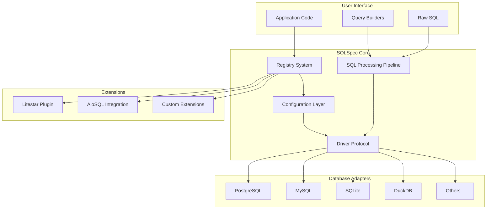
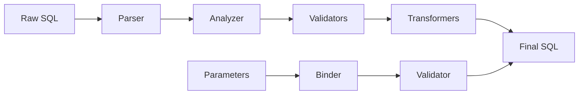

# SQLSpec Overview

## Introduction

SQLSpec is a modern database connectivity library for Python that provides a unified, type-safe interface for interacting with multiple database systems. Built on protocol-based design principles, it offers advanced features like SQL validation, automatic parameter binding, and comprehensive instrumentation while maintaining excellent performance.

## Design Philosophy

SQLSpec is built on several core principles:

### 1. Type Safety First

Every component leverages Python's type system to provide compile-time guarantees and excellent IDE support. Generic types flow through the entire stack, ensuring type information is never lost.

### 2. Protocol-Based Architecture

Instead of inheritance hierarchies, SQLSpec uses protocols (PEP-544) to define contracts. This enables better composability and makes the codebase more maintainable.

### 3. Single-Pass Processing

SQL statements are parsed, validated, and transformed in a single pass through the pipeline. This "parse once, transform once, validate once" approach ensures optimal performance.

### 4. Security by Design

Multiple layers of security validation prevent SQL injection and other attacks. Parameters are automatically bound, and dangerous patterns are detected before execution.

### 5. Zero Configuration

While highly configurable, SQLSpec works out of the box with sensible defaults. Configuration is progressive - you only specify what differs from defaults.

## High-Level Architecture



## Core Components

### 1. Registry System (`SQLSpec`)

The central hub that manages database configurations and provides factory methods for connections and sessions. It acts as a service locator and lifecycle manager.

```python
from sqlspec import SQLSpec
from sqlspec.adapters.postgresql import PostgreSQLConfig

# Register configuration
sqlspec = SQLSpec()
sqlspec.register_config(PostgreSQLConfig(...), name="primary")

# Get connection
with sqlspec.get_connection("primary") as conn:
    # Use connection
```

### 2. Configuration System

A hierarchical configuration system that provides type-safe settings for databases, connection pools, instrumentation, and SQL processing.

```python
from sqlspec.config import SQLConfig, InstrumentationConfig

config = PostgreSQLConfig(
    url="postgresql://localhost/db",
    pool_size=20,
    instrumentation=InstrumentationConfig(
        # Core logging
        log_queries=True,
        log_parameters=False,  # Security: off by default

        # Advanced instrumentation
        enable_correlation_ids=True,
        structured_logging=True,
        structured_format="json",

        # Debug modes
        debug_mode=False,
        debug_sql_ast=False,
        debug_parameter_binding=False,

        # Telemetry
        enable_opentelemetry=True,
        enable_prometheus=True,

        # Performance thresholds
        slow_query_threshold_ms=1000.0,
        slow_storage_operation_ms=500.0,
    ),
    statement_config=SQLConfig(
        strict_mode=True,
        enable_validation=True
    )
)
```

### 3. SQL Processing Pipeline

A sophisticated pipeline that processes SQL statements through multiple stages:



### 4. Driver Protocol System

Database adapters implement a common protocol, ensuring consistent behavior across different databases while allowing for database-specific optimizations.

```python
from typing import Protocol

class SyncDriverProtocol(Protocol[ConnectionT, RowT]):
    def execute(self, sql: SQL, **kwargs) -> SQLResult[RowT]: ...
    def execute_many(self, sql: SQL, **kwargs) -> SQLResult[RowT]: ...
    def fetch_arrow_table(self, sql: SQL, **kwargs) -> ArrowResult: ...
```

### 5. Query Builders

A fluent API for constructing SQL queries programmatically with automatic parameter binding:

```python
from sqlspec import sql

query = (
    sql.select("id", "name", "email")
    .from_("users")
    .where("active", "=", True)
    .where("created_at", ">", datetime.now() - timedelta(days=30))
    .order_by("created_at", "DESC")
    .limit(10)
)
```

Mix SQL and Query Builder together where you want.

```python
from sqlspec import sql

query = (
    sql.select("u.id", "u.name", "u.email")
    .from_("users u")
    .where(f"created_at > {datetime.now() - timedelta(days=30)}")  # NOTE: The `LiteralParametizer` automatically converts this into `created_at > ?` and modifies the value into a bind parameter
    .order_by("created_at", "DESC")
    .limit(10)
)
```

## Data Flow

Understanding how data flows through SQLSpec is crucial:

1. **Query Construction**: User creates SQL via builders or raw strings
2. **Configuration Lookup**: Registry provides appropriate configuration
3. **Pipeline Processing**: SQL passes through validation and transformation
4. **Driver Execution**: Processed SQL sent to database adapter
5. **Result Wrapping**: Results wrapped in type-safe containers
6. **User Consumption**: Type-safe results returned to user

## Key Features

### Type-Safe Results

```python
from dataclasses import dataclass

@dataclass
class User:
    id: int
    name: str
    email: str

result = session.execute(
    "SELECT * FROM users WHERE id = ?",
    (1,),
    schema_type=User
)
user: User = result.one()  # Fully typed!
```

### Automatic Parameter Binding

```python
# Parameters automatically extracted and bound
result = session.execute(
    sql.select().from_("users").where("age", ">", 18)
)
```

### Comprehensive Instrumentation

```python
# Full observability with correlation tracking
from sqlspec.utils.correlation import CorrelationContext

with CorrelationContext.context() as correlation_id:
    # All operations share this correlation ID
    with sqlspec.get_session("primary") as session:
        result = session.execute("SELECT * FROM users")
        # Automatic:
        # - OpenTelemetry spans with correlation ID
        # - Prometheus metrics for latency/errors
        # - Structured JSON logs with context
        # - Debug modes for SQL AST and parameters
```

Instrumentation features:

- **Correlation IDs**: Track requests across the entire stack
- **Structured Logging**: JSON-formatted logs for modern observability
- **Debug Modes**: SQL AST visualization, parameter binding details
- **Performance Tracking**: Automatic slow query detection
- **Storage Operations**: Full instrumentation of Arrow/Parquet operations

### Multi-Database Support

```python
# Same code works across databases
for db_name in ["postgres", "mysql", "sqlite"]:
    with sqlspec.get_session(db_name) as session:
        result = session.execute("SELECT COUNT(*) FROM users")
```

## Performance Characteristics

SQLSpec is designed for high performance:

- **Zero-Copy Operations**: Arrow integration enables zero-copy data transfer
- **Connection Pooling**: Efficient connection reuse with configurable pools
- **Lazy Processing**: SQL only processed when needed
- **Bulk Operations**: Optimized paths for bulk inserts and updates
- **Streaming Results**: Large result sets can be streamed efficiently

## Security Model

Security is built into every layer:

1. **Parameter Binding**: Automatic prevention of SQL injection
2. **Validation Pipeline**: Dangerous patterns detected and blocked
3. **Permission System**: Fine-grained control over allowed operations
4. **Audit Logging**: Comprehensive logging of all database operations
5. **Error Sanitization**: Sensitive information removed from errors

## Extensibility

SQLSpec is designed to be extended:

- **Custom Validators**: Add domain-specific SQL validation
- **Custom Transformers**: Implement query optimization
- **New Adapters**: Support additional databases
- **Framework Integration**: Plug into web frameworks
- **Custom Result Types**: Define specialized result containers

## Next Steps

Now that you understand the high-level architecture, dive deeper into specific components:

- [Registry System](./core/02-registry-system.md) - Learn about configuration management
- [Driver Architecture](./drivers/05-driver-architecture.md) - Understand database connectivity
- [Pipeline Overview](./pipeline/08-pipeline-overview.md) - Explore SQL processing

---

[← Back to Index](./README.md) | [Registry System →](./core/02-registry-system.md)
