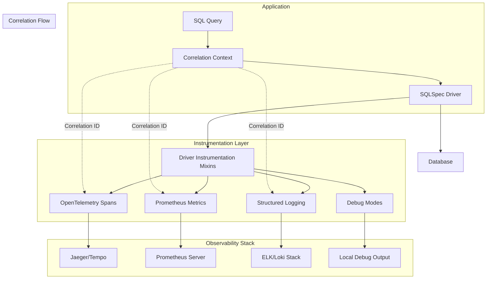

# Advanced Features

## Introduction

SQLSpec provides several advanced features that enable high-performance data operations, comprehensive monitoring, and seamless integration with modern data processing tools. This document covers instrumentation, Arrow/Parquet integration, bulk operations, and performance optimization techniques.

## Instrumentation and Telemetry

### Architecture Overview

SQLSpec's instrumentation system provides comprehensive observability with correlation tracking:



The instrumentation system is built into driver mixins (`sqlspec.driver.mixins._instrumentation.py`) providing automatic telemetry for all operations.

### Configuration

```python
from sqlspec.config import InstrumentationConfig
from sqlspec.adapters.postgresql import PostgreSQLConfig

config = PostgreSQLConfig(
    url="postgresql://localhost/db",
    instrumentation=InstrumentationConfig(
        # Core logging
        log_queries=True,
        log_runtime=True,
        log_parameters=False,  # Security: off by default
        log_results_count=True,
        log_pool_operations=True,

        # Extended logging
        log_storage_operations=True,
        log_sql_parsing=True,
        log_pipeline_steps=False,  # Verbose
        log_service_operations=True,

        # Structured logging
        structured_logging=True,
        structured_format="json",
        include_environment=True,
        include_hostname=True,

        # Correlation
        enable_correlation_ids=True,
        correlation_id_header="X-Correlation-ID",

        # Debug modes
        debug_mode=False,
        debug_sql_ast=False,
        debug_parameter_binding=False,
        debug_storage_io=False,

        # OpenTelemetry
        enable_opentelemetry=True,
        service_name="my-app",
        custom_tags={"team": "data-platform"},

        # Prometheus
        enable_prometheus=True,
        prometheus_latency_buckets=[0.001, 0.01, 0.1, 0.5, 1.0, 5.0],

        # Performance thresholds
        slow_query_threshold_ms=1000.0,
        slow_pool_operation_ms=5000.0,
        slow_storage_operation_ms=500.0,
        slow_parsing_threshold_ms=100.0,

        # Sampling
        sampling_rate=1.0,  # 100%
        sampling_rules={
            "storage.read": 0.1,  # Sample 10% of storage reads
            "query.select": 0.5,  # Sample 50% of SELECTs
        }
    )
)
```

### Correlation Tracking

```python
from sqlspec.utils.correlation import CorrelationContext
from sqlspec.utils.logging import get_logger

logger = get_logger("my_app")

# Correlation ID flows through all operations
with CorrelationContext.context() as correlation_id:
    logger.info("Starting user processing", extra={"correlation_id": correlation_id})

    with sqlspec.get_session("primary") as session:
        # All operations share the correlation ID
        users = session.execute("SELECT * FROM users").all()

        for user in users:
            # Update user - correlation ID included
            session.execute(
                "UPDATE users SET last_processed = NOW() WHERE id = ?",
                (user.id,)
            )
```

### Debug Modes

```python
# Enable debug modes for troubleshooting
config = InstrumentationConfig(
    debug_mode=True,
    debug_sql_ast=True,  # Log SQL parse trees
    debug_parameter_binding=True,  # Log parameter resolution
    debug_storage_io=True,  # Log storage operations
)

# Example debug output
with sqlspec.get_session("debug") as session:
    session.execute(
        "SELECT u.*, p.* FROM users u JOIN profiles p ON u.id = p.user_id WHERE u.age > ?",
        (25,)
    )
    # Logs:
    # - SQL AST structure
    # - Parameter binding: {param_0: 25}
    # - Execution plan details
```

### Structured Logging

```python
# JSON-formatted logs for log aggregation
{
    "timestamp": "2024-01-15T10:30:45.123Z",
    "level": "INFO",
    "logger": "adapters.postgresql",
    "message": "Executing SQL",
    "correlation_id": "a1b2c3d4-e5f6-7890-abcd-ef1234567890",
    "sql_length": 156,
    "has_parameters": true,
    "database": "primary",
    "operation": "select",
    "hostname": "app-server-01",
    "environment": "production"
}
```

### Prometheus Metrics

```python
# Automatic metrics collection
from prometheus_client import Counter, Histogram, Gauge

# SQLSpec exposes these metrics automatically:
# - sqlspec_queries_total{database, operation, status}
# - sqlspec_query_duration_seconds{database, operation}
# - sqlspec_active_connections{database}
# - sqlspec_connection_pool_size{database}
# - sqlspec_query_row_count{database, operation}

# Custom metrics
query_cache_hits = Counter(
    'sqlspec_cache_hits_total',
    'Total number of query cache hits',
    ['database', 'query_type']
)

class CachedSession(SQLSpecSession):
    def execute(self, sql, **kwargs):
        cache_key = self._get_cache_key(sql)

        if cache_key in self.cache:
            query_cache_hits.labels(
                database=self.config.name,
                query_type=sql.operation
            ).inc()
            return self.cache[cache_key]

        return super().execute(sql, **kwargs)
```

### Custom Instrumentation

```python
from typing import Any, Dict
from sqlspec.utils.telemetry import InstrumentorProtocol

class BusinessMetricsInstrumentor(InstrumentorProtocol):
    """Track business-specific metrics."""

    def on_query_start(self, context: Dict[str, Any]) -> None:
        # Track query patterns
        if "users" in context["sql"]:
            self.user_query_counter.inc()

    def on_query_complete(
        self,
        context: Dict[str, Any],
        result: Any,
        duration_ms: float
    ) -> None:
        # Track business metrics
        if context["operation"] == "SELECT":
            self.data_retrieved_bytes.observe(
                self._estimate_result_size(result)
            )

    def on_query_error(
        self,
        context: Dict[str, Any],
        error: Exception,
        duration_ms: float
    ) -> None:
        # Track error patterns
        self.error_counter.labels(
            error_type=type(error).__name__,
            operation=context["operation"]
        ).inc()
```

## Arrow Integration

### Zero-Copy Data Transfer

SQLSpec provides native Apache Arrow support for efficient data processing:

```python
# Direct Arrow table creation
arrow_result = session.fetch_arrow_table(
    "SELECT * FROM large_table WHERE category = ?",
    ("electronics",)
)

# Access Arrow table
table = arrow_result.table
print(f"Rows: {table.num_rows}")
print(f"Schema: {table.schema}")

# Zero-copy conversion to pandas
df = table.to_pandas(zero_copy_only=True)

# Zero-copy conversion to Polars
import polars as pl
df_polars = pl.from_arrow(table)
```

### Streaming Arrow Results

```python
# Stream large datasets efficiently
def process_large_dataset(session):
    # Stream in batches
    arrow_stream = session.fetch_arrow_table_stream(
        "SELECT * FROM events WHERE timestamp > ?",
        (datetime.now() - timedelta(days=30),),
        batch_size=10000
    )

    for batch in arrow_stream:
        # Process each batch
        df_batch = batch.to_pandas()

        # Perform calculations
        aggregated = df_batch.groupby('user_id').agg({
            'amount': 'sum',
            'timestamp': 'count'
        })

        # Write results back
        session.insert_from_arrow(
            "user_aggregates",
            pa.Table.from_pandas(aggregated)
        )
```

### Arrow-Based ETL

```python
class ArrowETLPipeline:
    """High-performance ETL using Arrow."""

    def __init__(self, source_db: str, target_db: str):
        self.source = sqlspec.get_session(source_db)
        self.target = sqlspec.get_session(target_db)

    def transfer_table(
        self,
        source_table: str,
        target_table: str,
        transform_fn=None
    ):
        # Read entire table as Arrow
        arrow_table = self.source.fetch_arrow_table(
            f"SELECT * FROM {source_table}"
        )

        # Apply transformations if needed
        if transform_fn:
            arrow_table = transform_fn(arrow_table)

        # Write to target database
        self.target.create_table_from_arrow(
            target_table,
            arrow_table,
            if_exists="replace"
        )
```

## Parquet Integration

### Direct Parquet Export

```python
# Export query results to Parquet
session.export_to_storage(
    "SELECT * FROM sales_2024",
    "s3://data-lake/sales/2024/data.parquet",
    compression="snappy",
    row_group_size=100000
)

# Export with partitioning
session.export_to_storage(
    """
    SELECT
        date_trunc('month', created_at) as month,
        category,
        SUM(amount) as total_sales,
        COUNT(*) as transaction_count
    FROM sales
    GROUP BY 1, 2
    """,
    "s3://data-lake/sales/monthly/",
    partition_cols=["month", "category"]
)
```

### Parquet Reading and Querying

```python
# Query Parquet files directly (DuckDB)
result = session.execute("""
    SELECT
        category,
        SUM(total_sales) as total,
        AVG(transaction_count) as avg_transactions
    FROM 's3://data-lake/sales/monthly/*.parquet'
    WHERE month >= '2024-01-01'
    GROUP BY category
""")

# Register Parquet as temporary table
session.execute("""
    CREATE TEMPORARY TABLE sales_archive AS
    SELECT * FROM read_parquet('s3://archive/sales_*.parquet')
""")
```

## Bulk Operations

### High-Performance Bulk Insert

```python
# Method 1: COPY operations (PostgreSQL)
session.copy_from_csv(
    "sales_data",
    "s3://data/sales_2024.csv",
    columns=["date", "product_id", "amount", "quantity"],
    format_options={
        "delimiter": ",",
        "header": True,
        "quote": '"',
        "null": "\\N"
    }
)

# Method 2: Bulk insert from Arrow
sales_data = pa.Table.from_pandas(large_sales_df)
session.insert_from_arrow(
    "sales_data",
    sales_data,
    batch_size=50000,
    on_conflict="update"  # Upsert behavior
)

# Method 3: Prepared bulk insert
insert_stmt = session.prepare(
    "INSERT INTO users (name, email, created_at) VALUES (?, ?, ?)"
)

# Execute in batches
for batch in chunk_data(user_data, size=1000):
    session.execute_prepared_many(insert_stmt, batch)
```

### Bulk Updates and Deletes

```python
# Bulk update with JOIN
session.execute("""
    UPDATE products p
    SET
        price = s.new_price,
        updated_at = CURRENT_TIMESTAMP
    FROM staging_prices s
    WHERE p.sku = s.sku
    AND s.effective_date <= CURRENT_DATE
""")

# Bulk delete with subquery
session.execute("""
    DELETE FROM events
    WHERE id IN (
        SELECT id
        FROM events
        WHERE created_at < ?
        ORDER BY created_at
        LIMIT 100000
    )
""", (cutoff_date,))
```

### Parallel Bulk Operations

```python
import asyncio
from concurrent.futures import ThreadPoolExecutor

class ParallelBulkProcessor:
    """Process bulk operations in parallel."""

    def __init__(self, sqlspec: SQLSpec, max_workers: int = 4):
        self.sqlspec = sqlspec
        self.executor = ThreadPoolExecutor(max_workers=max_workers)

    async def parallel_insert(
        self,
        table: str,
        data_chunks: List[List[Dict]],
        database: str = "primary"
    ):
        """Insert data chunks in parallel."""

        async def insert_chunk(chunk):
            loop = asyncio.get_event_loop()
            return await loop.run_in_executor(
                self.executor,
                self._insert_chunk_sync,
                database,
                table,
                chunk
            )

        tasks = [insert_chunk(chunk) for chunk in data_chunks]
        results = await asyncio.gather(*tasks)

        return sum(results)  # Total rows inserted

    def _insert_chunk_sync(
        self,
        database: str,
        table: str,
        chunk: List[Dict]
    ) -> int:
        with self.sqlspec.get_session(database) as session:
            result = session.execute_many(
                sql.insert(table).columns(*chunk[0].keys()),
                chunk
            )
            return result.row_count
```

## Performance Optimization

### Query Result Caching

```python
from functools import lru_cache
from sqlspec.utils.cache import TTLCache

class CachedSession:
    """Session with query result caching."""

    def __init__(self, session, cache_ttl: int = 300):
        self.session = session
        self.cache = TTLCache(maxsize=1000, ttl=cache_ttl)

    def execute_cached(
        self,
        sql: SQL,
        cache_key: Optional[str] = None,
        ttl: Optional[int] = None
    ):
        """Execute query with caching."""
        # Generate cache key
        if not cache_key:
            cache_key = self._generate_cache_key(sql)

        # Check cache
        if cache_key in self.cache:
            return self.cache[cache_key]

        # Execute query
        result = self.session.execute(sql)

        # Cache result
        self.cache.set(cache_key, result, ttl=ttl)

        return result

    @lru_cache(maxsize=100)
    def get_metadata(self, table_name: str):
        """Cache table metadata."""
        return self.session.execute(
            "SELECT * FROM information_schema.columns WHERE table_name = ?",
            (table_name,)
        ).all()
```

### Connection Pooling Optimization

```python
from sqlspec.config import PoolOptimizationConfig

# Adaptive pool configuration
config = PostgreSQLConfig(
    url="postgresql://localhost/db",

    # Base pool settings
    pool_size=20,
    max_overflow=10,

    # Optimization settings
    pool_optimization=PoolOptimizationConfig(
        # Dynamic sizing
        enable_adaptive_pool_size=True,
        min_pool_size=5,
        max_pool_size=50,

        # Connection lifecycle
        pool_recycle=1800,  # 30 minutes
        pool_pre_ping=True,

        # Performance tuning
        statement_cache_size=200,
        prepared_statement_cache_size=100,

        # Health monitoring
        health_check_interval=60,
        slow_query_log_threshold_ms=1000
    )
)
```

### Query Plan Analysis

```python
class QueryOptimizer:
    """Analyze and optimize query performance."""

    def analyze_query(self, session, sql: SQL) -> QueryAnalysis:
        """Get query execution plan and statistics."""

        # Get execution plan
        plan = session.execute(
            f"EXPLAIN (ANALYZE, BUFFERS, FORMAT JSON) {sql.to_sql()}",
            sql.parameters
        ).scalar()

        analysis = QueryAnalysis()
        analysis.parse_plan(plan)

        # Get index suggestions
        if analysis.sequential_scans:
            for scan in analysis.sequential_scans:
                suggestion = self._suggest_index(session, scan)
                if suggestion:
                    analysis.add_suggestion(suggestion)

        return analysis

    def _suggest_index(self, session, scan_info):
        """Suggest indexes for sequential scans."""
        # Analyze column usage in conditions
        columns = self._extract_filter_columns(scan_info)

        if columns:
            return IndexSuggestion(
                table=scan_info.table,
                columns=columns,
                estimated_improvement=scan_info.cost * 0.8
            )
```

## Storage Backend Integration

### Object Storage Support

```python
# S3 integration
session.copy_from_s3(
    table="events",
    s3_path="s3://bucket/data/events/",
    iam_role="arn:aws:iam::123456789012:role/MyRole",
    format="parquet",
    options={
        "partition_columns": ["year", "month", "day"]
    }
)

# Azure Blob Storage
session.copy_from_azure(
    table="events",
    container="data",
    blob_path="events/2024/",
    storage_account="mystorageaccount",
    format="csv",
    options={
        "delimiter": "|",
        "compression": "gzip"
    }
)

# Google Cloud Storage
session.copy_from_gcs(
    table="events",
    gcs_path="gs://bucket/data/events/*.json",
    format="json",
    options={
        "lines": True  # JSONL format
    }
)
```

### Custom Storage Backends

```python
from sqlspec.storage import StorageBackend, StorageRegistry

class CustomStorageBackend(StorageBackend):
    """Custom storage backend implementation."""

    def read(self, path: str) -> bytes:
        # Implement custom read logic
        pass

    def write(self, path: str, data: bytes) -> None:
        # Implement custom write logic
        pass

    def list(self, prefix: str) -> List[str]:
        # Implement listing logic
        pass

# Register custom backend
StorageRegistry.register("custom", CustomStorageBackend)

# Use in queries
session.execute("""
    COPY events FROM 'custom://path/to/data'
    WITH (FORMAT 'csv')
""")
```

## Streaming and Real-time Features

### Change Data Capture (CDC)

```python
class CDCProcessor:
    """Process database changes in real-time."""

    def __init__(self, source_db: str):
        self.source = sqlspec.get_session(source_db)
        self.listeners = []

    def watch_table(
        self,
        table: str,
        callback,
        operations: List[str] = ["INSERT", "UPDATE", "DELETE"]
    ):
        """Watch a table for changes."""
        # PostgreSQL LISTEN/NOTIFY
        trigger_sql = f"""
        CREATE OR REPLACE FUNCTION notify_{table}_changes()
        RETURNS TRIGGER AS $$
        BEGIN
            PERFORM pg_notify(
                'table_changes',
                json_build_object(
                    'table', '{table}',
                    'operation', TG_OP,
                    'data', row_to_json(NEW),
                    'old_data', row_to_json(OLD)
                )::text
            );
            RETURN NEW;
        END;
        $$ LANGUAGE plpgsql;

        CREATE TRIGGER {table}_changes
        AFTER {' OR '.join(operations)} ON {table}
        FOR EACH ROW EXECUTE FUNCTION notify_{table}_changes();
        """

        self.source.execute_script(trigger_sql)
        self.listeners.append((table, callback))

    async def start(self):
        """Start listening for changes."""
        async with self.source.listen_channel("table_changes") as channel:
            async for notification in channel:
                data = json.loads(notification.payload)

                for table, callback in self.listeners:
                    if data["table"] == table:
                        await callback(data)
```

### Stream Processing Integration

```python
# Kafka integration
from sqlspec.extensions.streaming import KafkaSource, KafkaSink

# Read from Kafka into database
kafka_source = KafkaSource(
    bootstrap_servers="localhost:9092",
    topic="events",
    value_deserializer=json.loads
)

async def process_kafka_events():
    async for batch in kafka_source.consume_batches(max_size=1000):
        # Convert to Arrow for efficiency
        arrow_table = pa.Table.from_pylist(batch)

        # Insert into database
        await session.insert_from_arrow_async(
            "events",
            arrow_table
        )

# Write query results to Kafka
kafka_sink = KafkaSink(
    bootstrap_servers="localhost:9092",
    topic="aggregated_metrics"
)

# Stream query results to Kafka
async def stream_metrics():
    stream = await session.stream("""
        SELECT
            date_trunc('minute', timestamp) as minute,
            COUNT(*) as event_count,
            AVG(duration) as avg_duration
        FROM events
        WHERE timestamp > NOW() - INTERVAL '1 hour'
        GROUP BY 1
        ORDER BY 1
    """)

    async for row in stream:
        await kafka_sink.send(row.to_dict())
```

## Machine Learning Integration

### Model Scoring in Database

```python
# Register ML model as UDF
import pickle
import numpy as np

model = pickle.load(open("model.pkl", "rb"))

@session.create_function("predict_churn")
def predict_churn(
    days_since_last_order: int,
    total_orders: int,
    avg_order_value: float
) -> float:
    """Predict customer churn probability."""
    features = np.array([[
        days_since_last_order,
        total_orders,
        avg_order_value
    ]])

    return float(model.predict_proba(features)[0, 1])

# Use in queries
results = session.execute("""
    SELECT
        customer_id,
        predict_churn(
            days_since_last_order,
            total_orders,
            avg_order_value
        ) as churn_probability
    FROM customer_metrics
    WHERE churn_probability > 0.8
""")
```

## Summary

SQLSpec's advanced features enable:

- **Comprehensive observability** through OpenTelemetry and Prometheus
- **High-performance data processing** with Arrow and Parquet
- **Efficient bulk operations** with parallel processing
- **Flexible storage integration** supporting cloud object stores
- **Real-time capabilities** with CDC and streaming
- **ML integration** for in-database scoring

These features make SQLSpec suitable for modern data engineering workloads requiring high performance and scalability.

---

[← Parameter Handling](./security/14-parameter-handling.md) | [Extension Architecture →](./extensions/16-extension-architecture.md)
