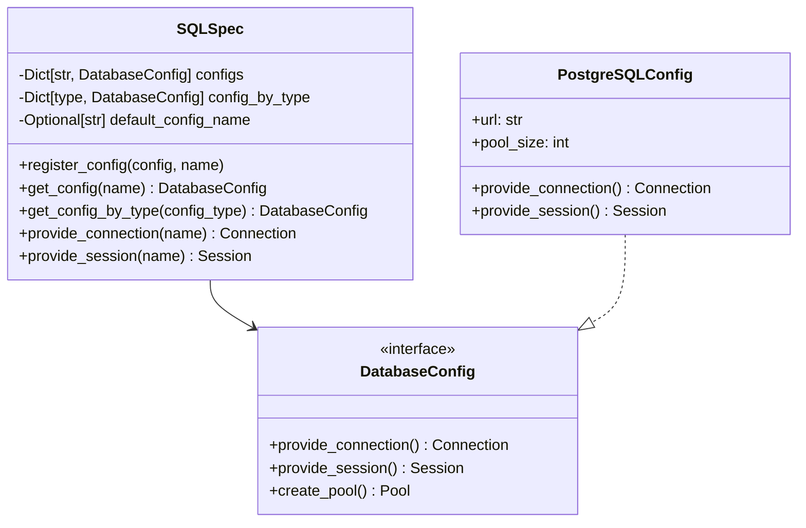
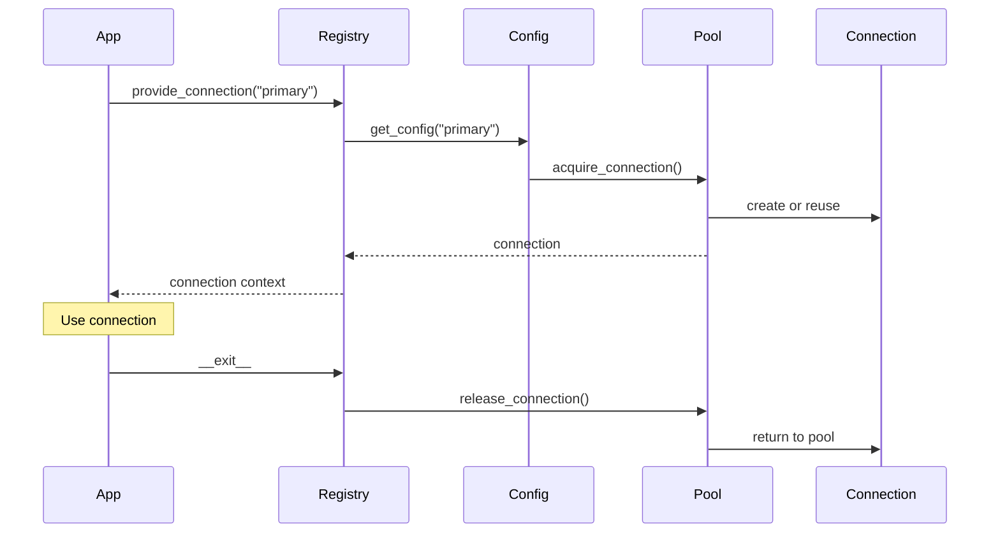

# Registry System

## Overview

The Registry System is the heart of SQLSpec, providing centralized configuration management, service location, and lifecycle control. It implements a sophisticated service registry pattern that manages database configurations, connection factories, and session providers while maintaining type safety throughout.

## Core Concepts

### The SQLSpec Registry

The `SQLSpec` class serves as the central registry and factory for all database operations. It's designed as a singleton-like service that manages multiple database configurations simultaneously.



### Configuration Registration

Configurations are registered with the registry using a name-based system:

```python
from sqlspec import SQLSpec
from sqlspec.adapters.postgresql import AsyncpgConfig
from sqlspec.adapters.mysql import AsyncMyConfig

# Create registry
spec = SQLSpec()

# Register configurations
spec.register_config(
    AsyncpgConfig(url="postgresql://primary/db"),
    name="primary"
)

spec.register_config(
    AsyncpgConfig(url="postgresql://replica/db", read_only=True),
    name="replica"
)

spec.register_config(
    AsyncMyConfig(url="mysql://analytics/db"),
    name="analytics"
)

# Set default
spec.set_default("primary")
```

### Type-Based Lookup

In addition to name-based lookup, the registry supports type-based configuration retrieval:

```python
# Register by type
spec.register_config(AsyncpgConfig(...))

# Retrieve by type
config = spec.get_config_by_type(AsyncpgConfig)
```

This enables elegant patterns in dependency injection frameworks.

## Lifecycle Management

### Connection Lifecycle

The registry manages connection lifecycles through context managers:



### Session Lifecycle

Sessions provide a higher-level abstraction over connections:

```python
# Automatic session management
with spec.provide_session("primary") as session:
    # Session automatically manages transactions
    result = session.execute("SELECT * FROM users")

    # Multiple operations in same session
    session.execute("INSERT INTO audit ...")

# Session automatically closed/returned to pool
```

## Configuration Hierarchy

The registry supports hierarchical configuration with inheritance and overrides:

```python
# Base configuration
base_config = PostgreSQLConfig(
    pool_size=20,
    pool_timeout=30,
    instrumentation=InstrumentationConfig(
        enable_opentelemetry=True,
        enable_prometheus=True
    )
)

# Environment-specific overrides
dev_config = base_config.merge(
    PostgreSQLConfig(
        url="postgresql://localhost/dev",
        instrumentation=InstrumentationConfig(
            log_queries=True,
            log_results=True
        )
    )
)

prod_config = base_config.merge(
    PostgreSQLConfig(
        url="postgresql://prod.db/app",
        pool_size=100,
        ssl_mode="require"
    )
)
```

## Service Location Patterns

### Standard Pattern

```python
# Initialize once at startup
spec = SQLSpec()
spec.register_config(PostgreSQLConfig(...), "main")

# Use throughout application
def get_user(user_id: int) -> User:
    with spec.provide_session("main") as session:
        return session.execute(
            "SELECT * FROM users WHERE id = ?",
            (user_id,),
            schema_type=User
        ).one()
```

### Dependency Injection Pattern

```python
from typing import Protocol

class DatabaseProvider(Protocol):
    def provide_session(self, name: str) -> ContextManager[Session]: ...

class UserRepository:
    def __init__(self, db_provider: DatabaseProvider):
        self.db = db_provider

    def get_user(self, user_id: int) -> User:
        with self.db.provide_session("main") as session:
            return session.execute(...).one()

# Wire up
repo = UserRepository(spec)
```

### Testing Pattern

```python
# Production config
spec.register_config(PostgreSQLConfig(...), "main")

# Test override
def test_something():
    # Override with test database
    spec.register_config(
        PostgreSQLConfig(url="postgresql://test/db"),
        name="main",
        override=True
    )

    # Run tests against test database
    assert get_user(1).name == "Test User"
```

## Multi-Database Scenarios

The registry excels at managing multiple databases:

```python
# Different databases for different purposes
spec.register_config(PostgreSQLConfig(...), "transactional")
spec.register_config(DuckDBConfig(...), "analytics")
spec.register_config(RedisConfig(...), "cache")

async def process_order(order_id: int):
    # Read from transactional database
    async with spec.provide_session("transactional") as session:
        order = await session.execute(
            "SELECT * FROM orders WHERE id = ?", (order_id,)
        ).one()

    # Write to analytics database
    async with spec.provide_session("analytics") as session:
        await session.execute(
            "INSERT INTO order_events ...",
            order.to_event()
        )

    # Update cache
    async with spec.provide_session("cache") as cache:
        await cache.set(f"order:{order_id}", order)
```

## Configuration Discovery

The registry supports various configuration discovery mechanisms:

### Environment Variables

```python
# Automatic configuration from environment
spec.register_from_env(
    prefix="DB_",
    mapping={
        "PRIMARY": PostgreSQLConfig,
        "ANALYTICS": DuckDBConfig
    }
)
```

### Configuration Files

```python
# Load from YAML/JSON/TOML
spec.register_from_file("config/database.yaml")
```

### Service Discovery

```python
# Integrate with service discovery
from consul import Consul

consul = Consul()
for service in consul.catalog.services():
    if service.startswith("db-"):
        config = PostgreSQLConfig(
            url=f"postgresql://{service.address}:{service.port}/db"
        )
        spec.register_config(config, service.name)
```

## Performance Considerations

### Connection Pool Management

The registry ensures efficient connection pooling:

```python
# Pools are created lazily and cached
config = PostgreSQLConfig(
    url="...",
    pool_size=20,
    pool_recycle=3600,  # Recycle connections after 1 hour
    pool_pre_ping=True  # Verify connections before use
)

# Pool created on first use
with spec.provide_connection("main") as conn:
    # Pool now exists and will be reused
    pass
```

### Configuration Caching

Configurations are cached aggressively:

```python
# These all return the same instance
config1 = spec.get_config("main")
config2 = spec.get_config("main")
config3 = spec.get_config_by_type(PostgreSQLConfig)
assert config1 is config2 is config3
```

## Error Handling

The registry provides comprehensive error handling:

```python
try:
    with spec.provide_session("unknown") as session:
        pass
except ConfigNotFoundError as e:
    # Handle missing configuration
    logger.error(f"Database config not found: {e.config_name}")

try:
    spec.register_config(config, "main")
    spec.register_config(other_config, "main")  # Duplicate!
except ConfigAlreadyRegisteredError as e:
    # Handle duplicate registration
    logger.error(f"Config already registered: {e.config_name}")
```

## Thread Safety

The registry is thread-safe for all operations:

```python
import threading

def worker(name: str):
    with spec.provide_session("main") as session:
        session.execute(f"INSERT INTO logs (thread) VALUES (?)", (name,))

# Safe to use from multiple threads
threads = [
    threading.Thread(target=worker, args=(f"thread-{i}",))
    for i in range(10)
]

for t in threads:
    t.start()
for t in threads:
    t.join()
```

## Integration Points

### With Web Frameworks

```python
# FastAPI integration
from fastapi import Depends

def get_db_session():
    with spec.provide_session("main") as session:
        yield session

@app.get("/users/{user_id}")
def get_user(user_id: int, session=Depends(get_db_session)):
    return session.execute(...).one()
```

### With Task Queues

```python
# Celery integration
@celery.task
def process_data(data_id: int):
    with spec.provide_session("main") as session:
        data = session.execute(...).one()
        # Process data
```

## Best Practices

1. **Single Registry**: Use one registry per application
2. **Early Registration**: Register all configs at startup
3. **Named Configs**: Use descriptive names for configurations
4. **Type Safety**: Leverage type-based lookup where appropriate
5. **Error Handling**: Always handle configuration errors gracefully
6. **Resource Cleanup**: Always use context managers

## Next Steps

- [Configuration Architecture](./03-configuration-architecture.md) - Deep dive into configuration system
- [Driver Architecture](../drivers/05-driver-architecture.md) - Understand driver implementation
- [Connection Management](../drivers/07-connection-management.md) - Learn about connection pooling

---

[← Overview](../01-overview.md) | [Configuration Architecture →](./03-configuration-architecture.md)
