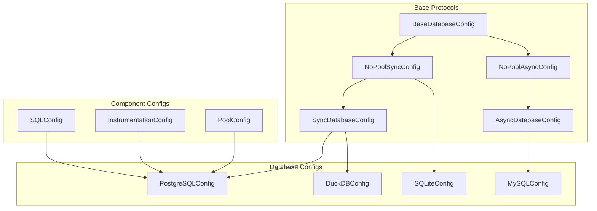
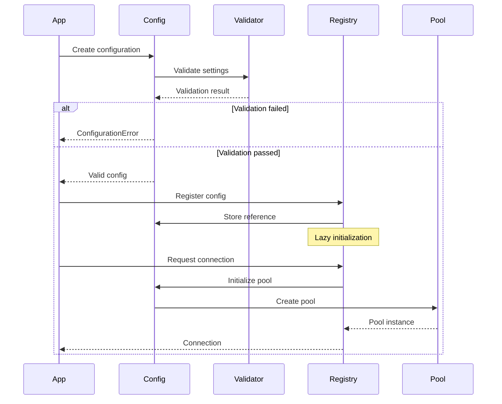

# Configuration Architecture

## Overview

SQLSpec's configuration system is a sophisticated, type-safe hierarchy that provides fine-grained control over every aspect of database connectivity, SQL processing, and instrumentation. The system follows a composable design where configurations can be merged, overridden, and validated at compile time.

## Configuration Hierarchy



## Core Configuration Types

### Base Database Configuration

The foundation of all database configurations:

```python
from typing import Protocol, TypeVar, Generic
from sqlspec.driver import ConnectionT, DriverT

class BaseDatabaseConfig(Protocol[ConnectionT, DriverT]):
    """Base protocol for all database configurations."""

    # Connection settings
    url: str
    connect_timeout: float
    command_timeout: float

    # Component configurations
    statement_config: SQLConfig
    instrumentation: InstrumentationConfig

    # Factory methods
    def create_connection(self) -> ConnectionT: ...
    def provide_connection(self) -> ContextManager[ConnectionT]: ...
    def provide_session(self) -> ContextManager[DriverT]: ...
```

### Connection Pool Configuration

For databases supporting connection pooling, all pool parameters are now direct fields on the configuration class:

```python
# Direct field-based configuration (NEW)
from sqlspec.adapters.asyncpg import AsyncpgConfig

config = AsyncpgConfig(
    # Connection parameters
    dsn="postgresql://localhost/mydb",
    host="localhost",
    port=5432,
    database="mydb",
    user="postgres",
    password="secret",

    # Pool parameters (direct fields)
    min_size=10,
    max_size=20,
    max_queries=50000,
    max_inactive_connection_lifetime=300.0,

    # Connection settings
    connect_timeout=10.0,
    command_timeout=60.0,
    statement_cache_size=100,

    # SSL settings
    ssl=True,
    direct_tls=False,
)

# All configuration fields are now direct attributes
print(config.min_size)  # 10
print(config.max_size)  # 20
```

### SQL Processing Configuration

Controls how SQL statements are processed:

```python
@dataclass
class SQLConfig:
    """SQL processing configuration."""

    # Parsing
    parse_sql: bool = True
    dialect: Optional[str] = None
    parser_timeout: float = 5.0

    # Validation
    enable_validation: bool = True
    strict_mode: bool = False
    allow_ddl: bool = False
    allow_transactions: bool = True

    # Parameter handling
    parameter_style: ParameterStyle = ParameterStyle.AUTO
    allowed_parameter_styles: Optional[tuple[str, ...]] = None
    target_parameter_style: Optional[str] = None
    allow_mixed_parameter_styles: bool = False

    # Transformation
    enable_transformation: bool = True
    optimize_queries: bool = False
    parameterize_literals: bool = True

    # Security
    max_query_length: int = 1_000_000
    max_parameter_count: int = 10_000
    forbidden_keywords: set[str] = field(default_factory=set)

    # Performance
    max_join_count: int = 10
    warn_on_cartesian_product: bool = True
    explain_analyze_threshold: Optional[float] = None
```

### Instrumentation Configuration

Comprehensive observability settings:

```python
@dataclass
class InstrumentationConfig:
    """Instrumentation and telemetry configuration."""

    # Logging
    log_queries: bool = False
    log_parameters: bool = False
    log_results: bool = False
    log_level: str = "INFO"
    query_log_max_length: int = 1000

    # OpenTelemetry
    enable_opentelemetry: bool = False
    otel_service_name: str = "sqlspec"
    otel_span_prefix: str = "db"
    otel_export_endpoint: Optional[str] = None

    # Prometheus
    enable_prometheus: bool = False
    prometheus_prefix: str = "sqlspec"
    prometheus_buckets: tuple[float, ...] = (
        0.005, 0.01, 0.025, 0.05, 0.1, 0.25, 0.5, 1.0, 2.5, 5.0
    )

    # Performance tracking
    slow_query_threshold: float = 1.0
    track_connection_pool: bool = True
    track_transaction_duration: bool = True

    # Error handling
    include_traceback_in_spans: bool = False
    sanitize_parameters: bool = True
    max_error_message_length: int = 1000
```

## Database-Specific Configurations

### PostgreSQL Configuration (AsyncPG)

```python
from sqlspec.adapters.asyncpg import AsyncpgConfig

config = AsyncpgConfig(
    # Connection parameters (all direct fields)
    dsn="postgresql://localhost/mydb",
    host="localhost",
    port=5432,
    database="mydb",
    user="postgres",
    password="secret",

    # PostgreSQL specific
    ssl=True,
    direct_tls=False,
    server_settings={"jit": "off"},

    # Performance
    statement_cache_size=100,
    max_cached_statement_lifetime=300,
    max_cacheable_statement_size=16384,

    # Pool settings
    min_size=10,
    max_size=20,
    max_queries=50000,
    max_inactive_connection_lifetime=300.0,

    # Parameter styles (class attributes)
    # supported_parameter_styles = ("numeric",)
    # preferred_parameter_style = "numeric"
)
```

### PostgreSQL Configuration (Psycopg)

```python
from sqlspec.adapters.psycopg import PsycopgAsyncConfig

config = PsycopgAsyncConfig(
    # Connection parameters (all direct fields)
    conninfo="postgresql://localhost/mydb",
    host="localhost",
    port=5432,
    dbname="mydb",
    user="postgres",
    password="secret",

    # PostgreSQL specific
    sslmode="require",
    sslcert="/path/to/cert",
    sslkey="/path/to/key",

    # Pool settings
    min_size=10,
    max_size=20,
    timeout=30.0,
    max_lifetime=3600.0,

    # Parameter styles (class attributes)
    # supported_parameter_styles = ("pyformat_positional", "pyformat_named")
    # preferred_parameter_style = "pyformat_positional"
)
```

### MySQL Configuration

```python
from sqlspec.adapters.asyncmy import AsyncmyConfig

config = AsyncmyConfig(
    # Connection parameters (all direct fields)
    host="localhost",
    port=3306,
    database="mydb",
    user="mysql",
    password="secret",

    # MySQL specific
    charset="utf8mb4",
    collation="utf8mb4_unicode_ci",
    use_unicode=True,

    # Performance
    autocommit=False,
    pool_size=20,

    # Parameter styles (class attributes)
    # supported_parameter_styles = ("pyformat",)
    # preferred_parameter_style = "pyformat"
)
```

## Configuration Composition

### Creating Configurations

Configurations are created by passing all parameters directly:

```python
from sqlspec.adapters.asyncpg import AsyncpgConfig
from sqlspec.config import InstrumentationConfig
from sqlspec.statement.sql import SQLConfig

# Base configuration with common settings
base_instrumentation = InstrumentationConfig(
    enable_opentelemetry=True,
    enable_prometheus=True,
    slow_query_threshold=0.5
)

base_statement_config = SQLConfig(
    strict_mode=True,
    enable_validation=True
)

# Development configuration
dev_config = AsyncpgConfig(
    # Connection settings
    dsn="postgresql://localhost/dev_db",
    min_size=2,
    max_size=5,

    # Instrumentation
    instrumentation=InstrumentationConfig(
        enable_opentelemetry=True,
        enable_prometheus=True,
        slow_query_threshold=0.5,
        log_queries=True,
        log_parameters=True,
        log_results=True
    ),

    # Statement config
    statement_config=base_statement_config
)

# Production configuration
prod_config = AsyncpgConfig(
    # Connection settings
    dsn="postgresql://prod.db.company.com/app",
    min_size=20,
    max_size=100,
    ssl=True,

    # Instrumentation
    instrumentation=base_instrumentation,

    # Statement config with additional settings
    statement_config=SQLConfig(
        strict_mode=True,
        enable_validation=True,
        explain_analyze_threshold=1.0
    )
)
```

### Migration from Old Configurations

SQLSpec now uses direct field-based configuration instead of TypedDict patterns:

```python
# Old style (no longer supported)
# pool_config = {
#     "dsn": "postgresql://localhost/mydb",
#     "min_size": 10,
#     "max_size": 20
# }

# New style - direct field configuration
config = AsyncpgConfig(
    dsn="postgresql://localhost/mydb",
    min_size=10,
    max_size=20,
    statement_config=SQLConfig(),
    instrumentation=InstrumentationConfig()
)
```

### Available Configuration Fields

Each adapter exports constants showing available configuration fields:

```python
from sqlspec.adapters.asyncpg import CONNECTION_FIELDS, POOL_FIELDS

# CONNECTION_FIELDS - Fields valid for direct connections
print(CONNECTION_FIELDS)
# {'dsn', 'host', 'port', 'user', 'password', 'database', 'ssl', ...}

# POOL_FIELDS - All fields valid for pooled connections (superset of CONNECTION_FIELDS)
print(POOL_FIELDS)
# {'dsn', 'host', 'port', ..., 'min_size', 'max_size', 'max_queries', ...}

# Use these to validate configuration
config_dict = {"dsn": "...", "min_size": 10, "invalid_field": "oops"}
valid_config = {k: v for k, v in config_dict.items() if k in POOL_FIELDS}
```

### Configuration Validation

All configurations are validated at construction time:

```python
try:
    config = PostgreSQLConfig(
        url="invalid://url",
        pool_size=-1,  # Invalid!
        instrumentation=InstrumentationConfig(
            prometheus_buckets=[]  # Invalid!
        )
    )
except ConfigurationError as e:
    print(f"Invalid configuration: {e}")
    # Detailed validation errors with paths
    for error in e.errors:
        print(f"  - {error.path}: {error.message}")
```

## Environment-Based Configuration

### Environment Variable Loading

```python
from sqlspec.config import load_from_env

# Automatically load from environment
config = load_from_env(
    PostgreSQLConfig,
    prefix="DB_",
    mapping={
        "DB_HOST": "host",
        "DB_PORT": ("port", int),
        "DB_POOL_SIZE": ("pool_size", int),
        "DB_SLOW_QUERY_THRESHOLD": ("instrumentation.slow_query_threshold", float)
    }
)
```

### Configuration Files

```python
# Load from YAML
from sqlspec.config import load_from_yaml

config = load_from_yaml("config/database.yaml", PostgreSQLConfig)
```

```yaml
# config/database.yaml
url: postgresql://localhost/app
pool_size: 50
instrumentation:
  enable_opentelemetry: true
  slow_query_threshold: 0.5
statement_config:
  strict_mode: true
  max_query_length: 50000
```

## Dynamic Configuration

### Runtime Updates

Some configuration aspects can be updated at runtime:

```python
# Update instrumentation dynamically
config.instrumentation.log_queries = True
config.instrumentation.slow_query_threshold = 0.1

# Update pool size (requires pool recreation)
config.update_pool_size(new_size=200)
```

### Feature Flags

```python
@dataclass
class FeatureFlags:
    """Runtime feature toggles."""

    enable_query_cache: bool = False
    enable_result_streaming: bool = True
    enable_automatic_retry: bool = True
    enable_circuit_breaker: bool = False

# Toggle features at runtime
config.features.enable_query_cache = True
```

## Configuration Best Practices

### 1. Layered Configuration

```python
# defaults.py
DEFAULT_CONFIG = {
    "pool_size": 20,
    "instrumentation": {
        "enable_prometheus": True
    }
}

# environment.py
ENV_CONFIG = {
    "development": {
        "instrumentation": {
            "log_queries": True
        }
    },
    "production": {
        "pool_size": 100,
        "ssl_mode": "require"
    }
}

# application.py
def create_config(env: str) -> PostgreSQLConfig:
    config_dict = deep_merge(
        DEFAULT_CONFIG,
        ENV_CONFIG.get(env, {}),
        load_from_env()
    )
    return PostgreSQLConfig(**config_dict)
```

### 2. Validation Guards

```python
def create_production_config() -> PostgreSQLConfig:
    config = PostgreSQLConfig(...)

    # Enforce production requirements
    assert config.ssl_mode == "require", "SSL required in production"
    assert not config.instrumentation.log_parameters, "Parameter logging forbidden"
    assert config.pool_size >= 50, "Insufficient pool size for production"

    return config
```

### 3. Configuration Documentation

```python
@dataclass
class MyAppDatabaseConfig(PostgreSQLConfig):
    """Application-specific database configuration.

    Environment Variables:
        DB_URL: Database connection URL (required)
        DB_POOL_SIZE: Connection pool size (default: 20)
        DB_SLOW_QUERY_MS: Slow query threshold in ms (default: 1000)

    Example:
        config = MyAppDatabaseConfig(
            url=os.environ["DB_URL"],
            pool_size=int(os.environ.get("DB_POOL_SIZE", "20"))
        )
    """
```

## Configuration Lifecycle



## Performance Implications

### Configuration Caching

```python
# Configurations are immutable and cached
config1 = PostgreSQLConfig(url="...")
config2 = PostgreSQLConfig(url="...")
assert config1 is not config2  # Different instances

# But registry caches them
spec.register_config(config1, "db")
assert spec.get_config("db") is config1  # Same instance
```

### Lazy Initialization

```python
# Pool not created until first use
config = PostgreSQLConfig(url="...", pool_size=100)
# No database connection yet

with config.provide_connection() as conn:
    # Pool created now
    pass
```

## Next Steps

- [Type System](./04-type-system.md) - Understanding SQLSpec's type safety
- [Driver Architecture](../drivers/05-driver-architecture.md) - How drivers use configurations
- [Parameter Handling](../security/14-parameter-handling.md) - Parameter style configuration

---

[← Registry System](./02-registry-system.md) | [Type System →](./04-type-system.md)
