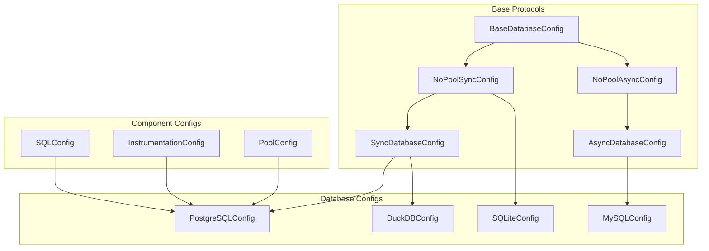
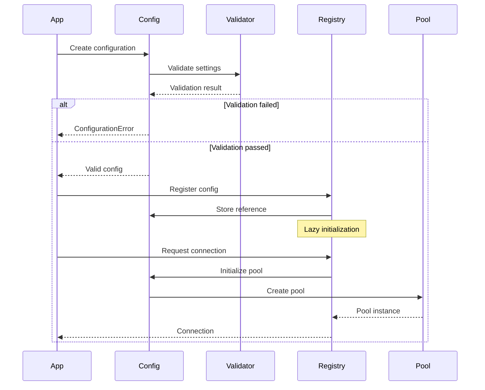

# Configuration Architecture

## Overview

SQLSpec's configuration system is a sophisticated, type-safe hierarchy that provides fine-grained control over every aspect of database connectivity, SQL processing, and instrumentation. The system follows a composable design where configurations can be merged, overridden, and validated at compile time.

## Configuration Hierarchy



## Core Configuration Types

### Base Database Configuration

The foundation of all database configurations:

```python
from typing import Protocol, TypeVar, Generic
from sqlspec.driver import ConnectionT, DriverT

class BaseDatabaseConfig(Protocol[ConnectionT, DriverT]):
    """Base protocol for all database configurations."""

    # Connection settings
    url: str
    connect_timeout: float
    command_timeout: float

    # Component configurations
    statement_config: SQLConfig
    instrumentation: InstrumentationConfig

    # Factory methods
    def create_connection(self) -> ConnectionT: ...
    def provide_connection(self) -> ContextManager[ConnectionT]: ...
    def provide_session(self) -> ContextManager[DriverT]: ...
```

### Connection Pool Configuration

For databases supporting connection pooling:

```python
@dataclass
class PoolConfig:
    """Connection pool configuration."""

    # Pool sizing
    min_size: int = 0
    max_size: int = 10

    # Connection lifecycle
    max_lifetime: float = 3600.0  # 1 hour
    idle_timeout: float = 600.0   # 10 minutes

    # Pool behavior
    acquire_timeout: float = 30.0
    retry_attempts: int = 3
    retry_delay: float = 0.1

    # Health checks
    pre_ping: bool = True
    ping_interval: float = 60.0

    # Advanced
    overflow: int = 10
    recycle: float = -1.0
    echo_pool: bool = False
```

### SQL Processing Configuration

Controls how SQL statements are processed:

```python
@dataclass
class SQLConfig:
    """SQL processing configuration."""

    # Parsing
    parse_sql: bool = True
    dialect: Optional[str] = None
    parser_timeout: float = 5.0

    # Validation
    enable_validation: bool = True
    strict_mode: bool = False
    allow_ddl: bool = False
    allow_transactions: bool = True

    # Parameter handling
    parameter_style: ParameterStyle = ParameterStyle.AUTO
    allowed_parameter_styles: Optional[tuple[str, ...]] = None
    target_parameter_style: Optional[str] = None
    allow_mixed_parameter_styles: bool = False

    # Transformation
    enable_transformation: bool = True
    optimize_queries: bool = False
    parameterize_literals: bool = True

    # Security
    max_query_length: int = 1_000_000
    max_parameter_count: int = 10_000
    forbidden_keywords: set[str] = field(default_factory=set)

    # Performance
    max_join_count: int = 10
    warn_on_cartesian_product: bool = True
    explain_analyze_threshold: Optional[float] = None
```

### Instrumentation Configuration

Comprehensive observability settings:

```python
@dataclass
class InstrumentationConfig:
    """Instrumentation and telemetry configuration."""

    # Logging
    log_queries: bool = False
    log_parameters: bool = False
    log_results: bool = False
    log_level: str = "INFO"
    query_log_max_length: int = 1000

    # OpenTelemetry
    enable_opentelemetry: bool = False
    otel_service_name: str = "sqlspec"
    otel_span_prefix: str = "db"
    otel_export_endpoint: Optional[str] = None

    # Prometheus
    enable_prometheus: bool = False
    prometheus_prefix: str = "sqlspec"
    prometheus_buckets: tuple[float, ...] = (
        0.005, 0.01, 0.025, 0.05, 0.1, 0.25, 0.5, 1.0, 2.5, 5.0
    )

    # Performance tracking
    slow_query_threshold: float = 1.0
    track_connection_pool: bool = True
    track_transaction_duration: bool = True

    # Error handling
    include_traceback_in_spans: bool = False
    sanitize_parameters: bool = True
    max_error_message_length: int = 1000
```

## Database-Specific Configurations

### PostgreSQL Configuration

```python
@dataclass
class PostgreSQLConfig(AsyncDatabaseConfig[AsyncpgConnection, AsyncpgDriver]):
    """PostgreSQL-specific configuration."""

    # Connection
    host: Optional[str] = None
    port: Optional[int] = None
    database: Optional[str] = None
    user: Optional[str] = None
    password: Optional[str] = None

    # PostgreSQL specific
    ssl_mode: str = "prefer"
    ssl_cert: Optional[str] = None
    ssl_key: Optional[str] = None
    ssl_rootcert: Optional[str] = None

    # Performance
    statement_cache_size: int = 100
    prepared_statement_cache_size: int = 0

    # Server settings
    server_settings: dict[str, str] = field(default_factory=dict)

    # Parameter styles
    supported_parameter_styles: ClassVar[tuple[str, ...]] = ("numeric",)
    preferred_parameter_style: ClassVar[str] = "numeric"

    def __post_init__(self):
        # Build URL from components if not provided
        if not self.url and self.host:
            self.url = self._build_url()

        # Validate SSL settings
        if self.ssl_mode == "require":
            self._validate_ssl_settings()
```

### MySQL Configuration

```python
@dataclass
class MySQLConfig(AsyncDatabaseConfig[AsyncmyConnection, AsyncmyDriver]):
    """MySQL-specific configuration."""

    # MySQL specific
    charset: str = "utf8mb4"
    collation: str = "utf8mb4_unicode_ci"
    use_unicode: bool = True

    # Performance
    autocommit: bool = False
    cache_sha2_password: bool = True

    # Parameter styles
    supported_parameter_styles: ClassVar[tuple[str, ...]] = ("pyformat",)
    preferred_parameter_style: ClassVar[str] = "pyformat"
```

## Configuration Composition

### Merging Configurations

Configurations can be merged to create specialized variants:

```python
# Base configuration with common settings
base_config = PostgreSQLConfig(
    pool_size=20,
    instrumentation=InstrumentationConfig(
        enable_opentelemetry=True,
        enable_prometheus=True,
        slow_query_threshold=0.5
    ),
    statement_config=SQLConfig(
        strict_mode=True,
        enable_validation=True
    )
)

# Development configuration
dev_config = base_config.merge({
    "url": "postgresql://localhost/dev_db",
    "instrumentation": {
        "log_queries": True,
        "log_parameters": True,
        "log_results": True
    }
})

# Production configuration
prod_config = base_config.merge({
    "url": "postgresql://prod.db.company.com/app",
    "pool_size": 100,
    "ssl_mode": "require",
    "statement_config": {
        "explain_analyze_threshold": 1.0
    }
})
```

### Configuration Validation

All configurations are validated at construction time:

```python
try:
    config = PostgreSQLConfig(
        url="invalid://url",
        pool_size=-1,  # Invalid!
        instrumentation=InstrumentationConfig(
            prometheus_buckets=[]  # Invalid!
        )
    )
except ConfigurationError as e:
    print(f"Invalid configuration: {e}")
    # Detailed validation errors with paths
    for error in e.errors:
        print(f"  - {error.path}: {error.message}")
```

## Environment-Based Configuration

### Environment Variable Loading

```python
from sqlspec.config import load_from_env

# Automatically load from environment
config = load_from_env(
    PostgreSQLConfig,
    prefix="DB_",
    mapping={
        "DB_HOST": "host",
        "DB_PORT": ("port", int),
        "DB_POOL_SIZE": ("pool_size", int),
        "DB_SLOW_QUERY_THRESHOLD": ("instrumentation.slow_query_threshold", float)
    }
)
```

### Configuration Files

```python
# Load from YAML
from sqlspec.config import load_from_yaml

config = load_from_yaml("config/database.yaml", PostgreSQLConfig)
```

```yaml
# config/database.yaml
url: postgresql://localhost/app
pool_size: 50
instrumentation:
  enable_opentelemetry: true
  slow_query_threshold: 0.5
statement_config:
  strict_mode: true
  max_query_length: 50000
```

## Dynamic Configuration

### Runtime Updates

Some configuration aspects can be updated at runtime:

```python
# Update instrumentation dynamically
config.instrumentation.log_queries = True
config.instrumentation.slow_query_threshold = 0.1

# Update pool size (requires pool recreation)
config.update_pool_size(new_size=200)
```

### Feature Flags

```python
@dataclass
class FeatureFlags:
    """Runtime feature toggles."""

    enable_query_cache: bool = False
    enable_result_streaming: bool = True
    enable_automatic_retry: bool = True
    enable_circuit_breaker: bool = False

# Toggle features at runtime
config.features.enable_query_cache = True
```

## Configuration Best Practices

### 1. Layered Configuration

```python
# defaults.py
DEFAULT_CONFIG = {
    "pool_size": 20,
    "instrumentation": {
        "enable_prometheus": True
    }
}

# environment.py
ENV_CONFIG = {
    "development": {
        "instrumentation": {
            "log_queries": True
        }
    },
    "production": {
        "pool_size": 100,
        "ssl_mode": "require"
    }
}

# application.py
def create_config(env: str) -> PostgreSQLConfig:
    config_dict = deep_merge(
        DEFAULT_CONFIG,
        ENV_CONFIG.get(env, {}),
        load_from_env()
    )
    return PostgreSQLConfig(**config_dict)
```

### 2. Validation Guards

```python
def create_production_config() -> PostgreSQLConfig:
    config = PostgreSQLConfig(...)

    # Enforce production requirements
    assert config.ssl_mode == "require", "SSL required in production"
    assert not config.instrumentation.log_parameters, "Parameter logging forbidden"
    assert config.pool_size >= 50, "Insufficient pool size for production"

    return config
```

### 3. Configuration Documentation

```python
@dataclass
class MyAppDatabaseConfig(PostgreSQLConfig):
    """Application-specific database configuration.

    Environment Variables:
        DB_URL: Database connection URL (required)
        DB_POOL_SIZE: Connection pool size (default: 20)
        DB_SLOW_QUERY_MS: Slow query threshold in ms (default: 1000)

    Example:
        config = MyAppDatabaseConfig(
            url=os.environ["DB_URL"],
            pool_size=int(os.environ.get("DB_POOL_SIZE", "20"))
        )
    """
```

## Configuration Lifecycle



## Performance Implications

### Configuration Caching

```python
# Configurations are immutable and cached
config1 = PostgreSQLConfig(url="...")
config2 = PostgreSQLConfig(url="...")
assert config1 is not config2  # Different instances

# But registry caches them
spec.register_config(config1, "db")
assert spec.get_config("db") is config1  # Same instance
```

### Lazy Initialization

```python
# Pool not created until first use
config = PostgreSQLConfig(url="...", pool_size=100)
# No database connection yet

with config.provide_connection() as conn:
    # Pool created now
    pass
```

## Next Steps

- [Type System](./04-type-system.md) - Understanding SQLSpec's type safety
- [Driver Architecture](../drivers/05-driver-architecture.md) - How drivers use configurations
- [Parameter Handling](../security/14-parameter-handling.md) - Parameter style configuration

---

[← Registry System](./02-registry-system.md) | [Type System →](./04-type-system.md)
