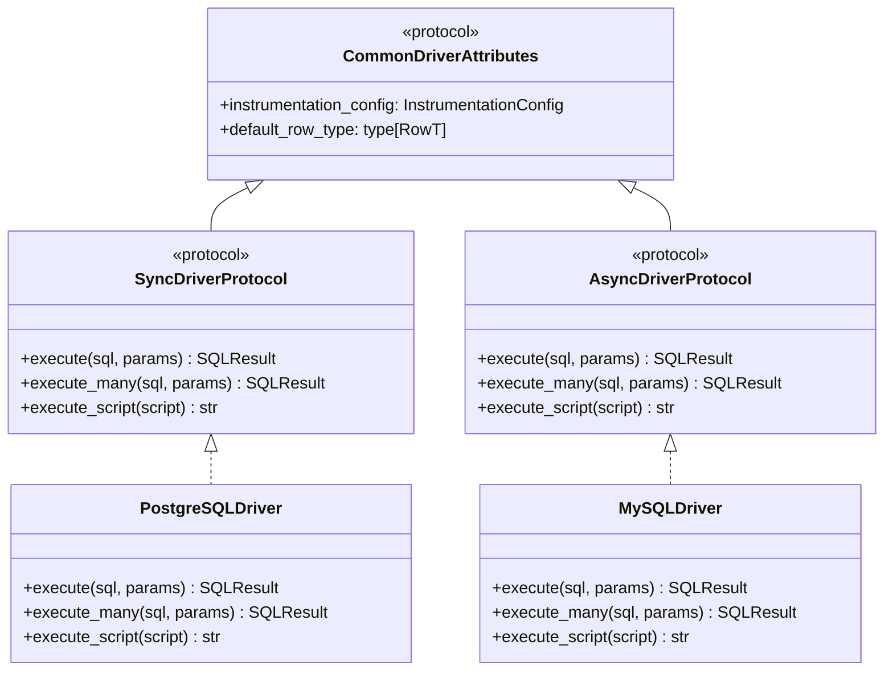
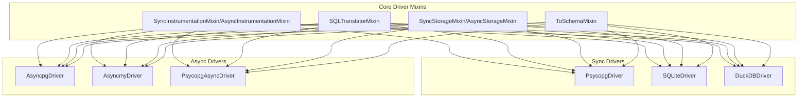

# Driver Architecture

## Overview

SQLSpec's driver architecture is built on a protocol-based design that provides a unified interface for database operations while allowing each database adapter to leverage its specific features and optimizations. This architecture ensures type safety, consistent behavior, and excellent performance across all supported databases.

## Core Design Principles

### Protocol-Based Design

Instead of using abstract base classes, SQLSpec defines driver behavior through protocols:



### Standardized Execution Pattern

All drivers follow a mandatory four-method execution pattern:

```python
class BaseDriver:
    """Example of standardized execution pattern."""

    def _execute_statement(
        self,
        statement: SQL,
        connection: Optional[ConnectionT] = None,
        **kwargs: Any
    ) -> Any:
        """Main dispatch method - relies solely on SQL object state."""
        # Ensure SQL is processed through pipeline
        statement._ensure_processed()

        # Dispatch based on SQL object state
        if statement.is_script:
            return self._execute_script(
                statement.to_sql(),
                self._connection(connection),
                **kwargs
            )
        elif statement.is_many:
            return self._execute_many(
                statement.to_sql(),
                statement.parameters,
                self._connection(connection),
                **kwargs
            )
        else:
            return self._execute(
                statement.to_sql(),
                statement.parameters,
                self._connection(connection),
                **kwargs
            )

    def _execute(
        self,
        sql: str,
        parameters: SQLParameterType,
        connection: ConnectionT,
        **kwargs: Any
    ) -> Any:
        """Execute single statement."""
        ...

    def _execute_many(
        self,
        sql: str,
        parameters: Sequence[SQLParameterType],
        connection: ConnectionT,
        **kwargs: Any
    ) -> Any:
        """Execute statement multiple times with different parameters."""
        ...

    def _execute_script(
        self,
        sql: str,
        connection: ConnectionT,
        **kwargs: Any
    ) -> Any:
        """Execute multi-statement script."""
        ...
```

## Driver Protocol Definition

### Sync Driver Protocol

```python
from typing import Protocol, Optional, Any, Union

class SyncDriverAdapterProtocol(
    CommonDriverAttributes,
    Protocol[ConnectionT, RowT]
):
    """Protocol for synchronous database drivers."""

    # Core execution methods
    def execute(
        self,
        sql: Union[str, SQL],
        parameters: Optional[Any] = None,
        *,
        schema_type: Optional[type[SchemaT]] = None,
        **kwargs: Any
    ) -> SQLResult[Union[SchemaT, RowT]]:
        """Execute SQL and return typed results."""
        ...

    def execute_many(
        self,
        sql: Union[str, SQL],
        parameters: list[Any],
        **kwargs: Any
    ) -> SQLResult[RowT]:
        """Execute SQL multiple times with different parameters."""
        ...

    def execute_script(
        self,
        script: str,
        **kwargs: Any
    ) -> str:
        """Execute multi-statement script."""
        ...

    # Data export methods
    def fetch_arrow_table(
        self,
        sql: Union[str, SQL],
        parameters: Optional[Any] = None,
        **kwargs: Any
    ) -> ArrowResult:
        """Execute SELECT and return Arrow table."""
        ...

    def to_parquet(
        self,
        sql: Union[str, SQL],
        path: Union[str, Path],
        parameters: Optional[Any] = None,
        **kwargs: Any
    ) -> None:
        """Execute and export to Parquet file."""
        ...
```

### Async Driver Protocol

```python
class AsyncDriverAdapterProtocol(
    CommonDriverAttributes,
    Protocol[ConnectionT, RowT]
):
    """Protocol for asynchronous database drivers."""

    async def execute(
        self,
        sql: Union[str, SQL],
        parameters: Optional[Any] = None,
        *,
        schema_type: Optional[type[SchemaT]] = None,
        **kwargs: Any
    ) -> SQLResult[Union[SchemaT, RowT]]:
        """Execute SQL asynchronously."""
        ...

    async def execute_many(
        self,
        sql: Union[str, SQL],
        parameters: list[Any],
        **kwargs: Any
    ) -> SQLResult[RowT]:
        """Execute SQL multiple times asynchronously."""
        ...

    # ... similar async versions of all methods
```

## Mixin Architecture

Drivers compose functionality through mixins located in `sqlspec.driver.mixins`:



All driver mixins are now centralized in `sqlspec.driver.mixins` for better organization:

- `_instrumentation.py` - Telemetry and logging mixins
- `_sql_translator.py` - SQL dialect translation
- `_unified_storage.py` - Storage operations (replaces old Arrow/Export/Copy mixins)
- `_result_utils.py` - Result conversion utilities

### Instrumentation Mixin

Provides comprehensive telemetry with correlation tracking:

```python
from sqlspec.driver.mixins import SyncInstrumentationMixin
from sqlspec.utils.telemetry import instrument_operation
from sqlspec.utils.logging import get_logger

class SyncInstrumentationMixin:
    """Adds instrumentation to sync drivers."""

    def __init__(self, *args, **kwargs):
        super().__init__(*args, **kwargs)
        self.logger = get_logger(f"adapters.{self.__class__.__name__}")

    def execute(self, sql, parameters=None, **kwargs):
        """Execute with full instrumentation."""
        with instrument_operation(
            self,
            f"{self.dialect}_execute",
            "database",
            sql_length=len(sql),
            has_parameters=bool(parameters),
        ) as ctx:
            if self.instrumentation_config.log_queries:
                self.logger.debug("Executing SQL: %s", sql[:1000])

            if self.instrumentation_config.log_parameters and parameters:
                self.logger.debug("Query parameters: %s", parameters)

            try:
                result = super().execute(sql, parameters, **kwargs)

                if self.instrumentation_config.log_results_count:
                    self.logger.debug(
                        "Query affected %d rows",
                        getattr(result, 'rows_affected', -1)
                    )

                return result
            except Exception as e:
                self.logger.exception(
                    "Database error: %s",
                    e,
                    extra={"error_type": type(e).__name__}
                )
                raise
```

### Correlation Tracking

All operations automatically include correlation IDs:

```python
from sqlspec.utils.correlation import CorrelationContext

# Correlation ID flows through all operations
with CorrelationContext.context() as correlation_id:
    # All logs and spans include this ID
    result = driver.execute("SELECT * FROM users")
```

### SQL Translator Mixin

Handles dialect translation:

```python
class SQLTranslatorMixin(Generic[ConnectionT]):
    """Translates SQL between dialects."""

    def _translate_sql(
        self,
        sql: str,
        source_dialect: Optional[str] = None,
        target_dialect: Optional[str] = None
    ) -> str:
        """Translate SQL between dialects if needed."""
        if not target_dialect:
            target_dialect = self.dialect

        if source_dialect == target_dialect:
            return sql

        # Parse with source dialect
        ast = sqlglot.parse_one(sql, dialect=source_dialect)

        # Generate with target dialect
        return ast.sql(dialect=target_dialect)
```

### Unified Storage Mixin

Replaces multiple old mixins with a single comprehensive storage interface:

```python
from sqlspec.driver.mixins import SyncStorageMixin

class SyncStorageMixin:
    """Unified storage operations for sync drivers."""

    def fetch_arrow_table(
        self,
        query: str
    ) -> pa.Table:
        """Execute SELECT and return Arrow table directly."""
        # Intelligent routing - use native if available
        if hasattr(self.connection, 'fetch_arrow'):
            return self._native_arrow_fetch(query)
        else:
            return self._generic_arrow_fetch(query)

    def export_to_storage(
        self,
        query: str,
        destination_uri: str,
        storage_key: Optional[str] = None,
        **kwargs: Any
    ) -> int:
        """Export query results directly to storage.

        Args:
            query: SQL query string to execute
            destination_uri: Target storage URI
            storage_key: Optional storage backend key
            **kwargs: Additional format-specific options

        Returns:
            Number of rows exported
        """
        # Auto-detect format from URI
        format = self._detect_format(destination_uri)

        # Use native export if available
        if self._has_native_capability('export', destination_uri, format):
            return self._native_export(query, destination_uri, format, **kwargs)
        else:
            # Fallback to storage backend
            return self._storage_backend_export(query, destination_uri, storage_key, **kwargs)

    def copy_from(
        self,
        table: str,
        source: Union[str, Path, BytesIO],
        format: str = "csv",
        **kwargs: Any
    ) -> CopyResult:
        """High-performance bulk import."""
        # Use native COPY if available (PostgreSQL, DuckDB)
        if hasattr(self.connection, 'copy_expert'):
            return self._native_copy_from(table, source, format, **kwargs)
        else:
            return self._generic_copy_from(table, source, format, **kwargs)
```

### Schema Conversion Mixin

Automatically converts results to Pydantic/msgspec models:

```python
from sqlspec.driver.mixins import ToSchemaMixin

class ToSchemaMixin:
    """Converts database results to schema types."""

    def to_schema(
        self,
        data: Sequence[dict[str, Any]],
        schema_type: type[SchemaT]
    ) -> Sequence[SchemaT]:
        """Convert dictionaries to schema instances."""
        # Optimized conversion based on schema type
        if is_dataclass(schema_type):
            return [schema_type(**row) for row in data]
        elif is_pydantic_model(schema_type):
            # Use Pydantic's optimized validation
            return pydantic.TypeAdapter(list[schema_type]).validate_python(data)
        elif is_msgspec_struct(schema_type):
            # Use msgspec's high-performance conversion
            return msgspec.convert(data, list[schema_type])
        else:
            raise TypeError(f"Unsupported schema type: {schema_type}")
```

## Database-Specific Implementations

### PostgreSQL Driver

```python
class PostgreSQLDriver(
    SyncDriverAdapterProtocol[psycopg.Connection, RowT],
    SQLTranslatorMixin[psycopg.Connection],
    SyncStorageMixin,
    SyncInstrumentationMixin,
):
    """PostgreSQL driver using psycopg."""

    dialect = "postgres"
    placeholder_style = ParameterStyle.PYFORMAT

    def _execute(
        self,
        sql: str,
        parameters: Any,
        connection: psycopg.Connection,
        **kwargs: Any
    ) -> Any:
        """Execute with PostgreSQL-specific handling."""
        with connection.cursor() as cursor:
            # Convert parameter style if needed
            sql, params = self._convert_parameters(sql, parameters)

            # Execute with proper parameter handling
            if isinstance(params, dict):
                cursor.execute(sql, params)
            elif isinstance(params, (list, tuple)):
                cursor.execute(sql, params)
            else:
                cursor.execute(sql)

            return cursor

    def _convert_parameters(
        self,
        sql: str,
        parameters: Any
    ) -> tuple[str, Any]:
        """Convert to PostgreSQL parameter style."""
        if self._has_numeric_placeholders(sql):
            # Already in $1, $2 format
            return sql, parameters

        # Convert from other formats
        return convert_parameter_style(
            sql,
            parameters,
            target_style=ParameterStyle.NUMERIC
        )
```

### SQLite Driver

```python
class SQLiteDriver(
    SyncDriverAdapterProtocol[sqlite3.Connection, RowT],
    SQLTranslatorMixin[sqlite3.Connection],
    ResultConverter,
    SyncArrowMixin[sqlite3.Connection],
    SyncExportMixin[sqlite3.Connection],
):
    """SQLite driver using stdlib sqlite3."""

    dialect = "sqlite"
    placeholder_style = ParameterStyle.QMARK

    def __init__(self, connection: sqlite3.Connection, **kwargs):
        super().__init__(connection, **kwargs)
        # Enable useful SQLite features
        connection.row_factory = sqlite3.Row
        connection.execute("PRAGMA foreign_keys = ON")

    def _execute(
        self,
        sql: str,
        parameters: Any,
        connection: sqlite3.Connection,
        **kwargs: Any
    ) -> Any:
        """Execute with SQLite-specific handling."""
        cursor = connection.cursor()

        # SQLite uses ? placeholders
        if parameters is not None:
            if isinstance(parameters, dict):
                # Convert dict to positional
                sql, params = self._dict_to_positional(sql, parameters)
                cursor.execute(sql, params)
            else:
                cursor.execute(sql, parameters)
        else:
            cursor.execute(sql)

        return cursor
```

## Connection Management

### Connection Context

Drivers manage connections through context managers:

```python
class ConnectionContext:
    """Manages connection lifecycle."""

    def __init__(self, driver: BaseDriver, connection: Optional[ConnectionT]):
        self.driver = driver
        self.provided_connection = connection
        self.owned_connection: Optional[ConnectionT] = None

    def __enter__(self) -> ConnectionT:
        if self.provided_connection:
            return self.provided_connection

        # Create new connection
        self.owned_connection = self.driver.create_connection()
        return self.owned_connection

    def __exit__(self, exc_type, exc_val, exc_tb):
        if self.owned_connection:
            try:
                if exc_type:
                    self.owned_connection.rollback()
                else:
                    self.owned_connection.commit()
            finally:
                self.owned_connection.close()
```

### Transaction Management

Drivers provide transaction control:

```python
class TransactionalDriver:
    """Mixin for transaction support."""

    @contextmanager
    def transaction(
        self,
        isolation_level: Optional[str] = None
    ) -> Generator[Transaction, None, None]:
        """Execute within transaction."""
        with self.provide_connection() as conn:
            # Set isolation level if specified
            if isolation_level:
                self._set_isolation_level(conn, isolation_level)

            # Begin transaction
            trans = conn.begin()

            try:
                yield trans
                trans.commit()
            except Exception:
                trans.rollback()
                raise
```

## Parameter Handling

### Parameter Style Conversion

Each database has its preferred parameter style:

```python
class ParameterConverter:
    """Converts between parameter styles."""

    STYLE_MAP = {
        "postgres": ParameterStyle.NUMERIC,      # $1, $2
        "mysql": ParameterStyle.PYFORMAT,        # %s
        "sqlite": ParameterStyle.QMARK,          # ?
        "oracle": ParameterStyle.NAMED_COLON,    # :name
    }

    def convert(
        self,
        sql: str,
        parameters: Any,
        source_style: ParameterStyle,
        target_style: ParameterStyle
    ) -> tuple[str, Any]:
        """Convert SQL and parameters between styles."""
        if source_style == target_style:
            return sql, parameters

        # Parse SQL to find placeholders
        placeholders = self._find_placeholders(sql, source_style)

        # Convert based on styles
        if target_style == ParameterStyle.NUMERIC:
            return self._to_numeric(sql, parameters, placeholders)
        elif target_style == ParameterStyle.QMARK:
            return self._to_qmark(sql, parameters, placeholders)
        # ... other conversions
```

## Result Handling

### Result Wrapping

All results are wrapped in type-safe containers:

```python
def _wrap_select_result(
    self,
    statement: SQL,
    cursor: Any,
    schema_type: Optional[type[SchemaT]] = None,
    **kwargs: Any
) -> SQLResult[Union[SchemaT, RowT]]:
    """Wrap SELECT results with type information."""
    # Fetch all results
    rows = cursor.fetchall()

    # Get column information
    column_names = [desc[0] for desc in cursor.description or []]

    # Convert to dicts if needed
    if hasattr(cursor, "row_factory") and cursor.row_factory:
        # Already dict-like
        data = list(rows)
    else:
        # Convert tuples to dicts
        data = [
            dict(zip(column_names, row))
            for row in rows
        ]

    # Apply schema conversion if requested
    if schema_type:
        data = list(self.to_schema(data, schema_type))

    return SQLResult(
        statement=statement,
        data=data,
        rows_affected=-1,  # SELECT doesn't affect rows
        column_names=column_names,
        operation_type="SELECT"
    )
```

## Error Handling

### Database Error Mapping

Drivers map database-specific errors to common types:

```python
class ErrorMapper:
    """Maps database errors to common exceptions."""

    ERROR_MAP = {
        # PostgreSQL
        "23505": IntegrityError,  # unique_violation
        "23503": IntegrityError,  # foreign_key_violation
        "42P01": ProgrammingError,  # undefined_table

        # MySQL
        "1062": IntegrityError,   # Duplicate entry
        "1452": IntegrityError,   # FK constraint
        "1146": ProgrammingError,  # Table doesn't exist
    }

    @contextmanager
    def wrap_database_errors(self):
        """Context manager to wrap database errors."""
        try:
            yield
        except self.database_error_type as e:
            # Extract error code
            code = self._extract_error_code(e)

            # Map to common exception
            exc_class = self.ERROR_MAP.get(code, DatabaseError)

            # Raise with original context
            raise exc_class(str(e)) from e
```

## Performance Optimizations

### Prepared Statements

Drivers can use prepared statements for performance:

```python
class PreparedStatementMixin:
    """Adds prepared statement support."""

    def __init__(self, *args, **kwargs):
        super().__init__(*args, **kwargs)
        self._prepared_cache: dict[str, Any] = {}

    def prepare(
        self,
        name: str,
        sql: str,
        parameter_types: Optional[list[type]] = None
    ) -> PreparedStatement:
        """Prepare statement for repeated execution."""
        if name in self._prepared_cache:
            return self._prepared_cache[name]

        with self.provide_connection() as conn:
            stmt = conn.prepare(sql, parameter_types)
            self._prepared_cache[name] = stmt
            return stmt

    def execute_prepared(
        self,
        name: str,
        parameters: Any,
        **kwargs: Any
    ) -> SQLResult[RowT]:
        """Execute prepared statement."""
        stmt = self._prepared_cache.get(name)
        if not stmt:
            raise ValueError(f"Statement {name} not prepared")

        return self._wrap_result(stmt.execute(parameters))
```

### Batch Operations

Efficient batch operations:

```python
def _execute_many(
    self,
    sql: str,
    parameters: Sequence[Any],
    connection: ConnectionT,
    **kwargs: Any
) -> Any:
    """Optimized batch execution."""
    # Use database-specific batch methods
    if hasattr(connection, "executemany"):
        # Direct batch execution
        cursor = connection.cursor()
        cursor.executemany(sql, parameters)
        return cursor

    # Fall back to loop
    total_affected = 0
    for params in parameters:
        result = self._execute(sql, params, connection)
        total_affected += result.rowcount or 0

    return MockCursor(rowcount=total_affected)
```

## Testing Drivers

### Driver Test Suite

All drivers must pass a common test suite with proper mocking:

```python
from unittest.mock import MagicMock
import pytest

class DriverTestSuite:
    """Common tests for all drivers."""

    @pytest.fixture
    def mock_connection(self):
        """Create mock connection with context manager support."""
        conn = MagicMock()
        # CRITICAL: Use MagicMock for context managers
        conn.__enter__ = MagicMock(return_value=conn)
        conn.__exit__ = MagicMock(return_value=None)
        return conn

    @pytest.fixture
    def driver(self, mock_connection) -> BaseDriver:
        """Driver instance with mocked connection."""
        from sqlspec.config import InstrumentationConfig
        config = self.get_config()
        return self.driver_class(
            connection=mock_connection,
            config=config,
            instrumentation_config=InstrumentationConfig(),
        )

    def test_execute_with_instrumentation(self, driver, mock_connection):
        """Test execution includes instrumentation."""
        # Arrange
        mock_cursor = MagicMock()
        mock_connection.cursor.return_value = mock_cursor
        mock_cursor.fetchall.return_value = [(1, "test")]
        mock_cursor.description = [("id",), ("name",)]

        sql = SQL("SELECT * FROM users WHERE id = ?", (1,))

        # Act
        with patch('sqlspec.utils.telemetry.instrument_operation') as mock_instrument:
            result = driver.execute(sql)

        # Assert
        mock_instrument.assert_called_once()
        assert driver.instrumentation_config.log_queries  # Should log by default

    def test_unified_storage_operations(self, driver):
        """Test unified storage mixin methods."""
        # All drivers should have these methods from SyncStorageMixin
        assert hasattr(driver, 'fetch_arrow_table')
        assert hasattr(driver, 'export_to_storage')
        assert hasattr(driver, 'import_from_storage')
        assert hasattr(driver, 'copy_from')
        assert hasattr(driver, 'copy_to')

    def test_parameter_style_injection(self, driver):
        """Test automatic parameter style configuration."""
        # The driver's config should inject parameter styles
        with driver.config.provide_session() as session:
            sql_config = session.config
            assert sql_config.allowed_parameter_styles is not None
            assert sql_config.target_parameter_style is not None
```

## Best Practices

### 1. Always Use Connection Context

```python
# Bad - manual connection management
conn = driver.create_connection()
try:
    result = driver.execute(sql, connection=conn)
finally:
    conn.close()

# Good - automatic management
with driver.provide_connection() as conn:
    result = driver.execute(sql, connection=conn)
```

### 2. Respect Parameter Styles

```python
# Bad - hardcoded style
sql = "SELECT * FROM users WHERE id = $1"

# Good - use driver's style
placeholder = driver.get_placeholder(0)
sql = f"SELECT * FROM users WHERE id = {placeholder}"
```

### 3. Handle Database Quirks

```python
class MyDriver(BaseDriver):
    """Driver with database-specific handling."""

    def _execute(self, sql, parameters, connection, **kwargs):
        # Handle database quirks
        if self._is_mysql_insert(sql):
            # MySQL returns last insert ID differently
            cursor = super()._execute(sql, parameters, connection)
            cursor.lastrowid = connection.insert_id()
            return cursor

        return super()._execute(sql, parameters, connection)
```

## Next Steps

- [Adapter Implementation](./06-adapter-implementation.md) - Building new adapters
- [Connection Management](./07-connection-management.md) - Pool management
- [Security Architecture](../security/12-security-architecture.md) - Security in drivers

---

[← Type System](../core/04-type-system.md) | [Adapter Implementation →](./06-adapter-implementation.md)
