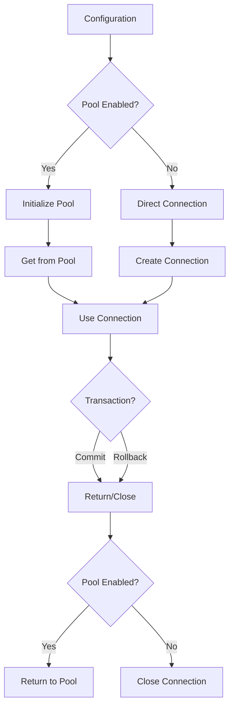

# Connection and Pool Management

## Introduction

SQLSpec provides sophisticated connection management capabilities that handle everything from simple single connections to high-performance connection pools. This document covers the architecture, configuration, and best practices for managing database connections effectively.

## Connection Lifecycle

Understanding the connection lifecycle is crucial for proper resource management:



## Configuration Hierarchy

SQLSpec uses a hierarchical configuration system for connection management:

### Base Configuration Classes

```python
from dataclasses import dataclass
from typing import Optional

@dataclass
class NoPoolSyncConfig:
    """Base for synchronous connections without pooling."""
    url: Optional[str] = None
    autocommit: bool = False
    echo: bool = False

    # Connection settings
    connect_timeout: float = 10.0
    command_timeout: Optional[float] = None

    # Instrumentation
    instrumentation: InstrumentationConfig = field(
        default_factory=InstrumentationConfig
    )

@dataclass
class SyncDatabaseConfig(NoPoolSyncConfig):
    """Adds connection pooling to sync config."""
    # Pool configuration
    pool_size: int = 10
    max_overflow: int = 20
    pool_timeout: float = 30.0
    pool_recycle: int = 3600  # Recycle connections after 1 hour
    pool_pre_ping: bool = True  # Test connections before use
```

### Pool Configuration Options

```python
from sqlspec.adapters.postgresql import PostgreSQLConfig

config = PostgreSQLConfig(
    url="postgresql://localhost/mydb",

    # Connection pool settings
    pool_size=20,           # Core pool size
    max_overflow=10,        # Additional connections under load
    pool_timeout=30.0,      # Max wait for connection
    pool_recycle=1800,      # Recycle after 30 minutes
    pool_pre_ping=True,     # Validate before use

    # Connection behavior
    autocommit=False,       # Manual transaction control
    connect_timeout=5.0,    # Connection establishment timeout
    command_timeout=30.0,   # Query execution timeout
)
```

## Connection Factory Methods

SQLSpec provides multiple ways to obtain connections:

### Direct Connection Creation

```python
from sqlspec import SQLSpec

sqlspec = SQLSpec()
sqlspec.register_config(config, name="primary")

# Method 1: Direct connection (manual management)
connection = sqlspec.create_connection("primary")
try:
    cursor = connection.cursor()
    cursor.execute("SELECT 1")
    result = cursor.fetchone()
finally:
    connection.close()

# Method 2: Context-managed connection
with sqlspec.get_connection("primary") as conn:
    cursor = conn.cursor()
    cursor.execute("SELECT 1")
    result = cursor.fetchone()
```

### Session-Based Access

```python
# Method 3: Session (recommended)
with sqlspec.get_session("primary") as session:
    result = session.execute("SELECT * FROM users").all()

# Method 4: Async session
async with sqlspec.get_async_session("primary") as session:
    result = await session.execute("SELECT * FROM users").all()
```

## Pool Implementation Details

### Pool Initialization

Connection pools are created lazily on first use:

```python
class PooledConnectionManager:
    """Manages a pool of database connections."""

    def __init__(self, config: SyncDatabaseConfig):
        self.config = config
        self._pool: Optional[Pool] = None
        self._lock = threading.Lock()

    def _ensure_pool(self) -> Pool:
        """Lazily initialize connection pool."""
        if self._pool is None:
            with self._lock:
                if self._pool is None:
                    self._pool = self._create_pool()
        return self._pool

    def _create_pool(self) -> Pool:
        """Create the underlying connection pool."""
        return Pool(
            creator=self._create_connection,
            pool_size=self.config.pool_size,
            max_overflow=self.config.max_overflow,
            timeout=self.config.pool_timeout,
            recycle=self.config.pool_recycle,
            pre_ping=self.config.pool_pre_ping,
        )
```

### Connection Acquisition

```python
def get_connection(self, timeout: Optional[float] = None) -> Connection:
    """Get a connection from the pool."""
    pool = self._ensure_pool()

    try:
        # Try to get connection with timeout
        connection = pool.connect(timeout=timeout)

        # Validate connection if pre-ping enabled
        if self.config.pool_pre_ping:
            self._validate_connection(connection)

        # Configure connection settings
        self._configure_connection(connection)

        return connection

    except PoolTimeout:
        raise ConnectionTimeout(
            f"Could not acquire connection within {timeout}s"
        )
```

### Connection Validation

Pre-ping validation ensures connections are alive:

```python
def _validate_connection(self, connection: Connection) -> None:
    """Validate connection is still alive."""
    try:
        # Database-specific ping
        if hasattr(connection, 'ping'):
            connection.ping()
        else:
            # Fallback: execute simple query
            cursor = connection.cursor()
            cursor.execute("SELECT 1")
            cursor.close()
    except Exception:
        # Connection is dead, remove from pool
        connection.invalidate()
        raise
```

## Transaction Management

### Manual Transaction Control

```python
with sqlspec.get_connection("primary") as conn:
    try:
        # Start transaction
        conn.begin()

        cursor = conn.cursor()
        cursor.execute("INSERT INTO users (name) VALUES (?)", ("Alice",))
        cursor.execute("UPDATE stats SET user_count = user_count + 1")

        # Commit transaction
        conn.commit()
    except Exception:
        # Rollback on error
        conn.rollback()
        raise
```

### Session-Based Transactions

```python
with sqlspec.get_session("primary") as session:
    # Session automatically manages transaction
    session.execute("INSERT INTO users (name) VALUES (?)", ("Bob",))
    session.execute("UPDATE stats SET user_count = user_count + 1")
    # Auto-commit on exit (unless exception)
```

### Nested Transactions (Savepoints)

```python
with sqlspec.get_session("primary") as session:
    # Main transaction
    session.execute("INSERT INTO orders (total) VALUES (100)")

    # Nested transaction (savepoint)
    with session.begin_nested() as sp:
        try:
            session.execute("INSERT INTO order_items (order_id, item) VALUES (?, ?)",
                          (order_id, "Item1"))
            # This might fail
            session.execute("INSERT INTO inventory (item, qty) VALUES (?, ?)",
                          ("Item1", -1))
        except Exception:
            # Only rollback to savepoint
            sp.rollback()
            # Main transaction continues
```

## Connection Pool Monitoring

### Pool Statistics

```python
from dataclasses import dataclass

@dataclass
class PoolStats:
    """Connection pool statistics."""
    size: int              # Current pool size
    checked_in: int        # Available connections
    checked_out: int       # In-use connections
    overflow: int          # Overflow connections created
    total: int             # Total connections

def get_pool_stats(config_name: str) -> PoolStats:
    """Get current pool statistics."""
    pool = sqlspec._get_pool(config_name)
    return PoolStats(
        size=pool.size(),
        checked_in=pool.checkedin(),
        checked_out=pool.checkedout(),
        overflow=pool.overflow(),
        total=pool.total()
    )
```

### Health Checks

```python
async def health_check(sqlspec: SQLSpec) -> dict[str, bool]:
    """Check health of all configured databases."""
    results = {}

    for name in sqlspec.list_configs():
        try:
            with sqlspec.get_connection(name) as conn:
                cursor = conn.cursor()
                cursor.execute("SELECT 1")
                cursor.close()
            results[name] = True
        except Exception as e:
            results[name] = False
            logger.error(f"Health check failed for {name}: {e}")

    return results
```

## Advanced Pool Management

### Dynamic Pool Sizing

```python
class AdaptivePool:
    """Pool that adjusts size based on load."""

    def __init__(self, config: PoolConfig):
        self.config = config
        self.metrics = PoolMetrics()

    def _adjust_pool_size(self):
        """Adjust pool size based on usage patterns."""
        usage = self.metrics.average_usage()

        if usage > 0.8:  # High usage
            self.config.pool_size = min(
                self.config.pool_size + 5,
                self.config.max_pool_size
            )
        elif usage < 0.2:  # Low usage
            self.config.pool_size = max(
                self.config.pool_size - 5,
                self.config.min_pool_size
            )
```

### Connection Recycling Strategies

```python
class RecyclingStrategy:
    """Custom connection recycling logic."""

    def should_recycle(self, connection: Connection) -> bool:
        """Determine if connection should be recycled."""
        # Age-based recycling
        if connection.age > self.max_age:
            return True

        # Usage-based recycling
        if connection.query_count > self.max_queries:
            return True

        # Error-based recycling
        if connection.error_count > self.max_errors:
            return True

        return False
```

## Database-Specific Considerations

### PostgreSQL

```python
class PostgreSQLPoolConfig:
    """PostgreSQL-specific pool configuration."""

    # Connection parameters
    application_name: str = "sqlspec"
    client_encoding: str = "utf8"

    # Performance settings
    prepare_threshold: int = 5  # Prepare statements after N uses
    jit: bool = True           # Enable JIT compilation

    # Pool behavior
    pool_reset_on_return: str = "rollback"  # rollback, commit, or none
```

### MySQL

```python
class MySQLPoolConfig:
    """MySQL-specific pool configuration."""

    # Connection parameters
    charset: str = "utf8mb4"
    sql_mode: str = "TRADITIONAL"

    # Pool behavior
    ping_on_checkout: bool = True  # MySQL connections timeout
    pool_recycle: int = 3600       # Shorter due to wait_timeout
```

### SQLite

```python
class SQLiteConnectionConfig:
    """SQLite connection configuration (no pooling)."""

    # Connection parameters
    check_same_thread: bool = False
    isolation_level: Optional[str] = None

    # Performance
    journal_mode: str = "WAL"
    synchronous: str = "NORMAL"
    cache_size: int = -64000  # 64MB cache
```

## Connection String Security

### Credential Management

```python
from urllib.parse import quote_plus

def build_secure_url(
    scheme: str,
    host: str,
    port: int,
    database: str,
    username: Optional[str] = None,
    password: Optional[str] = None,
    **params
) -> str:
    """Build connection URL with proper escaping."""
    url = f"{scheme}://"

    if username:
        url += quote_plus(username)
        if password:
            url += f":{quote_plus(password)}"
        url += "@"

    url += f"{host}:{port}/{database}"

    if params:
        url += "?" + "&".join(
            f"{k}={quote_plus(str(v))}" for k, v in params.items()
        )

    return url
```

### Environment-Based Configuration

```python
import os
from dataclasses import dataclass

@dataclass
class EnvironmentConfig:
    """Load configuration from environment."""

    @classmethod
    def from_env(cls, prefix: str = "DB_") -> dict[str, Any]:
        """Load config from environment variables."""
        return {
            "host": os.getenv(f"{prefix}HOST", "localhost"),
            "port": int(os.getenv(f"{prefix}PORT", "5432")),
            "database": os.getenv(f"{prefix}NAME", "postgres"),
            "user": os.getenv(f"{prefix}USER"),
            "password": os.getenv(f"{prefix}PASSWORD"),
        }
```

## Performance Optimization

### Connection Warming

```python
def warm_pool(sqlspec: SQLSpec, config_name: str, connections: int = 5):
    """Pre-create connections to warm the pool."""
    warmed = []

    try:
        # Create connections
        for _ in range(connections):
            conn = sqlspec.create_connection(config_name)

            # Execute warming query
            cursor = conn.cursor()
            cursor.execute("SELECT 1")
            cursor.close()

            warmed.append(conn)
    finally:
        # Return connections to pool
        for conn in warmed:
            conn.close()
```

### Prepared Statements

```python
class PreparedStatementCache:
    """Cache prepared statements per connection."""

    def __init__(self, max_size: int = 100):
        self.max_size = max_size
        self._cache: dict[str, PreparedStatement] = {}

    def get_or_prepare(
        self,
        connection: Connection,
        sql: str
    ) -> PreparedStatement:
        """Get cached statement or prepare new one."""
        key = hash(sql)

        if key not in self._cache:
            if len(self._cache) >= self.max_size:
                # Evict least recently used
                self._evict_lru()

            stmt = connection.prepare(sql)
            self._cache[key] = stmt

        return self._cache[key]
```

## Error Handling and Recovery

### Connection Retry Logic

```python
from typing import TypeVar, Callable
import time

T = TypeVar('T')

def with_retry(
    func: Callable[[], T],
    max_attempts: int = 3,
    backoff_factor: float = 2.0,
    max_delay: float = 30.0
) -> T:
    """Execute function with exponential backoff retry."""
    delay = 1.0

    for attempt in range(max_attempts):
        try:
            return func()
        except (ConnectionError, PoolTimeout) as e:
            if attempt == max_attempts - 1:
                raise

            time.sleep(min(delay, max_delay))
            delay *= backoff_factor
```

### Circuit Breaker Pattern

```python
class CircuitBreaker:
    """Prevent cascading failures in connection pool."""

    def __init__(
        self,
        failure_threshold: int = 5,
        recovery_timeout: float = 60.0
    ):
        self.failure_threshold = failure_threshold
        self.recovery_timeout = recovery_timeout
        self.failure_count = 0
        self.last_failure_time = None
        self.state = "closed"  # closed, open, half-open

    def call(self, func: Callable[[], T]) -> T:
        """Execute function with circuit breaker protection."""
        if self.state == "open":
            if time.time() - self.last_failure_time > self.recovery_timeout:
                self.state = "half-open"
            else:
                raise CircuitOpenError("Circuit breaker is open")

        try:
            result = func()
            if self.state == "half-open":
                self.state = "closed"
                self.failure_count = 0
            return result
        except Exception as e:
            self.record_failure()
            raise
```

## Best Practices

### 1. Use Connection Pools for Production

```python
# Development
dev_config = PostgreSQLConfig(
    url="postgresql://localhost/dev",
    pool_size=2,  # Small pool for dev
)

# Production
prod_config = PostgreSQLConfig(
    url="postgresql://prod-server/app",
    pool_size=20,
    max_overflow=10,
    pool_pre_ping=True,  # Essential for production
)
```

### 2. Configure Timeouts Appropriately

```python
config = PostgreSQLConfig(
    connect_timeout=5.0,      # Fast fail on connection
    command_timeout=30.0,     # Reasonable query timeout
    pool_timeout=10.0,        # Don't wait too long for pool
)
```

### 3. Monitor Pool Health

```python
@app.route("/health/db")
def db_health():
    """Database health endpoint."""
    stats = get_pool_stats("primary")

    health = {
        "status": "healthy" if stats.checked_in > 0 else "unhealthy",
        "connections": {
            "active": stats.checked_out,
            "idle": stats.checked_in,
            "total": stats.total,
        }
    }

    return health
```

### 4. Handle Connection Exhaustion

```python
def with_connection_fallback(sqlspec: SQLSpec):
    """Try primary connection, fall back to read replica."""
    try:
        with sqlspec.get_connection("primary", timeout=2.0) as conn:
            return conn
    except PoolTimeout:
        logger.warning("Primary pool exhausted, using replica")
        with sqlspec.get_connection("replica") as conn:
            return conn
```

## Summary

SQLSpec's connection management provides:

- **Flexible configuration** for different deployment scenarios
- **Automatic pooling** with intelligent connection reuse
- **Health monitoring** and statistics
- **Error recovery** with retry and circuit breaker patterns
- **Database-specific optimizations**

The system is designed to handle everything from simple scripts to high-traffic production applications with thousands of concurrent connections.

---

[← Adapter Implementation](./06-adapter-implementation.md) | [Pipeline Overview →](../pipeline/08-pipeline-overview.md)
