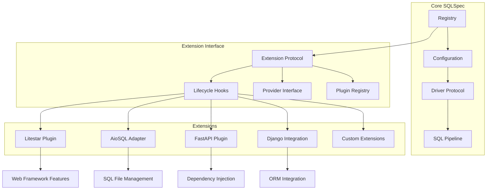

# Extension Architecture

## Introduction

SQLSpec's extension architecture provides a plugin system that allows seamless integration with web frameworks, ORMs, and other tools. Extensions can hook into SQLSpec's lifecycle, add new functionality, and provide framework-specific features while maintaining the core library's independence.

## Extension System Design



## Extension Protocol

### Base Extension Interface

```python
from typing import Protocol, Optional, Dict, Any, Type
from sqlspec.base import SQLSpec

class ExtensionProtocol(Protocol):
    """Base protocol for SQLSpec extensions."""

    # Extension metadata
    name: str
    version: str
    description: str

    def initialize(self, sqlspec: SQLSpec) -> None:
        """Initialize extension with SQLSpec instance."""
        ...

    def configure(self, config: Dict[str, Any]) -> None:
        """Configure extension with user settings."""
        ...

    def on_registry_created(self, registry: SQLSpec) -> None:
        """Hook called when SQLSpec registry is created."""
        ...

    def on_config_registered(
        self,
        config_name: str,
        config: Any
    ) -> None:
        """Hook called when a database config is registered."""
        ...

    def on_connection_created(
        self,
        connection: Any,
        config_name: str
    ) -> None:
        """Hook called when a connection is created."""
        ...

    def on_session_created(
        self,
        session: Any,
        config_name: str
    ) -> None:
        """Hook called when a session is created."""
        ...

    def cleanup(self) -> None:
        """Cleanup extension resources."""
        ...
```

### Provider Extensions

Provider extensions supply additional functionality:

```python
class ProviderExtension(ExtensionProtocol):
    """Extension that provides services to SQLSpec."""

    def get_providers(self) -> Dict[str, Type]:
        """Return provider classes this extension offers."""
        return {
            "cache": self.get_cache_provider(),
            "metrics": self.get_metrics_provider(),
            "middleware": self.get_middleware_provider()
        }

    def get_cache_provider(self) -> Optional[Type[CacheProvider]]:
        """Provide a cache implementation."""
        return None

    def get_metrics_provider(self) -> Optional[Type[MetricsProvider]]:
        """Provide a metrics collector."""
        return None

    def get_middleware_provider(self) -> Optional[Type[MiddlewareProvider]]:
        """Provide middleware for query processing."""
        return None
```

## Creating Extensions

### Basic Extension Example

```python
from dataclasses import dataclass
from typing import Optional
import logging

@dataclass
class LoggingExtension:
    """Simple logging extension for SQLSpec."""

    name: str = "sqlspec-logging"
    version: str = "1.0.0"
    description: str = "Enhanced logging for SQLSpec operations"

    log_level: str = "INFO"
    log_format: str = "%(asctime)s - %(name)s - %(levelname)s - %(message)s"

    def __post_init__(self):
        self.logger = logging.getLogger("sqlspec.extension.logging")
        self._configure_logging()

    def _configure_logging(self):
        handler = logging.StreamHandler()
        handler.setFormatter(logging.Formatter(self.log_format))
        self.logger.addHandler(handler)
        self.logger.setLevel(getattr(logging, self.log_level))

    def initialize(self, sqlspec: SQLSpec) -> None:
        self.logger.info(f"Initializing {self.name} v{self.version}")
        self.sqlspec = sqlspec

    def on_config_registered(self, config_name: str, config: Any) -> None:
        self.logger.info(
            f"Database config registered: {config_name} "
            f"(type: {type(config).__name__})"
        )

    def on_connection_created(self, connection: Any, config_name: str) -> None:
        self.logger.debug(
            f"Connection created for {config_name}: {connection}"
        )

    def on_session_created(self, session: Any, config_name: str) -> None:
        self.logger.debug(
            f"Session created for {config_name}: {session}"
        )

        # Add query logging to session
        original_execute = session.execute

        def logged_execute(sql, *args, **kwargs):
            self.logger.info(f"Executing query: {sql}")
            try:
                result = original_execute(sql, *args, **kwargs)
                self.logger.debug(f"Query completed successfully")
                return result
            except Exception as e:
                self.logger.error(f"Query failed: {e}")
                raise

        session.execute = logged_execute
```

### Advanced Extension with Providers

```python
from typing import Dict, List, Any, Optional
import time

class PerformanceMonitoringExtension(ProviderExtension):
    """Advanced extension providing performance monitoring."""

    name = "sqlspec-performance"
    version = "2.0.0"
    description = "Performance monitoring and optimization for SQLSpec"

    def __init__(self):
        self.query_stats: Dict[str, List[float]] = {}
        self.slow_queries: List[Dict[str, Any]] = []
        self.cache = QueryPlanCache()

    def initialize(self, sqlspec: SQLSpec) -> None:
        self.sqlspec = sqlspec

        # Register performance commands
        sqlspec.register_command("perf:stats", self.show_stats)
        sqlspec.register_command("perf:slow", self.show_slow_queries)
        sqlspec.register_command("perf:cache", self.show_cache_stats)

    def get_middleware_provider(self) -> Type[MiddlewareProvider]:
        return PerformanceMiddleware

    def get_cache_provider(self) -> Type[CacheProvider]:
        return self.cache

    def show_stats(self) -> Dict[str, Any]:
        """Show performance statistics."""
        stats = {}

        for query_fingerprint, timings in self.query_stats.items():
            stats[query_fingerprint] = {
                "count": len(timings),
                "avg_ms": sum(timings) / len(timings),
                "min_ms": min(timings),
                "max_ms": max(timings),
                "p95_ms": self._percentile(timings, 95)
            }

        return stats

    def show_slow_queries(self, limit: int = 10) -> List[Dict[str, Any]]:
        """Show slowest queries."""
        return sorted(
            self.slow_queries,
            key=lambda x: x["duration_ms"],
            reverse=True
        )[:limit]

class PerformanceMiddleware:
    """Middleware that monitors query performance."""

    def __init__(self, extension: PerformanceMonitoringExtension):
        self.extension = extension

    def process_query(self, context: QueryContext) -> QueryContext:
        """Monitor query execution time."""
        start_time = time.time()

        # Execute query
        result = context.execute()

        # Record timing
        duration_ms = (time.time() - start_time) * 1000
        fingerprint = self._fingerprint(context.sql)

        # Update statistics
        if fingerprint not in self.extension.query_stats:
            self.extension.query_stats[fingerprint] = []
        self.extension.query_stats[fingerprint].append(duration_ms)

        # Track slow queries
        if duration_ms > 1000:  # 1 second threshold
            self.extension.slow_queries.append({
                "sql": context.sql,
                "duration_ms": duration_ms,
                "timestamp": time.time(),
                "parameters": context.parameters
            })

        return result
```

## Extension Registration

### Manual Registration

```python
from sqlspec import SQLSpec
from myapp.extensions import CustomExtension

# Create SQLSpec instance
sqlspec = SQLSpec()

# Create and register extension
extension = CustomExtension(
    option1="value1",
    option2="value2"
)
sqlspec.register_extension(extension)

# Extension hooks will now be called automatically
```

### Automatic Discovery

```python
# setup.py entry points
setup(
    name="sqlspec-myextension",
    entry_points={
        "sqlspec.extensions": [
            "myext = myextension:MyExtension",
        ],
    },
)

# SQLSpec discovers and loads extensions automatically
sqlspec = SQLSpec(
    auto_discover_extensions=True,
    extension_config={
        "myext": {
            "enabled": True,
            "option1": "value1"
        }
    }
)
```

### Configuration-Based Loading

```python
# config.yaml
sqlspec:
  extensions:
    - name: logging
      class: sqlspec.extensions.LoggingExtension
      config:
        log_level: DEBUG

    - name: performance
      class: myapp.extensions.PerformanceExtension
      config:
        slow_query_threshold: 500

    - name: security
      enabled: false  # Disable specific extension

# Load from configuration
from sqlspec.config import load_config

config = load_config("config.yaml")
sqlspec = SQLSpec.from_config(config)
```

## Framework Integration Patterns

### Web Framework Integration

```python
class WebFrameworkExtension(ExtensionProtocol):
    """Base class for web framework integrations."""

    def create_plugin(self) -> Any:
        """Create framework-specific plugin."""
        raise NotImplementedError

    def setup_dependency_injection(self, container: Any) -> None:
        """Setup DI container integration."""
        pass

    def create_middleware(self) -> List[Any]:
        """Create framework middleware."""
        return []

    def register_handlers(self, app: Any) -> None:
        """Register request handlers."""
        pass
```

### ORM Integration

```python
class ORMIntegrationExtension(ExtensionProtocol):
    """Integrate SQLSpec with ORMs."""

    def create_session_factory(self) -> SessionFactory:
        """Create ORM session factory using SQLSpec."""
        pass

    def register_event_listeners(self) -> None:
        """Register ORM event listeners."""
        pass

    def sync_models(self, models: List[Type]) -> None:
        """Synchronize ORM models with database."""
        pass
```

## Extension Communication

### Event System

```python
from typing import Callable, List
from dataclasses import dataclass, field

@dataclass
class ExtensionEventBus:
    """Event bus for extension communication."""

    listeners: Dict[str, List[Callable]] = field(default_factory=dict)

    def on(self, event: str, handler: Callable) -> None:
        """Register event handler."""
        if event not in self.listeners:
            self.listeners[event] = []
        self.listeners[event].append(handler)

    def emit(self, event: str, *args, **kwargs) -> None:
        """Emit event to all listeners."""
        for handler in self.listeners.get(event, []):
            try:
                handler(*args, **kwargs)
            except Exception as e:
                logger.error(f"Error in event handler: {e}")

# Extension using event bus
class EventAwareExtension(ExtensionProtocol):
    def initialize(self, sqlspec: SQLSpec) -> None:
        # Subscribe to events
        sqlspec.events.on("query.executed", self.on_query_executed)
        sqlspec.events.on("error.occurred", self.on_error)

    def on_query_executed(self, sql: str, duration: float) -> None:
        # Handle query execution event
        pass

    def on_error(self, error: Exception, context: Dict) -> None:
        # Handle error event
        pass
```

### Shared State

```python
from typing import TypeVar, Generic

T = TypeVar('T')

class ExtensionState(Generic[T]):
    """Shared state container for extensions."""

    def __init__(self):
        self._state: Dict[str, T] = {}

    def set(self, key: str, value: T) -> None:
        self._state[key] = value

    def get(self, key: str, default: T = None) -> T:
        return self._state.get(key, default)

    def update(self, key: str, updater: Callable[[T], T]) -> T:
        current = self.get(key)
        new_value = updater(current)
        self.set(key, new_value)
        return new_value

# Extensions sharing state
class CacheExtension(ExtensionProtocol):
    def initialize(self, sqlspec: SQLSpec) -> None:
        # Create shared cache
        cache = LRUCache(maxsize=1000)
        sqlspec.state.set("query_cache", cache)

class MonitoringExtension(ExtensionProtocol):
    def initialize(self, sqlspec: SQLSpec) -> None:
        # Use shared cache for monitoring
        cache = sqlspec.state.get("query_cache")
        if cache:
            self.monitor_cache_performance(cache)
```

## Testing Extensions

### Extension Test Framework

```python
import pytest
from sqlspec.testing import ExtensionTestCase

class TestMyExtension(ExtensionTestCase):
    """Test custom extension."""

    def get_extension(self):
        return MyExtension(option1="test")

    def test_initialization(self, sqlspec):
        """Test extension initialization."""
        extension = self.get_extension()
        sqlspec.register_extension(extension)

        assert extension.initialized
        assert sqlspec in extension.registries

    def test_lifecycle_hooks(self, sqlspec):
        """Test lifecycle hook calls."""
        extension = self.get_extension()
        sqlspec.register_extension(extension)

        # Track hook calls
        calls = []
        extension.on_config_registered = lambda n, c: calls.append(("config", n))
        extension.on_connection_created = lambda c, n: calls.append(("conn", n))

        # Register config and create connection
        sqlspec.register_config(TestConfig(), "test")
        with sqlspec.get_connection("test") as conn:
            pass

        assert ("config", "test") in calls
        assert ("conn", "test") in calls

    @pytest.mark.asyncio
    async def test_async_extension(self, async_sqlspec):
        """Test async extension functionality."""
        extension = AsyncExtension()
        async_sqlspec.register_extension(extension)

        # Test async hooks
        await async_sqlspec.register_config_async(AsyncConfig(), "test")
        async with async_sqlspec.get_session("test") as session:
            result = await session.execute("SELECT 1")
            assert result is not None
```

### Mocking and Isolation

```python
from unittest.mock import Mock, patch

def test_extension_isolation():
    """Test extension doesn't affect core functionality."""

    # Create isolated SQLSpec instance
    sqlspec = SQLSpec()

    # Create extension that modifies behavior
    extension = Mock(spec=ExtensionProtocol)
    extension.name = "test"

    # Register extension
    sqlspec.register_extension(extension)

    # Verify core functionality unchanged
    config = Mock()
    sqlspec.register_config(config, "test")

    # Extension should be called but not break core
    extension.on_config_registered.assert_called_once_with("test", config)

    # Core functionality should work
    assert sqlspec.get_config("test") is config
```

## Best Practices

### 1. Minimal Core Dependency

```python
class GoodExtension(ExtensionProtocol):
    """Extension with minimal core dependency."""

    def initialize(self, sqlspec: SQLSpec) -> None:
        # Only store reference, don't modify core
        self.sqlspec = sqlspec

        # Add functionality through providers
        sqlspec.register_provider("custom", self.get_provider())

    def get_provider(self):
        # Return isolated provider instance
        return CustomProvider(self.config)
```

### 2. Graceful Degradation

```python
class ResilientExtension(ExtensionProtocol):
    """Extension with graceful degradation."""

    def initialize(self, sqlspec: SQLSpec) -> None:
        try:
            # Try to initialize optional features
            self._init_advanced_features()
        except ImportError:
            logger.warning(
                f"{self.name}: Advanced features unavailable, "
                "running in basic mode"
            )
            self._init_basic_features()

    def _init_advanced_features(self):
        import advanced_library
        self.advanced = advanced_library.Client()

    def _init_basic_features(self):
        self.advanced = None
```

### 3. Configuration Validation

```python
from pydantic import BaseModel, validator

class ExtensionConfig(BaseModel):
    """Validated extension configuration."""

    enabled: bool = True
    cache_size: int = 1000
    timeout: float = 30.0

    @validator('cache_size')
    def validate_cache_size(cls, v):
        if v < 0:
            raise ValueError("Cache size must be positive")
        return v

class ConfiguredExtension(ExtensionProtocol):
    """Extension with validated configuration."""

    def __init__(self, config: Dict[str, Any]):
        self.config = ExtensionConfig(**config)

    def initialize(self, sqlspec: SQLSpec) -> None:
        if not self.config.enabled:
            logger.info(f"{self.name} is disabled")
            return

        # Initialize with validated config
        self._setup_cache(self.config.cache_size)
        self._setup_timeout(self.config.timeout)
```

### 4. Extension Documentation

```python
class DocumentedExtension(ExtensionProtocol):
    """Well-documented extension.

    This extension provides caching capabilities for SQLSpec queries.

    Configuration:
        cache_size (int): Maximum number of cached queries (default: 1000)
        ttl (int): Cache TTL in seconds (default: 300)

    Usage:
        sqlspec = SQLSpec()
        extension = CacheExtension(cache_size=5000, ttl=600)
        sqlspec.register_extension(extension)

    Provides:
        - Query result caching
        - Cache statistics
        - Cache invalidation commands
    """

    name = "sqlspec-cache"
    version = "1.0.0"
    description = __doc__.split('\n')[0]

    def get_commands(self) -> Dict[str, Callable]:
        """Return CLI commands this extension provides."""
        return {
            "cache:stats": self.show_cache_stats,
            "cache:clear": self.clear_cache,
            "cache:info": self.show_cache_info
        }
```

## Summary

SQLSpec's extension architecture provides:

- **Plugin system** for adding functionality without modifying core
- **Lifecycle hooks** for integrating with SQLSpec operations
- **Provider interface** for supplying services
- **Event system** for extension communication
- **Framework integration** patterns for web frameworks and ORMs
- **Testing utilities** for extension development

The extension system enables SQLSpec to remain lightweight while supporting rich ecosystem of plugins and integrations.

---

[← Advanced Features](../15-advanced-features.md) | [Litestar Integration →](./17-litestar-integration.md)
