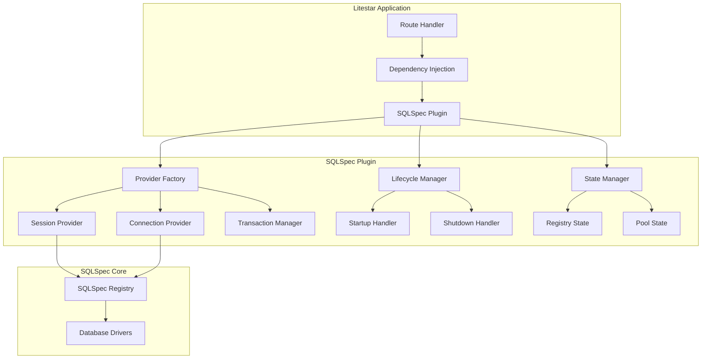

# Litestar Integration

## Introduction

The Litestar integration provides seamless database connectivity for Litestar applications through a powerful plugin system. It handles connection lifecycle, dependency injection, and provides Litestar-specific features while maintaining the full power of SQLSpec.

## Quick Start

### Basic Setup

```python
from litestar import Litestar, get
from sqlspec.extensions.litestar import SQLSpecPlugin, SQLSpecConfig
from sqlspec.adapters.postgresql import PostgreSQLConfig

# Configure databases
db_config = SQLSpecConfig(
    databases={
        "primary": PostgreSQLConfig(
            url="postgresql://localhost/myapp",
            pool_size=20
        ),
        "readonly": PostgreSQLConfig(
            url="postgresql://localhost/myapp_replica",
            pool_size=10
        )
    },
    default_database="primary"
)

# Create plugin
plugin = SQLSpecPlugin(config=db_config)

# Create Litestar app
app = Litestar(
    route_handlers=[...],
    plugins=[plugin]
)

# Use in route handlers
@get("/users")
async def get_users(db: SQLSpecSession) -> list[dict]:
    result = await db.execute("SELECT * FROM users")
    return result.all()
```

### Multiple Database Support

```python
from sqlspec.extensions.litestar import db_session

@get("/report")
async def generate_report(
    primary_db: SQLSpecSession,
    analytics_db: Annotated[SQLSpecSession, db_session("analytics")]
) -> dict:
    # Use primary database
    users = await primary_db.execute("SELECT COUNT(*) FROM users")

    # Use analytics database
    metrics = await analytics_db.execute("""
        SELECT
            DATE(created_at) as date,
            COUNT(*) as events
        FROM events
        GROUP BY 1
        ORDER BY 1 DESC
        LIMIT 30
    """)

    return {
        "total_users": users.scalar(),
        "daily_events": metrics.all()
    }
```

## Plugin Architecture

### Plugin Components



### Plugin Implementation

```python
from typing import Dict, Any, Optional
from litestar import Litestar
from litestar.plugins import InitPluginProtocol
from sqlspec import SQLSpec

class SQLSpecPlugin(InitPluginProtocol):
    """Litestar plugin for SQLSpec integration."""

    def __init__(self, config: SQLSpecConfig):
        self.config = config
        self.sqlspec: Optional[SQLSpec] = None

    def on_app_init(self, app_config: AppConfig) -> AppConfig:
        """Initialize plugin with Litestar app."""
        # Create SQLSpec registry
        self.sqlspec = self._create_registry()

        # Register providers
        app_config.dependencies.update(self._create_providers())

        # Add lifecycle hooks
        app_config.on_startup.append(self._on_startup)
        app_config.on_shutdown.append(self._on_shutdown)

        # Store in app state
        app_config.state.sqlspec = self.sqlspec

        return app_config

    def _create_registry(self) -> SQLSpec:
        """Create and configure SQLSpec registry."""
        registry = SQLSpec()

        # Register all database configurations
        for name, db_config in self.config.databases.items():
            registry.register_config(db_config, name=name)

        return registry

    def _create_providers(self) -> Dict[str, Any]:
        """Create dependency injection providers."""
        return {
            "db": Provide(self._provide_default_session),
            "db_connection": Provide(self._provide_default_connection),
            **self._create_named_providers()
        }

    async def _provide_default_session(
        self,
        state: State,
        scope: Scope
    ) -> AsyncGenerator[SQLSpecSession, None]:
        """Provide default database session."""
        sqlspec = state.sqlspec
        db_name = self.config.default_database

        async with sqlspec.get_session(db_name) as session:
            # Store in scope for nested access
            scope["sqlspec_session"] = session
            yield session
```

## Dependency Injection

### Session Injection

```python
from typing import Annotated
from litestar import post
from sqlspec.extensions.litestar import SQLSpecSession, db_session

@post("/users")
async def create_user(
    data: UserCreate,
    db: SQLSpecSession  # Injects default database session
) -> User:
    result = await db.execute(
        sql.insert("users").values(**data.dict())
    )

    user_id = result.last_insert_id()
    return await get_user_by_id(db, user_id)

@get("/analytics/users/{user_id:int}")
async def get_user_analytics(
    user_id: int,
    analytics_db: Annotated[SQLSpecSession, db_session("analytics")]
) -> UserAnalytics:
    result = await analytics_db.execute(
        "SELECT * FROM user_metrics WHERE user_id = ?",
        (user_id,)
    )
    return UserAnalytics(**result.one())
```

### Connection Injection

```python
from sqlspec.extensions.litestar import SQLSpecConnection, db_connection

@get("/health/db")
async def check_database_health(
    conn: Annotated[SQLSpecConnection, db_connection("primary")]
) -> dict:
    """Direct connection access for health checks."""
    try:
        cursor = await conn.execute("SELECT 1")
        await cursor.close()
        return {"status": "healthy", "database": "primary"}
    except Exception as e:
        return {"status": "unhealthy", "error": str(e)}
```

### Transaction Management

```python
from sqlspec.extensions.litestar import SQLSpecTransaction

@post("/orders")
async def create_order(
    data: OrderCreate,
    tx: SQLSpecTransaction  # Automatic transaction management
) -> Order:
    # All operations within the handler are transactional

    # Create order
    order_result = await tx.execute(
        sql.insert("orders").values(**data.order_data)
    )
    order_id = order_result.last_insert_id()

    # Create order items
    for item in data.items:
        await tx.execute(
            sql.insert("order_items").values(
                order_id=order_id,
                **item.dict()
            )
        )

    # Update inventory (will rollback everything if this fails)
    for item in data.items:
        result = await tx.execute(
            """
            UPDATE inventory
            SET quantity = quantity - ?
            WHERE product_id = ? AND quantity >= ?
            """,
            (item.quantity, item.product_id, item.quantity)
        )

        if result.row_count == 0:
            raise ValueError(f"Insufficient inventory for product {item.product_id}")

    # Transaction commits automatically on success
    return await get_order_by_id(tx, order_id)
```

## Advanced Features

### Request-Scoped Sessions

```python
from litestar.datastructures import State, Scope

class RequestScopedSessionProvider:
    """Provide request-scoped database sessions."""

    async def __call__(
        self,
        state: State,
        scope: Scope
    ) -> SQLSpecSession:
        # Check if session already exists in scope
        if "db_session" in scope:
            return scope["db_session"]

        # Create new session for this request
        sqlspec = state.sqlspec
        session = await sqlspec.create_session("primary")

        # Store in scope
        scope["db_session"] = session

        # Register cleanup
        scope.setdefault("cleanup_handlers", []).append(
            lambda: session.close()
        )

        return session
```

### Database Middleware

```python
from litestar.middleware import MiddlewareProtocol

class DatabaseMiddleware(MiddlewareProtocol):
    """Middleware for database operations."""

    async def __call__(
        self,
        scope: Scope,
        receive: Receive,
        send: Send
    ) -> None:
        if scope["type"] != "http":
            await self.app(scope, receive, send)
            return

        # Add database context to scope
        scope["db_context"] = {
            "query_count": 0,
            "total_time": 0.0,
            "queries": []
        }

        # Wrap send to add headers
        async def wrapped_send(message):
            if message["type"] == "http.response.start":
                headers = MutableHeaders(scope=message)
                db_ctx = scope["db_context"]

                # Add performance headers
                headers["X-DB-Queries"] = str(db_ctx["query_count"])
                headers["X-DB-Time"] = f"{db_ctx['total_time']:.3f}"

            await send(message)

        await self.app(scope, receive, wrapped_send)
```

### Background Tasks

```python
from litestar.background_tasks import BackgroundTask

@post("/reports/generate")
async def generate_report(
    data: ReportRequest,
    db: SQLSpecSession,
    background_tasks: BackgroundTasks
) -> dict:
    # Quick validation
    report_id = str(uuid.uuid4())

    # Schedule background processing
    background_tasks.add_task(
        process_report,
        report_id=report_id,
        request_data=data,
        db_config_name="analytics"
    )

    return {
        "report_id": report_id,
        "status": "processing",
        "message": "Report generation started"
    }

async def process_report(
    report_id: str,
    request_data: ReportRequest,
    db_config_name: str
):
    """Process report in background."""
    # Create new session for background task
    sqlspec = SQLSpec.get_current()

    async with sqlspec.get_session(db_config_name) as db:
        # Long-running report generation
        results = await db.execute(
            request_data.query,
            request_data.parameters
        )

        # Save results
        await db.execute(
            sql.insert("report_results").values(
                id=report_id,
                data=results.to_json(),
                created_at=datetime.now()
            )
        )
```

## Configuration Options

### Comprehensive Configuration

```python
from dataclasses import dataclass, field
from typing import Dict, Optional, Any

@dataclass
class SQLSpecConfig:
    """SQLSpec plugin configuration."""

    # Database configurations
    databases: Dict[str, Any]
    default_database: str = "primary"

    # Connection settings
    enable_connection_pooling: bool = True
    pool_pre_ping: bool = True
    pool_recycle: int = 3600

    # Session settings
    autocommit: bool = False
    autoflush: bool = True
    expire_on_commit: bool = False

    # Query settings
    echo_queries: bool = False
    slow_query_threshold: float = 1.0

    # Security settings
    enable_sql_validation: bool = True
    allowed_operations: List[str] = field(
        default_factory=lambda: ["SELECT", "INSERT", "UPDATE", "DELETE"]
    )

    # Performance settings
    enable_query_cache: bool = False
    cache_size: int = 1000

    # Instrumentation
    enable_opentelemetry: bool = True
    enable_prometheus: bool = True
    enable_correlation_tracking: bool = True
    correlation_id_header: str = "X-Correlation-ID"

    # Plugin behavior
    auto_register_handlers: bool = True
    include_admin_routes: bool = False

# Use in application
config = SQLSpecConfig(
    databases={
        "primary": PostgreSQLConfig(
            url=os.getenv("DATABASE_URL"),
            pool_size=30,
            max_overflow=10
        ),
        "cache": SQLiteConfig(
            url="sqlite:///cache.db",
            check_same_thread=False
        )
    },
    enable_query_cache=True,
    slow_query_threshold=0.5
)
```

### Environment-Based Configuration

```python
from litestar.config import EnvironmentConfig

def create_sqlspec_config() -> SQLSpecConfig:
    """Create config from environment variables."""
    env = EnvironmentConfig()

    return SQLSpecConfig(
        databases={
            "primary": PostgreSQLConfig(
                host=env("DB_HOST", default="localhost"),
                port=env("DB_PORT", cast=int, default=5432),
                database=env("DB_NAME", default="myapp"),
                user=env("DB_USER", default="postgres"),
                password=env("DB_PASSWORD"),
                pool_size=env("DB_POOL_SIZE", cast=int, default=20)
            )
        },
        echo_queries=env("SQL_ECHO", cast=bool, default=False),
        enable_opentelemetry=env("ENABLE_TRACING", cast=bool, default=True)
    )
```

## Event Handlers

### Lifecycle Events

```python
@dataclass
class SQLSpecLifecycleHandlers:
    """Handlers for database lifecycle events."""

    async def on_startup(self, app: Litestar) -> None:
        """Initialize database on startup."""
        sqlspec = app.state.sqlspec

        # Warm connection pools
        for db_name in sqlspec.list_databases():
            async with sqlspec.get_connection(db_name) as conn:
                await conn.execute("SELECT 1")

        # Run migrations if needed
        if app.state.get("run_migrations", False):
            await self.run_migrations(sqlspec)

        logger.info("Database initialization complete")

    async def on_shutdown(self, app: Litestar) -> None:
        """Cleanup database resources."""
        sqlspec = app.state.sqlspec

        # Close all pools
        await sqlspec.close_all()

        logger.info("Database cleanup complete")

    async def run_migrations(self, sqlspec: SQLSpec) -> None:
        """Run database migrations."""
        # Implementation depends on migration tool
        pass
```

### Query Events

```python
from litestar.events import listener

@listener("before_query_execute")
async def log_query_execution(event: QueryEvent) -> None:
    """Log query before execution."""
    logger.debug(
        f"Executing query on {event.database}: {event.sql[:100]}..."
    )

@listener("after_query_execute")
async def track_query_metrics(event: QueryEvent) -> None:
    """Track query performance metrics."""
    if event.duration_ms > 1000:
        logger.warning(
            f"Slow query detected ({event.duration_ms}ms): {event.sql[:100]}..."
        )

    # Update metrics
    query_duration_histogram.labels(
        database=event.database,
        operation=event.operation
    ).observe(event.duration_ms)
```

## Testing Support

### Test Fixtures

```python
import pytest
from litestar.testing import create_test_client

@pytest.fixture
def test_db_config():
    """Test database configuration."""
    return SQLSpecConfig(
        databases={
            "test": SQLiteConfig(url="sqlite:///:memory:")
        },
        default_database="test"
    )

@pytest.fixture
def test_client(test_db_config):
    """Create test client with database."""
    plugin = SQLSpecPlugin(config=test_db_config)

    with create_test_client(
        route_handlers=[...],
        plugins=[plugin]
    ) as client:
        # Setup test data
        with client.app.state.sqlspec.get_session("test") as session:
            session.execute("""
                CREATE TABLE users (
                    id INTEGER PRIMARY KEY,
                    name TEXT NOT NULL,
                    email TEXT UNIQUE NOT NULL
                )
            """)

        yield client

async def test_create_user(test_client):
    """Test user creation endpoint."""
    response = await test_client.post(
        "/users",
        json={"name": "Test User", "email": "test@example.com"}
    )

    assert response.status_code == 201
    assert response.json()["name"] == "Test User"
```

### Database Isolation

```python
from contextlib import asynccontextmanager

@asynccontextmanager
async def isolated_database(sqlspec: SQLSpec, db_name: str = "test"):
    """Create isolated database for testing."""
    # Begin transaction
    async with sqlspec.get_connection(db_name) as conn:
        await conn.execute("BEGIN")
        savepoint = f"test_sp_{uuid.uuid4().hex[:8]}"
        await conn.execute(f"SAVEPOINT {savepoint}")

        try:
            yield conn
        finally:
            # Rollback to savepoint
            await conn.execute(f"ROLLBACK TO SAVEPOINT {savepoint}")
            await conn.execute("COMMIT")

# Use in tests
async def test_with_isolation(test_client):
    sqlspec = test_client.app.state.sqlspec

    async with isolated_database(sqlspec) as conn:
        # All changes will be rolled back
        await conn.execute(
            "INSERT INTO users (name, email) VALUES (?, ?)",
            ("Test", "test@example.com")
        )

        # Verify in same transaction
        result = await conn.execute("SELECT COUNT(*) FROM users")
        assert result.scalar() == 1

    # Verify rollback
    with sqlspec.get_session("test") as session:
        result = session.execute("SELECT COUNT(*) FROM users")
        assert result.scalar() == 0
```

## Best Practices

### 1. Use Dependency Injection

```python
# Good: Use DI for database access
@get("/users/{user_id:int}")
async def get_user(
    user_id: int,
    db: SQLSpecSession
) -> User:
    return await db.get_or_404(User, user_id)

# Bad: Direct database access
@get("/users/{user_id:int}")
async def get_user(user_id: int, app: Litestar) -> User:
    sqlspec = app.state.sqlspec  # Avoid this
    with sqlspec.get_session("primary") as db:
        return await db.get_or_404(User, user_id)
```

### 2. Handle Errors Gracefully

```python
from litestar.exceptions import HTTPException

@post("/users")
async def create_user(
    data: UserCreate,
    db: SQLSpecSession
) -> User:
    try:
        result = await db.execute(
            sql.insert("users").values(**data.dict())
        )
        return User(id=result.last_insert_id(), **data.dict())

    except IntegrityError as e:
        if "email" in str(e):
            raise HTTPException(
                status_code=409,
                detail="User with this email already exists"
            )
        raise HTTPException(
            status_code=400,
            detail="Invalid user data"
        )
```

### 3. Optimize for Performance

```python
from litestar.datastructures import CacheControlHeader

@get("/reports/summary", cache_control=CacheControlHeader(max_age=300))
async def get_summary_report(
    db: SQLSpecSession,
    cache: Cache
) -> dict:
    # Check cache first
    cache_key = "report:summary:latest"
    cached = await cache.get(cache_key)
    if cached:
        return cached

    # Generate report
    result = await db.execute("""
        SELECT
            DATE(created_at) as date,
            COUNT(*) as total,
            SUM(amount) as revenue
        FROM orders
        WHERE created_at >= CURRENT_DATE - INTERVAL '30 days'
        GROUP BY 1
        ORDER BY 1
    """)

    report = {
        "period": "last_30_days",
        "data": result.all()
    }

    # Cache result
    await cache.set(cache_key, report, expire=300)

    return report
```

## Summary

The Litestar integration provides:

- **Seamless dependency injection** for database sessions and connections
- **Automatic lifecycle management** with proper cleanup
- **Multiple database support** with easy switching
- **Transaction management** with automatic commit/rollback
- **Testing utilities** for isolated database tests
- **Performance features** including caching and monitoring

The integration maintains all of SQLSpec's features while providing idiomatic Litestar patterns and developer experience.

---

[← Extension Architecture](./16-extension-architecture.md) | [AioSQL Integration →](./18-aiosql-integration.md)
