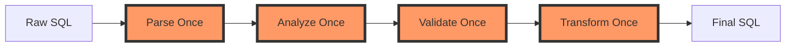
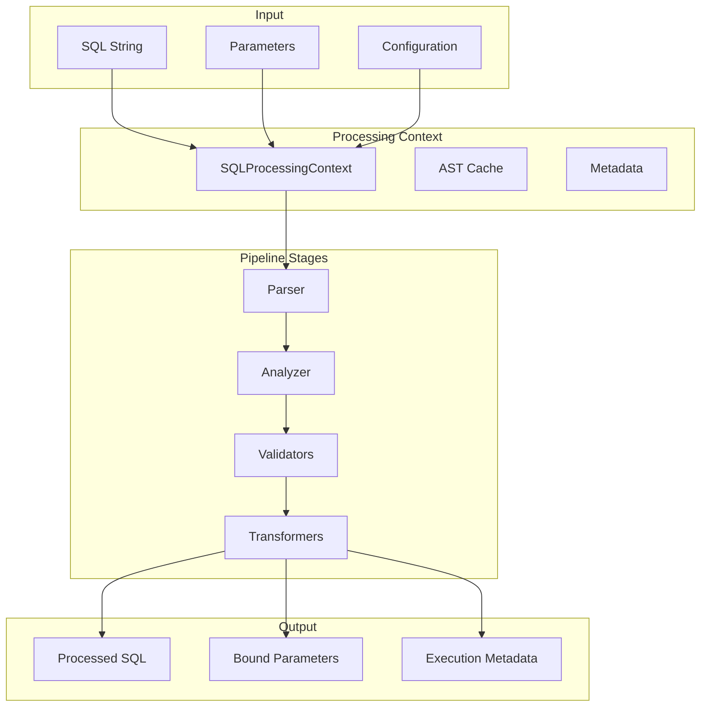

# Pipeline Overview

## Introduction

The SQL Processing Pipeline is the heart of SQLSpec's statement handling system. It embodies the project's core philosophy of "parse once, transform once, validate once" - ensuring that every SQL statement flows through a single, efficient pass that handles parsing, analysis, validation, transformation, and parameter binding. This single-pass approach is an unbreakable rule that guarantees optimal performance and consistency.

## Core Philosophy: Single-Pass Processing

### The Unbreakable Rule

SQLSpec's pipeline follows a strict single-pass processing model:



**Why Single-Pass?**

1. **Performance**: Parsing SQL is expensive. Doing it once is critical for performance.
2. **Consistency**: Single pass ensures all components see the same AST state.
3. **Simplicity**: No complex state management between multiple passes.
4. **Predictability**: Transformations can't interfere with each other.

### Pipeline Architecture



## Pipeline Components

### SQLProcessingContext

The context carries all state through the pipeline:

```python
@dataclass
class SQLProcessingContext:
    """Context for SQL processing pipeline."""

    # Input
    raw_sql: str
    raw_parameters: Optional[Any]
    config: SQLConfig

    # Processing state
    ast: Optional[Expression] = None
    dialect: Optional[str] = None
    analyzed_metadata: Optional[AnalysisResult] = None

    # Parameter handling
    extracted_parameters: list[Any] = field(default_factory=list)
    parameter_mapping: dict[str, Any] = field(default_factory=dict)
    input_sql_had_placeholders: bool = False

    # Results
    validation_results: list[ValidationResult] = field(default_factory=list)
    transformation_results: list[TransformationResult] = field(default_factory=list)

    # Flags
    is_processed: bool = False
    processing_errors: list[Exception] = field(default_factory=list)
```

### StatementPipeline

The pipeline orchestrator:

```python
class StatementPipeline:
    """Orchestrates SQL processing through stages."""

    def __init__(
        self,
        parser: Optional[Parser] = None,
        analyzer: Optional[Analyzer] = None,
        validators: Optional[list[Validator]] = None,
        transformers: Optional[list[Transformer]] = None,
    ):
        self.parser = parser or SQLGlotParser()
        self.analyzer = analyzer or StatementAnalyzer()
        self.validators = validators or self._default_validators()
        self.transformers = transformers or self._default_transformers()

    def process(self, context: SQLProcessingContext) -> PipelineResult:
        """Process SQL through all pipeline stages - SINGLE PASS ONLY."""
        try:
            # 1. Parse (if not already parsed)
            if not context.ast:
                context.ast = self.parser.parse(context.raw_sql, context.dialect)

            # 2. Analyze
            context.analyzed_metadata = self.analyzer.analyze(context.ast)

            # 3. Validate
            for validator in self.validators:
                if validator.should_run(context):
                    result = validator.validate(context)
                    context.validation_results.append(result)

                    if result.should_block:
                        raise ValidationError(result.message)

            # 4. Transform
            transformed_ast = context.ast
            for transformer in self.transformers:
                if transformer.should_run(context):
                    transformed_ast, result = transformer.transform(
                        transformed_ast, context
                    )
                    context.transformation_results.append(result)

            # 5. Generate final SQL
            final_sql = transformed_ast.sql(dialect=context.dialect)

            # 6. Merge parameters
            final_parameters = self._merge_parameters(context)

            context.is_processed = True

            return PipelineResult(
                sql=final_sql,
                parameters=final_parameters,
                context=context
            )

        except Exception as e:
            context.processing_errors.append(e)
            raise
```

## Pipeline Stages

### 1. Parsing Stage

The parser converts SQL text to an Abstract Syntax Tree (AST):

```python
class SQLGlotParser:
    """Parser using sqlglot library."""

    def parse(self, sql: str, dialect: Optional[str] = None) -> Expression:
        """Parse SQL into AST - happens exactly once."""
        try:
            # Detect dialect if not specified
            if not dialect:
                dialect = self._detect_dialect(sql)

            # Parse with timeout
            with timeout(5.0):
                ast = sqlglot.parse_one(
                    sql,
                    dialect=dialect,
                    error_level="RAISE"
                )

            # Cache parsing results
            self._cache_ast(sql, ast, dialect)

            return ast

        except sqlglot.ParseError as e:
            raise SQLParseError(f"Failed to parse SQL: {e}")
```

### 2. Analysis Stage

The analyzer extracts metadata from the AST:

```python
class StatementAnalyzer:
    """Analyzes SQL AST to extract metadata."""

    def analyze(self, ast: Expression) -> AnalysisResult:
        """Analyze AST - single traversal only."""
        result = AnalysisResult()

        # Single traversal extracts all information
        for node in ast.walk():
            # Statement type
            if isinstance(node, Select):
                result.statement_type = "SELECT"
                result.is_dql = True
            elif isinstance(node, Insert):
                result.statement_type = "INSERT"
                result.is_dml = True

            # Tables
            if isinstance(node, Table):
                result.tables.add(node.name)

            # Columns
            if isinstance(node, Column):
                result.columns.add(node.name)

            # Joins
            if isinstance(node, Join):
                result.join_count += 1
                result.join_types.add(node.kind)

            # Subqueries
            if isinstance(node, Subquery):
                result.subquery_count += 1
                result.max_subquery_depth = max(
                    result.max_subquery_depth,
                    self._get_depth(node)
                )

        return result
```

### 3. Validation Stage

Validators check for security and performance issues:

```python
class Validator(Protocol):
    """Protocol for pipeline validators."""

    def should_run(self, context: SQLProcessingContext) -> bool:
        """Check if validator should run for this SQL."""
        ...

    def validate(self, context: SQLProcessingContext) -> ValidationResult:
        """Validate SQL and return result."""
        ...
```

Example validator:

```python
class DMLSafetyValidator:
    """Validates DML operations for safety."""

    def validate(self, context: SQLProcessingContext) -> ValidationResult:
        """Single pass validation - no re-parsing."""
        issues = []
        risk_level = RiskLevel.LOW

        # Use already-parsed AST
        for node in context.ast.walk():
            if isinstance(node, Delete) and not node.where:
                issues.append(ValidationIssue(
                    level=RiskLevel.HIGH,
                    message="DELETE without WHERE clause",
                    location=node.pos
                ))
                risk_level = max(risk_level, RiskLevel.HIGH)

            if isinstance(node, Update) and not node.where:
                issues.append(ValidationIssue(
                    level=RiskLevel.HIGH,
                    message="UPDATE without WHERE clause",
                    location=node.pos
                ))
                risk_level = max(risk_level, RiskLevel.HIGH)

        return ValidationResult(
            validator="DMLSafety",
            passed=risk_level < RiskLevel.HIGH,
            issues=issues,
            risk_level=risk_level,
            should_block=risk_level >= RiskLevel.HIGH
        )
```

### 4. Transformation Stage

Transformers modify the AST:

```python
class Transformer(Protocol):
    """Protocol for pipeline transformers."""

    def should_run(self, context: SQLProcessingContext) -> bool:
        """Check if transformer should run."""
        ...

    def transform(
        self,
        ast: Expression,
        context: SQLProcessingContext
    ) -> tuple[Expression, TransformationResult]:
        """Transform AST and return new AST with result."""
        ...
```

Example transformer:

```python
class ParameterizeLiteralsTransformer:
    """Extracts literals and replaces with parameters."""

    def transform(
        self,
        ast: Expression,
        context: SQLProcessingContext
    ) -> tuple[Expression, TransformationResult]:
        """Single pass transformation - modifies AST in place."""

        # Clone AST to avoid modifying original
        new_ast = ast.copy()
        extracted_count = 0

        # Single traversal to find and replace literals
        for node in new_ast.walk():
            if isinstance(node, Literal):
                # Extract value
                context.extracted_parameters.append(node.value)

                # Replace with placeholder
                param_name = f"param_{len(context.extracted_parameters) - 1}"
                node.replace(Placeholder(param_name))

                extracted_count += 1

        return new_ast, TransformationResult(
            transformer="ParameterizeLiterals",
            changes_made=extracted_count > 0,
            metadata={"extracted_count": extracted_count}
        )
```

## Pipeline Configuration

### Default Pipeline

```python
def create_default_pipeline(config: SQLConfig) -> StatementPipeline:
    """Create pipeline with default components based on config."""

    validators = []
    transformers = []

    # Add validators based on config
    if config.enable_validation:
        validators.extend([
            SQLInjectionValidator(),
            DMLSafetyValidator(),
            PerformanceValidator(config),
        ])

        if config.strict_mode:
            validators.extend([
                TautologyValidator(),
                SuspiciousPatternValidator(),
            ])

    # Add transformers based on config
    if config.enable_transformation:
        if config.parameterize_literals:
            transformers.append(ParameterizeLiteralsTransformer())

        if config.optimize_queries:
            transformers.append(QueryOptimizer())

        transformers.append(CommentRemover())

    return StatementPipeline(
        validators=validators,
        transformers=transformers
    )
```

### Custom Pipeline

```python
# Create custom pipeline
pipeline = StatementPipeline(
    validators=[
        MyCustomValidator(),
        DMLSafetyValidator(allow_truncate=False),
    ],
    transformers=[
        RemoveHintsTransformer(),
        ParameterizeLiteralsTransformer(
            skip_types=["date", "boolean"]
        ),
    ]
)

# Use with SQL object
sql = SQL("SELECT * FROM users WHERE active = true", pipeline=pipeline)
```

## Lazy Processing

SQL objects use lazy processing to defer pipeline execution:

```python
class SQL:
    """SQL statement with lazy processing."""

    def __init__(
        self,
        sql: str,
        parameters: Optional[Any] = None,
        config: Optional[SQLConfig] = None,
    ):
        self._raw_sql = sql
        self._raw_parameters = parameters
        self._config = config or SQLConfig()

        # Lazy fields
        self._processed: Optional[PipelineResult] = None
        self._pipeline: Optional[StatementPipeline] = None

    def _ensure_processed(self) -> None:
        """Process SQL through pipeline if not already done."""
        if self._processed is not None:
            return

        # Create context
        context = SQLProcessingContext(
            raw_sql=self._raw_sql,
            raw_parameters=self._raw_parameters,
            config=self._config
        )

        # Get or create pipeline
        if self._pipeline is None:
            self._pipeline = create_default_pipeline(self._config)

        # Process exactly once
        self._processed = self._pipeline.process(context)

    @property
    def sql(self) -> str:
        """Get processed SQL."""
        self._ensure_processed()
        return self._processed.sql

    @property
    def parameters(self) -> Any:
        """Get processed parameters."""
        self._ensure_processed()
        return self._processed.parameters
```

## Performance Optimizations

### AST Caching

Parsed ASTs are cached to avoid re-parsing:

```python
class ASTCache:
    """LRU cache for parsed ASTs."""

    def __init__(self, maxsize: int = 1000):
        self._cache = LRUCache(maxsize=maxsize)

    def get(self, sql: str, dialect: str) -> Optional[Expression]:
        """Get cached AST if available."""
        key = (sql, dialect)
        return self._cache.get(key)

    def put(self, sql: str, dialect: str, ast: Expression) -> None:
        """Cache parsed AST."""
        key = (sql, dialect)
        self._cache[key] = ast.copy()  # Store copy to prevent mutations
```

### Pipeline Result Caching

Entire pipeline results can be cached:

```python
@lru_cache(maxsize=1000)
def process_cached(
    sql: str,
    config_hash: int
) -> PipelineResult:
    """Cache entire pipeline results for common queries."""
    context = SQLProcessingContext(
        raw_sql=sql,
        config=_get_config_by_hash(config_hash)
    )
    pipeline = create_default_pipeline(context.config)
    return pipeline.process(context)
```

## Error Handling

### Pipeline Errors

The pipeline provides detailed error information:

```python
class PipelineError(SQLSpecError):
    """Base pipeline error with context."""

    def __init__(
        self,
        message: str,
        context: SQLProcessingContext,
        stage: str,
        cause: Optional[Exception] = None
    ):
        super().__init__(message)
        self.context = context
        self.stage = stage
        self.cause = cause

        # Add context to message
        self.message = f"{message} (stage: {stage})"
        if context.ast:
            self.message += f"\nSQL: {context.raw_sql[:100]}..."
```

### Error Recovery

Some errors can be recovered from:

```python
class ResilientPipeline(StatementPipeline):
    """Pipeline with error recovery."""

    def process(self, context: SQLProcessingContext) -> PipelineResult:
        """Process with fallbacks for recoverable errors."""
        try:
            return super().process(context)

        except SQLParseError as e:
            # Try alternative parser
            if self.fallback_parser:
                context.ast = self.fallback_parser.parse(
                    context.raw_sql
                )
                return super().process(context)
            raise

        except ValidationError as e:
            # Check if error can be bypassed
            if context.config.validation_mode == "warn":
                context.validation_results.append(
                    ValidationResult(
                        validator="Pipeline",
                        passed=False,
                        issues=[ValidationIssue.from_exception(e)],
                        should_block=False
                    )
                )
                # Continue processing
                return self._process_without_validation(context)
            raise
```

## Monitoring and Observability

### Pipeline Metrics

```python
class InstrumentedPipeline(StatementPipeline):
    """Pipeline with metrics collection."""

    def process(self, context: SQLProcessingContext) -> PipelineResult:
        """Process with metrics."""
        with timer("pipeline.total_time"):
            # Parse time
            with timer("pipeline.parse_time"):
                if not context.ast:
                    context.ast = self.parser.parse(
                        context.raw_sql,
                        context.dialect
                    )

            # Validation time
            with timer("pipeline.validation_time"):
                self._run_validators(context)

            # Transformation time
            with timer("pipeline.transformation_time"):
                self._run_transformers(context)

            # Record metrics
            metrics.increment("pipeline.processed_statements")
            metrics.histogram(
                "pipeline.sql_length",
                len(context.raw_sql)
            )

            return self._build_result(context)
```

## Best Practices

### 1. Never Re-Parse

```python
# Bad - parses SQL multiple times
def process_sql(sql: str):
    ast1 = parse(sql)  # First parse
    validate(sql)      # Might parse again internally
    ast2 = parse(sql)  # Third parse!

# Good - parse once, reuse AST
def process_sql(sql: str):
    ast = parse(sql)
    validate(ast)      # Uses existing AST
    transform(ast)     # Still same AST
```

### 2. Use Context Everywhere

```python
# Bad - loses context between stages
ast = parse(sql)
validated = validate(ast)
transformed = transform(validated)

# Good - context flows through pipeline
context = SQLProcessingContext(raw_sql=sql, config=config)
result = pipeline.process(context)
# All stages share same context
```

### 3. Fail Fast

```python
# Configure pipeline to fail on first error
pipeline = StatementPipeline(
    fail_fast=True,
    validators=[
        CriticalSecurityValidator(),  # Fails immediately if issues
        PerformanceValidator(),        # Won't run if security fails
    ]
)
```

## Next Steps

- [Validators](./09-validators.md) - Deep dive into validation system
- [Transformers](./10-transformers.md) - Understanding SQL transformation
- [Query Builders](./11-query-builders.md) - Building SQL programmatically

---

[← Type System](../core/04-type-system.md) | [Validators →](./09-validators.md)
