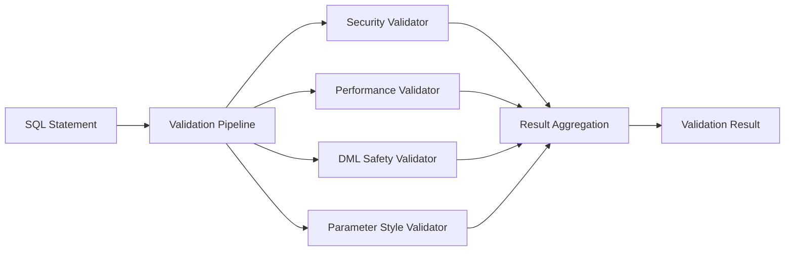

# SQL Validation System

## Introduction

SQLSpec's validation system provides multiple layers of security and performance checks to ensure SQL statements are safe, efficient, and compliant with organizational policies. The validation pipeline runs as part of SQL processing, catching issues before they reach the database.

## Validation Architecture

The validation system follows a modular, composable design with consolidated validators:



## Core Validators

### 1. Security Validator

The comprehensive security validator combines multiple security checks in a single pass:

```python
from sqlspec.statement.pipelines.validators import (
    SecurityValidator,
    SecurityIssueType
)

# Security validator detects:
# - SQL injection patterns
# - Tautology conditions (1=1, true=true)
# - Suspicious keywords (xp_cmdshell, sys.objects)
# - Dynamic SQL construction
# - Administrative commands

validator = SecurityValidator()
result = validator.process(context)

# Result includes detailed security analysis
for issue in result.issues:
    print(f"Type: {issue.type}")        # SQL_INJECTION, TAUTOLOGY, etc.
    print(f"Risk: {issue.risk_level}")  # HIGH, MEDIUM, LOW
    print(f"Location: {issue.location}") # Line and column
    print(f"Message: {issue.message}")   # Description
```

#### Security Issue Types

```python
class SecurityIssueType(Enum):
    SQL_INJECTION = "sql_injection"
    TAUTOLOGY = "tautology"
    SUSPICIOUS_KEYWORD = "suspicious_keyword"
    DYNAMIC_SQL = "dynamic_sql"
    ADMIN_COMMAND = "admin_command"
    STRING_CONCAT = "string_concatenation"
    COMMENT_INJECTION = "comment_injection"
```

### 2. Performance Validator

The performance validator identifies potential performance issues in a single AST traversal:

```python
from sqlspec.statement.pipelines.validators import PerformanceValidator

# Performance validator detects:
# - Cartesian products (missing join conditions)
# - Excessive joins (configurable threshold)
# - Missing WHERE clauses on large table operations
# - Subquery depth issues
# - Missing indexes (heuristic-based)
# - SELECT * without LIMIT

validator = PerformanceValidator()

# Detected issues include:
# - "Potential cartesian product between orders and customers"
# - "Query contains 7 joins (threshold: 5)"
# - "SELECT * without LIMIT clause may return large result set"
# - "Consider adding index on orders.customer_id for better join performance"
```

### 3. DML Safety Validator

The DML Safety validator enforces safety policies for data modification:

```python
from sqlspec.statement.pipelines.validators import DMLSafetyValidator

# DML Safety validator provides:
# - Statement categorization (DDL, DML, DQL, DCL, TCL)
# - Operation allowlisting/blocklisting
# - Protected table enforcement
# - WHERE clause requirements for UPDATE/DELETE
# - Row count warnings

validator = DMLSafetyValidator()

# Configuration options:
# - allowed_operations: ["SELECT", "INSERT"]
# - blocked_operations: ["DROP", "TRUNCATE"]
# - require_where_for_update: True
# - require_where_for_delete: True
# - protected_tables: ["users", "audit_log"]
# - max_affected_rows_warning: 1000
```

#### Statement Categories

```python
class StatementCategory(Enum):
    DDL = "ddl"  # CREATE, ALTER, DROP
    DML = "dml"  # INSERT, UPDATE, DELETE, MERGE
    DQL = "dql"  # SELECT
    DCL = "dcl"  # GRANT, REVOKE
    TCL = "tcl"  # COMMIT, ROLLBACK
```

### 4. Parameter Style Validator

Ensures parameter placeholders match database requirements:

```python
from sqlspec.statement.pipelines.validators import ParameterStyleValidator

# Parameter validator checks:
# - Parameter style compatibility with target database
# - Mixed parameter style detection
# - Parameter count validation
# - Placeholder format correctness

validator = ParameterStyleValidator()

# Validates against configured styles:
# - SQLite: qmark (?), named_colon (:name)
# - PostgreSQL: numeric ($1, $2)
# - MySQL: pyformat (%s)
# - SQL Server: named_at (@name)
```

## Validation Configuration

### SQLConfig Integration

Validators are configured through the `SQLConfig` class:

```python
from sqlspec.config import SQLConfig

config = SQLConfig(
    # Enable/disable validation
    enable_validation=True,

    # Strict mode fails on warnings
    strict_mode=True,

    # DML Safety settings
    allow_ddl=False,
    allow_risky_dml=False,
    allowed_operations=["SELECT", "INSERT", "UPDATE"],
    blocked_operations=["DROP", "TRUNCATE"],
    require_where_for_update=True,
    require_where_for_delete=True,
    protected_tables=["users", "audit_log"],

    # Performance settings
    max_joins=5,
    max_subquery_depth=3,
    warn_cartesian_product=True,
    require_limit_for_select_all=True,

    # Security settings
    detect_injection=True,
    detect_tautology=True,
    detect_suspicious_keywords=True,
    forbidden_keywords=["xp_cmdshell", "EXEC"],

    # Parameter settings
    allowed_parameter_styles=("qmark", "named_colon"),
    target_parameter_style="qmark",
    allow_mixed_parameter_styles=False,
)
```

### Pipeline Registration

Validators are automatically registered based on configuration:

```python
def get_statement_pipeline(config: SQLConfig) -> StatementPipeline:
    """Build pipeline with configured validators."""
    validators = []

    if config.enable_validation:
        # Security always runs first
        validators.append(SecurityValidator())

        # Add other validators based on settings
        if config.max_joins or config.warn_cartesian_product:
            validators.append(PerformanceValidator())

        if config.allowed_operations or config.blocked_operations:
            validators.append(DMLSafetyValidator())

        if config.allowed_parameter_styles:
            validators.append(ParameterStyleValidator())

    return StatementPipeline(validators=validators)
```

## Validation Results

### Result Aggregation

The `ResultAggregator` collects results from all validators:

```python
from sqlspec.statement.pipelines.aggregator import ResultAggregator

aggregator = ResultAggregator()

# Process multiple validator results
for validator in validators:
    result = validator.process(context)
    aggregator.add_result(result)

# Get aggregated results
final_result = aggregator.get_aggregated_result()

# Access aggregated data
print(f"Overall risk: {final_result.risk_level}")
print(f"Total issues: {len(final_result.all_issues)}")
print(f"Has errors: {final_result.has_errors}")
print(f"Has warnings: {final_result.has_warnings}")
```

### Risk Levels

```python
class RiskLevel(Enum):
    """Risk levels for validation results."""

    SKIP = -1      # Validation was skipped
    NONE = 0       # No issues found
    LOW = 1        # Minor issues, suggestions
    MEDIUM = 2     # Should be reviewed
    HIGH = 3       # Should be blocked
    CRITICAL = 4   # Must be blocked
```

### Validation Result Structure

```python
@dataclass
class ValidationResult:
    """Result from validation process."""

    # Basic result
    is_safe: bool
    risk_level: RiskLevel

    # Issues found
    errors: list[ValidationIssue] = field(default_factory=list)
    warnings: list[ValidationIssue] = field(default_factory=list)
    suggestions: list[ValidationIssue] = field(default_factory=list)

    # Metadata
    validator_name: Optional[str] = None
    execution_time_ms: Optional[float] = None

    @property
    def should_block(self) -> bool:
        """Whether this result should block execution."""
        return not self.is_safe and self.risk_level >= RiskLevel.HIGH
```

## Advanced Validation Features

### 1. Custom Validators

Create custom validators by implementing the processor protocol:

```python
from typing import Optional, Tuple
from sqlspec.statement.pipelines.base import ProcessorProtocol
from sqlspec.statement.pipelines.context import SQLProcessingContext
from sqlspec.statement.pipelines.validators.base import ValidationResult
import sqlglot.expressions as exp

class BusinessRuleValidator(ProcessorProtocol):
    """Enforce business-specific SQL rules."""

    def __init__(self, config: BusinessConfig):
        self.config = config

    def process(
        self,
        context: SQLProcessingContext
    ) -> Tuple[exp.Expression, Optional[ValidationResult]]:
        """Validate business rules in SQL."""
        result = ValidationResult()

        # Example: Enforce data retention policy
        for table in context.current_expression.find_all(exp.Table):
            if table.name in self.config.archived_tables:
                if not self._has_date_filter(context.current_expression, table):
                    result.add_error(
                        f"Queries on archived table {table.name} must include date filter"
                    )

        # Example: Enforce row limits on certain tables
        if self._accesses_large_table(context.current_expression):
            if not self._has_limit_clause(context.current_expression):
                result.add_warning(
                    "Large table access should include LIMIT clause"
                )

        return context.current_expression, result
```

### 2. Conditional Validation

Apply different rules based on context:

```python
class ContextualValidator(ProcessorProtocol):
    """Apply validation based on execution context."""

    def process(self, context: SQLProcessingContext):
        result = ValidationResult()

        # Different rules for different environments
        if context.metadata.get("environment") == "production":
            # Stricter rules in production
            if self._is_data_modification(context.current_expression):
                if not context.metadata.get("approved_by"):
                    result.add_error(
                        "Production data modifications require approval"
                    )

        # Time-based rules
        if self._is_maintenance_window():
            # Allow DDL during maintenance
            self.config.allow_ddl = True

        # User role-based rules
        user_role = context.metadata.get("user_role")
        if user_role == "readonly":
            if self._is_write_operation(context.current_expression):
                result.add_error(
                    "Read-only users cannot perform write operations"
                )

        return context.current_expression, result
```

### 3. Performance Profiling

Track validation performance:

```python
class ProfiledValidator(ProcessorProtocol):
    """Validator with performance tracking."""

    def process(self, context: SQLProcessingContext):
        start_time = time.perf_counter()

        try:
            # Run actual validation
            result = self._validate(context)

            # Record timing
            elapsed_ms = (time.perf_counter() - start_time) * 1000
            result.execution_time_ms = elapsed_ms

            # Log slow validations
            if elapsed_ms > 100:
                logger.warning(
                    "Slow validation: %s took %.2fms",
                    self.__class__.__name__,
                    elapsed_ms
                )

            return context.current_expression, result

        except Exception as e:
            # Record failed validation
            metrics.increment("validation.failures",
                           tags={"validator": self.__class__.__name__})
            raise
```

## Integration with SQL Processing

### Lazy Validation

Validation only runs when SQL properties are accessed:

```python
# Create SQL object - no validation yet
sql = SQL("DELETE FROM users WHERE active = false")

# Validation happens on first property access
try:
    rendered_sql = sql.to_sql()  # Triggers validation
except SQLValidationError as e:
    print(f"Validation failed: {e}")
```

### Validation Caching

Results are cached to avoid re-validation:

```python
sql = SQL("SELECT * FROM users WHERE id = ?", (1,))

# First access triggers validation
result1 = sql.validation_result  # Runs validators

# Subsequent access uses cache
result2 = sql.validation_result  # No re-validation
assert result1 is result2  # Same object
```

### Strict Mode Behavior

In strict mode, validation failures raise exceptions:

```python
config = SQLConfig(
    strict_mode=True,
    require_where_for_delete=True
)

# This will raise SQLValidationError in strict mode
sql = SQL("DELETE FROM users", config=config)
try:
    sql.to_sql()  # Raises exception
except SQLValidationError as e:
    print(f"Blocked by strict mode: {e}")
```

## Best Practices

### 1. Layer Validation Rules

Organize validators from most to least critical:

```python
# Order matters - fail fast on critical issues
validators = [
    SecurityValidator(),        # Block injection attempts first
    DMLSafetyValidator(),      # Check operation permissions
    PerformanceValidator(),    # Warn about performance
    StyleValidator(),          # Suggest improvements
]
```

### 2. Provide Clear Messages

Include actionable information in validation messages:

```python
def add_validation_issue(result: ValidationResult, issue_type: str):
    if issue_type == "missing_index":
        result.add_suggestion(
            message="Query may benefit from index on customer_id",
            recommendation="CREATE INDEX idx_orders_customer_id ON orders(customer_id)",
            documentation_url="https://docs.example.com/performance/indexes"
        )
```

### 3. Use Appropriate Risk Levels

Choose risk levels that match the severity:

```python
# CRITICAL - Data loss risk
if detects_truncate_table():
    result.risk_level = RiskLevel.CRITICAL

# HIGH - Security risk
if detects_sql_injection():
    result.risk_level = RiskLevel.HIGH

# MEDIUM - Performance risk
if detects_missing_index():
    result.risk_level = RiskLevel.MEDIUM

# LOW - Style suggestion
if detects_uppercase_keywords():
    result.risk_level = RiskLevel.LOW
```

### 4. Consider Performance

Validators run on every SQL execution, so optimize for speed:

```python
class EfficientValidator(ProcessorProtocol):
    def __init__(self):
        # Pre-compile patterns
        self.patterns = [re.compile(p) for p in PATTERNS]

        # Cache frequently used data
        self.keyword_set = frozenset(KEYWORDS)

    def process(self, context):
        # Single AST traversal
        issues = []
        for node in context.current_expression.walk():
            # Check all rules in one pass
            self._check_security(node, issues)
            self._check_performance(node, issues)
            self._check_style(node, issues)

        return self._build_result(issues)
```

## Summary

SQLSpec's validation system provides:

- **Consolidated validators** for efficient single-pass validation
- **Comprehensive security checks** against injection and malicious patterns
- **Performance analysis** to catch inefficient queries before execution
- **Safety enforcement** for data modification operations
- **Extensible architecture** for custom validation rules
- **Risk-based assessment** with appropriate response levels
- **Result aggregation** for unified validation reporting

The validation pipeline ensures that only safe, efficient, and compliant SQL reaches your database while maintaining high performance through intelligent caching and single-pass processing.

---

[← Pipeline Overview](./08-pipeline-overview.md) | [Transformers →](./10-transformers.md)
