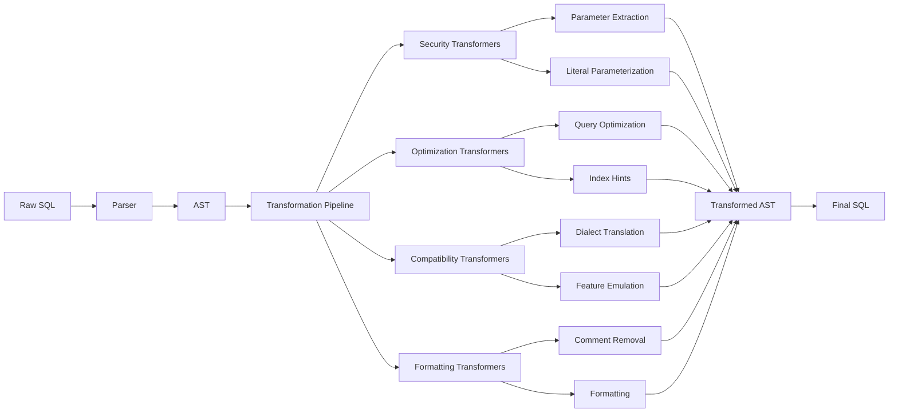

# SQL Transformation System

## Introduction

SQLSpec's transformation system modifies SQL statements during processing to improve security, performance, and compatibility. Transformers run as part of the SQL pipeline, operating on the parsed AST to make systematic changes while preserving query semantics.

## Transformation Architecture

Transformers operate in a single-pass pipeline after parsing but before validation:



## Core Transformer Types

### 1. Security Transformers

#### Literal Parameterization

The most critical security transformer extracts literal values and replaces them with parameters:

```python
from sqlspec.statement.pipelines.transformers import ParameterizeLiterals

transformer = ParameterizeLiterals()

# Input SQL with literals
input_sql = """
    SELECT * FROM users
    WHERE age > 25
    AND status = 'active'
    AND created_at > '2024-01-01'
"""

# Transformed SQL with parameters
output_sql = """
    SELECT * FROM users
    WHERE age > ?
    AND status = ?
    AND created_at > ?
"""
# Extracted parameters: [25, 'active', '2024-01-01']
```

Configuration options:

```python
transformer = ParameterizeLiterals(
    # Skip parameterization if SQL already has placeholders
    skip_if_has_placeholders=True,

    # Parameterize only specific types
    parameterize_numbers=True,
    parameterize_strings=True,
    parameterize_dates=True,

    # Keep certain literals (e.g., table names)
    preserve_identifiers=True,

    # Custom patterns to preserve
    preserve_patterns=[
        r"LIMIT \d+",  # Keep LIMIT values as literals
        r"OFFSET \d+", # Keep OFFSET values as literals
    ]
)
```

#### SQL Injection Prevention

```python
from sqlspec.statement.pipelines.transformers import SanitizeIdentifiers

transformer = SanitizeIdentifiers()

# Sanitizes potentially dangerous identifiers
unsafe_sql = "SELECT * FROM `users; DROP TABLE users;--`"
# Transformed: SELECT * FROM users_DROP_TABLE_users
```

### 2. Optimization Transformers

#### Query Optimization

```python
from sqlspec.statement.pipelines.transformers import QueryOptimizer

optimizer = QueryOptimizer(
    # Optimization strategies
    eliminate_redundant_conditions=True,
    optimize_join_order=True,
    push_down_predicates=True,
    eliminate_subqueries=True
)

# Redundant condition elimination
input_sql = """
    SELECT * FROM users
    WHERE active = true
    AND active = true
    AND age > 25
"""
# Optimized: SELECT * FROM users WHERE active = true AND age > 25

# Predicate pushdown
input_sql = """
    SELECT * FROM (
        SELECT * FROM orders
    ) WHERE status = 'pending'
"""
# Optimized: SELECT * FROM orders WHERE status = 'pending'
```

#### Index Hint Injection

```python
from sqlspec.statement.pipelines.transformers import IndexHintInjector

injector = IndexHintInjector(
    hints={
        "users": ["idx_users_email", "idx_users_created"],
        "orders": ["idx_orders_status_date"]
    }
)

# Adds index hints for better performance
input_sql = "SELECT * FROM users WHERE email = ?"
# MySQL: SELECT * FROM users USE INDEX (idx_users_email) WHERE email = ?
# PostgreSQL: SELECT /*+ INDEX(users idx_users_email) */ * FROM users WHERE email = ?
```

### 3. Compatibility Transformers

#### Dialect Translation

```python
from sqlspec.statement.pipelines.transformers import DialectTranslator

translator = DialectTranslator(
    source_dialect="mysql",
    target_dialect="postgresql"
)

# MySQL to PostgreSQL
mysql_sql = """
    SELECT CONCAT(first_name, ' ', last_name) AS full_name,
           DATE_FORMAT(created_at, '%Y-%m-%d') AS created_date
    FROM users
    LIMIT 10 OFFSET 20
"""

# Translated PostgreSQL
postgres_sql = """
    SELECT first_name || ' ' || last_name AS full_name,
           TO_CHAR(created_at, 'YYYY-MM-DD') AS created_date
    FROM users
    LIMIT 10 OFFSET 20
"""
```

#### Feature Emulation

```python
from sqlspec.statement.pipelines.transformers import FeatureEmulator

emulator = FeatureEmulator(
    target_dialect="sqlite",
    emulate_window_functions=True,
    emulate_ctes=True
)

# Window function emulation for SQLite < 3.25
input_sql = """
    SELECT name, salary,
           ROW_NUMBER() OVER (ORDER BY salary DESC) as rank
    FROM employees
"""

# Emulated with subquery
output_sql = """
    SELECT name, salary,
           (SELECT COUNT(*) + 1
            FROM employees e2
            WHERE e2.salary > e1.salary) as rank
    FROM employees e1
    ORDER BY salary DESC
"""
```

### 4. Formatting Transformers

#### Comment Removal

```python
from sqlspec.statement.pipelines.transformers import RemoveComments

transformer = RemoveComments(
    remove_line_comments=True,
    remove_block_comments=True,
    preserve_hints=True  # Keep optimizer hints
)

input_sql = """
    SELECT
        id,           -- User identifier
        name,         -- User full name
        /* Legacy field, remove in v2 */
        old_status,
        /*+ INDEX(users idx_active) */ -- Keep this hint
        active
    FROM users
"""

output_sql = """
    SELECT
        id,
        name,
        old_status,
        /*+ INDEX(users idx_active) */
        active
    FROM users
"""
```

#### SQL Formatting

```python
from sqlspec.statement.pipelines.transformers import SQLFormatter

formatter = SQLFormatter(
    indent_width=4,
    uppercase_keywords=True,
    comma_style="trailing",  # or "leading"
    max_line_length=80
)

# Unformatted SQL
input_sql = "select u.id,u.name,o.total from users u join orders o on u.id=o.user_id where u.active=true and o.status='pending'"

# Formatted SQL
output_sql = """
SELECT
    u.id,
    u.name,
    o.total
FROM users u
JOIN orders o ON u.id = o.user_id
WHERE
    u.active = true
    AND o.status = 'pending'
"""
```

## Advanced Transformation Features

### 1. Contextual Transformation

Transformers can access and use pipeline context:

```python
from typing import Optional, Tuple
from sqlspec.statement.pipelines.base import ProcessorProtocol
from sqlspec.statement.pipelines.context import SQLProcessingContext
import sqlglot.expressions as exp

class ContextualTransformer(ProcessorProtocol):
    """Transform based on context information."""

    def process(
        self,
        context: SQLProcessingContext
    ) -> Tuple[exp.Expression, Optional[ValidationResult]]:

        # Skip if SQL already had parameters
        if context.input_sql_had_placeholders:
            return context.current_expression, None

        # Apply different rules based on dialect
        if context.dialect == "postgresql":
            transformed = self._postgres_transform(context.current_expression)
        elif context.dialect == "mysql":
            transformed = self._mysql_transform(context.current_expression)
        else:
            transformed = context.current_expression

        # Add extracted parameters to context
        if self.extracted_params:
            context.extracted_parameters_from_pipeline.extend(
                self.extracted_params
            )

        return transformed, None
```

### 2. Composite Transformers

Combine multiple transformations in a single pass:

```python
class SecurityTransformer(CompositeTransformer):
    """Apply multiple security transformations."""

    def __init__(self):
        super().__init__([
            ParameterizeLiterals(),
            SanitizeIdentifiers(),
            RemoveDangerousPatterns(),
            EscapeSpecialCharacters()
        ])

    def process(self, context):
        # Run all sub-transformers in sequence
        result = context.current_expression

        for transformer in self.transformers:
            result, _ = transformer.process(
                context._replace(current_expression=result)
            )

        return result, None
```

### 3. Custom Transformers

Create domain-specific transformers:

```python
class TenantIsolationTransformer(ProcessorProtocol):
    """Add tenant isolation to all queries."""

    def __init__(self, tenant_column: str = "tenant_id"):
        self.tenant_column = tenant_column

    def process(self, context):
        expression = context.current_expression

        # Add tenant filter to all table references
        for select in expression.find_all(exp.Select):
            # Get current tenant from context
            tenant_id = context.kwargs.get("tenant_id")
            if not tenant_id:
                continue

            # Add WHERE clause or extend existing
            tenant_condition = exp.EQ(
                exp.Column(self.tenant_column),
                exp.Literal.string(tenant_id)
            )

            if select.args.get("where"):
                # Extend existing WHERE
                select.args["where"] = exp.And(
                    select.args["where"],
                    tenant_condition
                )
            else:
                # Add new WHERE
                select.where(tenant_condition)

        return expression, None
```

### 4. Performance-Aware Transformation

```python
class SmartParameterizer(ProcessorProtocol):
    """Intelligently parameterize based on performance impact."""

    def __init__(self, stats_provider):
        self.stats = stats_provider

    def process(self, context):
        expression = context.current_expression

        for condition in expression.find_all(exp.EQ):
            column = condition.left
            literal = condition.right

            if isinstance(literal, exp.Literal):
                # Check cardinality statistics
                cardinality = self.stats.get_column_cardinality(
                    str(column.table),
                    str(column)
                )

                # Keep high-cardinality literals for better plans
                if cardinality > 10000:
                    continue

                # Parameterize low-cardinality values
                param_name = f"param_{len(context.extracted_parameters_from_pipeline)}"
                condition.args["expression"] = exp.Placeholder(param_name)
                context.extracted_parameters_from_pipeline.append(
                    literal.value
                )

        return expression, None
```

## Transformation Pipeline Integration

### Configuration

Configure transformers in `SQLConfig`:

```python
from sqlspec.config import SQLConfig

config = SQLConfig(
    # Enable transformation
    enable_transformation=True,

    # Configure transformers
    transformers=[
        # Security (run first)
        ParameterizeLiterals(skip_if_has_placeholders=True),

        # Optimization
        QueryOptimizer(eliminate_redundant_conditions=True),

        # Compatibility
        DialectTranslator(target_dialect="postgresql"),

        # Formatting (run last)
        RemoveComments(),
        SQLFormatter()
    ],

    # Dialect for parsing/generation
    dialect="mysql",
    target_dialect="postgresql"
)
```

### Transformation Results

Access transformation details:

```python
from sqlspec.statement.sql import SQL

sql = SQL(
    "SELECT * FROM users WHERE age > 25 AND status = 'active'",
    config=config
)

# Get transformed SQL
print(sql.to_sql())
# SELECT * FROM users WHERE age > ? AND status = ?

# Get extracted parameters
print(sql.parameters)
# [25, 'active']

# Access transformation metadata
if hasattr(sql, '_transformation_metadata'):
    print(f"Literals extracted: {sql._transformation_metadata['literals_extracted']}")
    print(f"Optimizations applied: {sql._transformation_metadata['optimizations']}")
```

## Best Practices

### 1. Order Matters

```python
# Correct order: parameterize before optimization
transformers = [
    ParameterizeLiterals(),      # Extract literals first
    QueryOptimizer(),            # Then optimize structure
    DialectTranslator(),         # Then translate dialect
    SQLFormatter()               # Finally format
]

# Wrong order: formatting before parameterization
# would make pattern matching harder
```

### 2. Preserve Semantics

```python
class SemanticPreservingTransformer(ProcessorProtocol):
    """Ensure transformations don't change query meaning."""

    def process(self, context):
        original = context.current_expression
        transformed = self._transform(original)

        # Verify semantic equivalence
        if not self._semantically_equivalent(original, transformed):
            # Log warning and return original
            logger.warning("Transformation would change semantics")
            return original, None

        return transformed, None
```

### 3. Handle Edge Cases

```python
class RobustTransformer(ProcessorProtocol):
    """Handle edge cases gracefully."""

    def process(self, context):
        try:
            # Handle empty/null expressions
            if not context.current_expression:
                return context.current_expression, None

            # Handle unsupported SQL types
            if isinstance(context.current_expression, exp.Command):
                logger.debug("Skipping command transformation")
                return context.current_expression, None

            # Apply transformation
            return self._transform(context.current_expression), None

        except Exception as e:
            # Log and continue with original
            logger.error(f"Transformation failed: {e}")
            return context.current_expression, None
```

### 4. Performance Optimization

```python
class EfficientTransformer(ProcessorProtocol):
    """Optimize transformer performance."""

    def __init__(self):
        # Pre-compile patterns
        self._patterns = [
            re.compile(p) for p in self.get_patterns()
        ]

        # Cache transformation results
        self._cache = {}

    def process(self, context):
        # Check cache first
        cache_key = hash(context.current_expression.sql())
        if cache_key in self._cache:
            return self._cache[cache_key], None

        # Transform and cache
        result = self._do_transform(context.current_expression)
        self._cache[cache_key] = result

        return result, None
```

## Common Transformation Patterns

### 1. Add Audit Columns

```python
class AuditTransformer(ProcessorProtocol):
    """Add audit columns to INSERT/UPDATE statements."""

    def process(self, context):
        expression = context.current_expression
        user_id = context.kwargs.get("user_id", "system")

        # Handle INSERT
        for insert in expression.find_all(exp.Insert):
            # Add created_by, created_at
            insert.args["columns"].append(exp.Column("created_by"))
            insert.args["columns"].append(exp.Column("created_at"))
            insert.args["values"].append(exp.Literal.string(user_id))
            insert.args["values"].append(exp.func("NOW"))

        # Handle UPDATE
        for update in expression.find_all(exp.Update):
            # Add updated_by, updated_at
            update.set("updated_by", exp.Literal.string(user_id))
            update.set("updated_at", exp.func("NOW"))

        return expression, None
```

### 2. Query Result Limiting

```python
class SafeLimitTransformer(ProcessorProtocol):
    """Ensure all SELECT queries have reasonable limits."""

    def __init__(self, default_limit: int = 1000):
        self.default_limit = default_limit

    def process(self, context):
        expression = context.current_expression

        for select in expression.find_all(exp.Select):
            if not select.args.get("limit"):
                # Add default limit
                select.limit(self.default_limit)
            elif select.args["limit"].expression.value > self.default_limit:
                # Reduce excessive limits
                select.limit(self.default_limit)

        return expression, None
```

### 3. Soft Delete Implementation

```python
class SoftDeleteTransformer(ProcessorProtocol):
    """Convert DELETE to soft delete UPDATE."""

    def process(self, context):
        expression = context.current_expression

        if isinstance(expression, exp.Delete):
            # Convert to UPDATE
            update = exp.Update(
                this=expression.args["from"],
                expressions=[
                    exp.EQ(
                        exp.Column("deleted_at"),
                        exp.func("NOW")
                    )
                ]
            )

            # Preserve WHERE clause
            if expression.args.get("where"):
                update.where(expression.args["where"])

            return update, None

        return expression, None
```

## Summary

SQLSpec's transformation system provides:

- **Security enhancement** through automatic parameterization
- **Performance optimization** via query rewriting
- **Cross-database compatibility** with dialect translation
- **Extensibility** for custom transformation logic
- **Single-pass efficiency** in the processing pipeline

Transformers ensure that SQL statements are secure, optimized, and compatible before execution.

---

[← Validators](./09-validators.md) | [Query Builders →](./11-query-builders.md)
