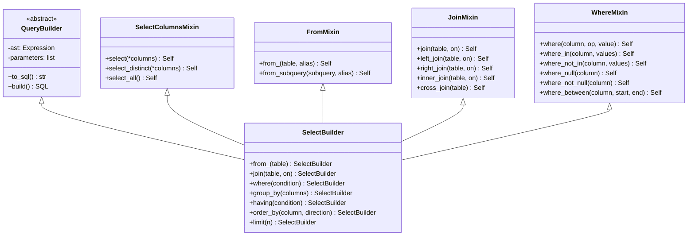

# Query Builders

## Overview

SQLSpec's Query Builder system provides a fluent, type-safe API for constructing SQL queries programmatically. Built on a sophisticated mixin architecture, it offers the expressiveness of raw SQL with the safety of automatic parameter binding and the convenience of method chaining. The system prevents SQL injection by design while maintaining readability and composability.

## Architecture

### Mixin-Based Design

The query builder system uses mixins to compose functionality:



### Builder Factory

The `sql` factory provides a unified entry point:

```python
from sqlspec import sql
query = sql.get_sql("my_users").where_not_like()
# Create different query types
select_query = sql.select("id", "name").from_("users")
insert_query = sql.insert_into("users").values({"name": "Alice", "email": "alice@example.com"})
update_query = sql.update("users").set({"active": True}).where("id", "=", 1)
delete_query = sql.delete_from("users").where("active", "=", False)
```

## SELECT Queries

### Basic SELECT

```python
# Simple select
query = sql.select("id", "name", "email").from_("users")
# SELECT id, name, email FROM users

# Select all columns
query = sql.select().from_("users")
# SELECT * FROM users

# Select with alias
query = sql.select(
    "u.id",
    "u.name",
    sql.raw("COUNT(*) AS order_count")
).from_("users", "u")
# SELECT u.id, u.name, COUNT(*) AS order_count FROM users u
```

### WHERE Conditions

```python
# Single condition
query = sql.select().from_("users").where("active", "=", True)
# SELECT * FROM users WHERE active = ?
# Parameters: [True]

# Multiple conditions (AND)
query = (
    sql.select()
    .from_("users")
    .where("active", "=", True)
    .where("age", ">", 18)
)
# SELECT * FROM users WHERE active = ? AND age > ?
# Parameters: [True, 18]

# OR conditions
query = (
    sql.select()
    .from_("users")
    .where(
        sql.or_(
            sql.condition("role", "=", "admin"),
            sql.condition("role", "=", "moderator")
        )
    )
)
# SELECT * FROM users WHERE (role = ? OR role = ?)
# Parameters: ["admin", "moderator"]

# Complex conditions
query = (
    sql.select()
    .from_("users")
    .where("active", "=", True)
    .where(
        sql.or_(
            sql.and_(
                sql.condition("age", ">=", 18),
                sql.condition("age", "<=", 65)
            ),
            sql.condition("vip", "=", True)
        )
    )
)
# SELECT * FROM users WHERE active = ? AND ((age >= ? AND age <= ?) OR vip = ?)
# Parameters: [True, 18, 65, True]
```

### IN and NOT IN

```python
# IN clause
user_ids = [1, 2, 3, 4, 5]
query = sql.select().from_("orders").where_in("user_id", user_ids)
# SELECT * FROM orders WHERE user_id IN (?, ?, ?, ?, ?)
# Parameters: [1, 2, 3, 4, 5]

# NOT IN clause
excluded_statuses = ["cancelled", "refunded"]
query = sql.select().from_("orders").where_not_in("status", excluded_statuses)
# SELECT * FROM orders WHERE status NOT IN (?, ?)
# Parameters: ["cancelled", "refunded"]

# Subquery IN
subquery = sql.select("id").from_("users").where("active", "=", False)
query = sql.select().from_("orders").where_in("user_id", subquery)
# SELECT * FROM orders WHERE user_id IN (SELECT id FROM users WHERE active = ?)
# Parameters: [False]
```

### JOINs

```python
# Inner join
query = (
    sql.select("u.name", "o.total")
    .from_("users", "u")
    .join("orders", "o", "u.id = o.user_id")
)
# SELECT u.name, o.total FROM users u JOIN orders o ON u.id = o.user_id

# Left join with conditions
query = (
    sql.select("u.name", sql.raw("COUNT(o.id) as order_count"))
    .from_("users", "u")
    .left_join("orders", "o", "u.id = o.user_id AND o.status = ?", ("completed",))
    .group_by("u.id", "u.name")
)
# SELECT u.name, COUNT(o.id) as order_count
# FROM users u
# LEFT JOIN orders o ON u.id = o.user_id AND o.status = ?
# GROUP BY u.id, u.name
# Parameters: ["completed"]

# Multiple joins
query = (
    sql.select("u.name", "o.id", "oi.product_name", "oi.quantity")
    .from_("users", "u")
    .join("orders", "o", "u.id = o.user_id")
    .join("order_items", "oi", "o.id = oi.order_id")
    .where("u.active", "=", True)
)
```

### GROUP BY and HAVING

```python
# Group by with aggregation
query = (
    sql.select(
        "category",
        sql.raw("COUNT(*) as product_count"),
        sql.raw("AVG(price) as avg_price")
    )
    .from_("products")
    .group_by("category")
    .having(sql.raw("COUNT(*)"), ">", 5)
)
# SELECT category, COUNT(*) as product_count, AVG(price) as avg_price
# FROM products
# GROUP BY category
# HAVING COUNT(*) > ?
# Parameters: [5]

# Multiple group by columns
query = (
    sql.select("department", "role", sql.raw("AVG(salary) as avg_salary"))
    .from_("employees")
    .group_by("department", "role")
    .having(sql.raw("AVG(salary)"), ">", 50000)
    .order_by("department", "ASC")
    .order_by("avg_salary", "DESC")
)
```

### ORDER BY and LIMIT

```python
# Order by single column
query = sql.select().from_("users").order_by("created_at", "DESC")
# SELECT * FROM users ORDER BY created_at DESC

# Multiple order by
query = (
    sql.select()
    .from_("products")
    .order_by("category", "ASC")
    .order_by("price", "DESC")
    .order_by("name", "ASC")
)
# SELECT * FROM products ORDER BY category ASC, price DESC, name ASC

# Limit and offset
query = (
    sql.select()
    .from_("users")
    .where("active", "=", True)
    .order_by("created_at", "DESC")
    .limit(10)
    .offset(20)
)
# SELECT * FROM users WHERE active = ? ORDER BY created_at DESC LIMIT ? OFFSET ?
# Parameters: [True, 10, 20]
```

### Subqueries

```python
# Subquery in FROM
subquery = (
    sql.select("user_id", sql.raw("COUNT(*) as order_count"))
    .from_("orders")
    .where("status", "=", "completed")
    .group_by("user_id")
)

query = (
    sql.select("u.name", "sub.order_count")
    .from_("users", "u")
    .join(subquery, "sub", "u.id = sub.user_id")
    .where("sub.order_count", ">", 10)
)

# Correlated subquery
query = (
    sql.select("u.id", "u.name",
        sql.raw("""(
            SELECT COUNT(*)
            FROM orders o
            WHERE o.user_id = u.id
        ) as order_count""")
    )
    .from_("users", "u")
    .where("u.active", "=", True)
)
```

## INSERT Queries

### Single Row Insert

```python
# Insert with values
query = (
    sql.insert_into("users")
    .values({
        "name": "Alice",
        "email": "alice@example.com",
        "age": 25,
        "active": True
    })
)
# INSERT INTO users (name, email, age, active) VALUES (?, ?, ?, ?)
# Parameters: ["Alice", "alice@example.com", 25, True]

# Insert specific columns
query = (
    sql.insert_into("users", ["name", "email"])
    .values(["Bob", "bob@example.com"])
)
# INSERT INTO users (name, email) VALUES (?, ?)
# Parameters: ["Bob", "bob@example.com"]
```

### Multiple Row Insert

```python
# Insert multiple rows
users = [
    {"name": "Alice", "email": "alice@example.com", "age": 25},
    {"name": "Bob", "email": "bob@example.com", "age": 30},
    {"name": "Charlie", "email": "charlie@example.com", "age": 35}
]

query = sql.insert_into("users").values(users)
# INSERT INTO users (name, email, age) VALUES (?, ?, ?), (?, ?, ?), (?, ?, ?)
# Parameters: ["Alice", "alice@example.com", 25, "Bob", "bob@example.com", 30, "Charlie", "charlie@example.com", 35]
```

### INSERT FROM SELECT

```python
# Insert from select
query = (
    sql.insert_into("archived_users", ["id", "name", "email", "archived_at"])
    .from_select(
        sql.select("id", "name", "email", sql.raw("CURRENT_TIMESTAMP"))
        .from_("users")
        .where("active", "=", False)
        .where("last_login", "<", datetime.now() - timedelta(days=365))
    )
)
# INSERT INTO archived_users (id, name, email, archived_at)
# SELECT id, name, email, CURRENT_TIMESTAMP
# FROM users
# WHERE active = ? AND last_login < ?
# Parameters: [False, <datetime>]
```

### RETURNING Clause

```python
# Insert with returning (PostgreSQL)
query = (
    sql.insert_into("users")
    .values({"name": "Alice", "email": "alice@example.com"})
    .returning("id", "created_at")
)
# INSERT INTO users (name, email) VALUES (?, ?) RETURNING id, created_at
# Parameters: ["Alice", "alice@example.com"]
```

## UPDATE Queries

### Basic Update

```python
# Update single column
query = (
    sql.update("users")
    .set({"active": False})
    .where("last_login", "<", datetime.now() - timedelta(days=90))
)
# UPDATE users SET active = ? WHERE last_login < ?
# Parameters: [False, <datetime>]

# Update multiple columns
query = (
    sql.update("products")
    .set({
        "price": 19.99,
        "discount": 0.1,
        "updated_at": datetime.now()
    })
    .where("category", "=", "electronics")
)
# UPDATE products SET price = ?, discount = ?, updated_at = ? WHERE category = ?
# Parameters: [19.99, 0.1, <datetime>, "electronics"]
```

### Update with Expressions

```python
# Increment value
query = (
    sql.update("products")
    .set({"stock": sql.raw("stock + ?", (10,))})
    .where("id", "=", 1)
)
# UPDATE products SET stock = stock + ? WHERE id = ?
# Parameters: [10, 1]

# Update with calculation
query = (
    sql.update("orders")
    .set({
        "total": sql.raw("subtotal * (1 - discount_rate)"),
        "status": "calculated"
    })
    .where("status", "=", "pending")
)
```

### Update with JOIN

```python
# Update with join (varies by database)
query = (
    sql.update("orders", "o")
    .from_("users", "u")
    .set({"o.priority": "high"})
    .where("o.user_id", "=", sql.raw("u.id"))
    .where("u.vip", "=", True)
)
# UPDATE orders o SET o.priority = ? FROM users u WHERE o.user_id = u.id AND u.vip = ?
# Parameters: ["high", True]
```

## DELETE Queries

### Basic Delete

```python
# Delete with condition
query = (
    sql.delete_from("users")
    .where("active", "=", False)
    .where("created_at", "<", datetime.now() - timedelta(days=730))
)
# DELETE FROM users WHERE active = ? AND created_at < ?
# Parameters: [False, <datetime>]

# Delete with IN clause
ids_to_delete = [1, 2, 3, 4, 5]
query = sql.delete_from("comments").where_in("id", ids_to_delete)
# DELETE FROM comments WHERE id IN (?, ?, ?, ?, ?)
# Parameters: [1, 2, 3, 4, 5]
```

### Delete with RETURNING

```python
# Delete with returning (PostgreSQL)
query = (
    sql.delete_from("tasks")
    .where("completed", "=", True)
    .where("completed_at", "<", datetime.now() - timedelta(days=30))
    .returning("id", "title")
)
# DELETE FROM tasks WHERE completed = ? AND completed_at < ? RETURNING id, title
# Parameters: [True, <datetime>]
```

## Advanced Features

### CASE Expressions

```python
# Simple CASE
query = (
    sql.select(
        "name",
        sql.case()
        .when("age < ?", 18).then("minor")
        .when("age < ?", 65).then("adult")
        .else_("senior")
        .end("age_group"),
        (18, 65)  # Parameters for WHEN conditions
    )
    .from_("users")
)
# SELECT name,
#   CASE
#     WHEN age < ? THEN 'minor'
#     WHEN age < ? THEN 'adult'
#     ELSE 'senior'
#   END as age_group
# FROM users
# Parameters: [18, 65]

# Searched CASE
query = (
    sql.select(
        "product_name",
        "price",
        sql.case("price")
        .when("<", 10).then("budget")
        .when("<", 50).then("standard")
        .when("<", 100).then("premium")
        .else_("luxury")
        .end("price_category")
    )
    .from_("products")
)
```

### Window Functions

```python
# Row number
query = (
    sql.select(
        "name",
        "department",
        "salary",
        sql.window("ROW_NUMBER()").over(
            partition_by="department",
            order_by=[("salary", "DESC")]
        ).as_("rank")
    )
    .from_("employees")
)
# SELECT name, department, salary,
#   ROW_NUMBER() OVER (PARTITION BY department ORDER BY salary DESC) as rank
# FROM employees

# Running total
query = (
    sql.select(
        "date",
        "amount",
        sql.window("SUM(amount)").over(
            order_by=[("date", "ASC")],
            rows_between=("UNBOUNDED PRECEDING", "CURRENT ROW")
        ).as_("running_total")
    )
    .from_("transactions")
    .where("account_id", "=", 1)
)
```

### Common Table Expressions (CTEs)

```python
# Single CTE
with_managers = sql.with_("managers",
    sql.select("id", "name")
    .from_("employees")
    .where("role", "=", "manager")
)

query = (
    with_managers
    .select("e.name", "m.name as manager_name")
    .from_("employees", "e")
    .join("managers", "m", "e.manager_id = m.id")
)
# WITH managers AS (
#   SELECT id, name FROM employees WHERE role = ?
# )
# SELECT e.name, m.name as manager_name
# FROM employees e
# JOIN managers m ON e.manager_id = m.id
# Parameters: ["manager"]

# Recursive CTE
with_recursive = sql.with_recursive("org_chart",
    # Anchor member
    sql.select("id", "name", "manager_id", sql.raw("0 as level"))
    .from_("employees")
    .where_null("manager_id")
    .union_all(
        # Recursive member
        sql.select("e.id", "e.name", "e.manager_id", sql.raw("o.level + 1"))
        .from_("employees", "e")
        .join("org_chart", "o", "e.manager_id = o.id")
    )
)

query = with_recursive.select().from_("org_chart").order_by("level", "ASC")
```

### UNION Operations

```python
# Union
active_users = sql.select("id", "name").from_("users").where("active", "=", True)
vip_users = sql.select("id", "name").from_("users").where("vip", "=", True)

query = active_users.union(vip_users)
# SELECT id, name FROM users WHERE active = ?
# UNION
# SELECT id, name FROM users WHERE vip = ?
# Parameters: [True, True]

# Union All
query = active_users.union_all(vip_users)
# SELECT id, name FROM users WHERE active = ?
# UNION ALL
# SELECT id, name FROM users WHERE vip = ?
```

## Type Safety

### Automatic Parameter Binding

```python
# All values are automatically parameterized
user_input = "'; DROP TABLE users; --"
query = sql.select().from_("users").where("name", "=", user_input)
# SELECT * FROM users WHERE name = ?
# Parameters: ["'; DROP TABLE users; --"]  # Safely bound, not concatenated

# Even complex values are safe
search_term = "%admin%"
query = sql.select().from_("users").where("email", "LIKE", search_term)
# SELECT * FROM users WHERE email LIKE ?
# Parameters: ["%admin%"]
```

### Type Inference

```python
from dataclasses import dataclass
from typing import Optional

@dataclass
class User:
    id: int
    name: str
    email: str
    age: Optional[int]

# Builder maintains type information
query = sql.select("id", "name", "email", "age").from_("users").where("id", "=", 1)

# Execute with schema type
result = session.execute(query.build(), schema_type=User)
user: User = result.one()  # Fully typed!
```

## Performance Considerations

### Query Reuse

```python
# Build query once, execute multiple times
base_query = sql.select().from_("orders").where("status", "=", "pending")

# Add different conditions for different uses
recent_orders = base_query.where("created_at", ">", datetime.now() - timedelta(days=7))
large_orders = base_query.where("total", ">", 1000)

# Original base_query is unchanged
```

### Lazy Building

```python
# Query is not built until needed
query = sql.select().from_("users")

# Add conditions conditionally
if filter_active:
    query = query.where("active", "=", True)

if filter_role:
    query = query.where("role", "=", role)

if sort_by:
    query = query.order_by(sort_by, sort_order)

# SQL only generated when built
sql_string = query.build()
```

## Best Practices

### 1. Use Method Chaining

```python
# Good - clear and readable
query = (
    sql.select("u.name", "COUNT(o.id) as order_count")
    .from_("users", "u")
    .left_join("orders", "o", "u.id = o.user_id")
    .where("u.active", "=", True)
    .group_by("u.id", "u.name")
    .having(sql.raw("COUNT(o.id)"), ">", 0)
    .order_by("order_count", "DESC")
    .limit(10)
)

# Avoid - hard to read
query = sql.select("u.name", "COUNT(o.id) as order_count")
query = query.from_("users", "u")
query = query.left_join("orders", "o", "u.id = o.user_id")
# etc...
```

### 2. Use Raw Expressions Carefully

```python
# Good - parameterized raw expression
query = sql.select(
    sql.raw("DATE_TRUNC('month', created_at) as month"),
    sql.raw("COUNT(*) as count")
).from_("orders")

# Bad - concatenating values into raw SQL
month = "2024-01"
query = sql.select(
    sql.raw(f"DATE_TRUNC('month', '{month}') as month")  # SQL injection risk!
)

# Good - use parameters with raw
query = sql.select(
    sql.raw("DATE_TRUNC('month', ?) as month", (month,))
)
```

### 3. Extract Complex Queries

```python
class UserQueries:
    """Repository of user-related queries."""

    @staticmethod
    def active_users_with_orders():
        """Get active users with their order counts."""
        return (
            sql.select(
                "u.id",
                "u.name",
                "u.email",
                sql.raw("COUNT(DISTINCT o.id) as order_count"),
                sql.raw("COALESCE(SUM(o.total), 0) as total_spent")
            )
            .from_("users", "u")
            .left_join("orders", "o", "u.id = o.user_id AND o.status = 'completed'")
            .where("u.active", "=", True)
            .group_by("u.id", "u.name", "u.email")
        )

    @staticmethod
    def users_by_role(role: str):
        """Get users by role."""
        return (
            sql.select()
            .from_("users")
            .where("role", "=", role)
            .order_by("created_at", "DESC")
        )
```

## Integration with Pipeline

Query builders integrate seamlessly with the SQL processing pipeline:

```python
# Query builder creates SQL object
query = sql.select().from_("users").where("active", "=", True)
sql_obj = query.build()

# SQL object goes through pipeline
# - Parsing
# - Validation
# - Transformation
# - Parameter binding

# Execute processed query
result = session.execute(sql_obj)
```

## Next Steps

- [Pipeline Overview](./08-pipeline-overview.md) - How builders integrate with pipeline
- [Security Architecture](../security/12-security-architecture.md) - Security in query builders
- [Advanced Features](../15-advanced-features.md) - Advanced query techniques

---

[← Transformers](./10-transformers.md) | [Security Architecture →](../security/12-security-architecture.md)
