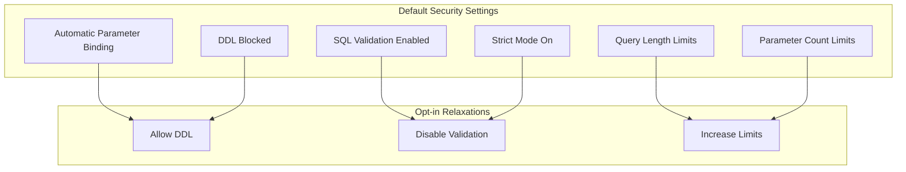
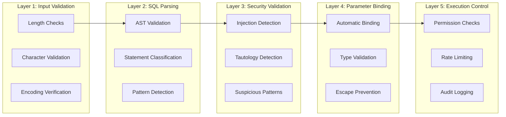

# Security Architecture

## Overview

Security is not an afterthought in SQLSpec - it's woven into every layer of the architecture. The library implements a defense-in-depth approach with multiple security layers that work together to prevent SQL injection, data leaks, and other security vulnerabilities. This document details the comprehensive security architecture that makes SQLSpec safe by default.

## Security Philosophy

### Secure by Default

SQLSpec follows the principle of secure defaults:



### Defense in Depth

Multiple security layers provide overlapping protection:



## Security Components

### SQL Injection Prevention

The primary security concern for any SQL library is injection attacks. SQLSpec prevents these through multiple mechanisms:

#### Automatic Parameter Binding

```python
# User input is NEVER concatenated into SQL
user_input = "'; DROP TABLE users; --"

# Bad (would be SQL injection in unsafe library)
# sql = f"SELECT * FROM users WHERE name = '{user_input}'"

# Good - SQLSpec automatically binds parameters
result = session.execute(
    "SELECT * FROM users WHERE name = ?",
    (user_input,)  # Safely bound as parameter
)

# Query builders also safe by default
result = session.execute(
    sql.select().from_("users").where("name", "=", user_input)
)
```

#### Literal Parameterization

The pipeline automatically extracts and parameterizes literals:

```python
# Original SQL with literals
sql_obj = SQL("SELECT * FROM users WHERE age > 18 AND status = 'active'")

# After pipeline processing:
# SQL: "SELECT * FROM users WHERE age > ? AND status = ?"
# Parameters: [18, "active"]
```

#### Pattern-Based Detection

Multiple validators detect injection attempts:

```python
class SQLInjectionValidator:
    """Detects potential SQL injection patterns."""

    DANGEROUS_PATTERNS = [
        # Comment-based injection
        r"--.*$",
        r"/\*.*\*/",

        # Union-based injection
        r"\bUNION\b.*\bSELECT\b",

        # Stacked queries
        r";\s*(?:DELETE|UPDATE|INSERT|DROP|CREATE|ALTER)",

        # Time-based injection
        r"\b(?:SLEEP|WAITFOR|PG_SLEEP)\b",

        # Boolean-based injection
        r"'\s*OR\s*'?\d*'\s*=\s*'?\d*",
        r'"\s*OR\s*"?\d*"\s*=\s*"?\d*',
    ]

    def validate(self, context: SQLProcessingContext) -> ValidationResult:
        """Check for injection patterns."""
        sql = context.raw_sql

        for pattern in self.DANGEROUS_PATTERNS:
            if re.search(pattern, sql, re.IGNORECASE):
                return ValidationResult(
                    validator="SQLInjection",
                    passed=False,
                    risk_level=RiskLevel.CRITICAL,
                    message=f"Potential SQL injection detected: {pattern}",
                    should_block=True
                )

        return ValidationResult(
            validator="SQLInjection",
            passed=True,
            risk_level=RiskLevel.LOW
        )
```

### Tautology Detection

Prevents always-true conditions that could bypass security:

```python
class TautologyValidator:
    """Detects tautological conditions."""

    def validate(self, context: SQLProcessingContext) -> ValidationResult:
        """Check for tautologies in WHERE clauses."""
        issues = []

        for node in context.ast.find_all(Where):
            if self._is_tautology(node.expression):
                issues.append(ValidationIssue(
                    level=RiskLevel.HIGH,
                    message="Tautological condition detected",
                    location=node.pos,
                    details={
                        "condition": node.expression.sql(),
                        "type": "always_true"
                    }
                ))

        return ValidationResult(
            validator="Tautology",
            passed=len(issues) == 0,
            issues=issues,
            risk_level=max((i.level for i in issues), default=RiskLevel.LOW)
        )

    def _is_tautology(self, expr: Expression) -> bool:
        """Check if expression is always true."""
        # Check for patterns like '1'='1', 1=1, true, etc.
        if isinstance(expr, EQ):
            left = expr.left
            right = expr.right

            # Same literal on both sides
            if isinstance(left, Literal) and isinstance(right, Literal):
                return left.value == right.value

            # Same column on both sides
            if isinstance(left, Column) and isinstance(right, Column):
                return left.name == right.name

        # Check for OR with same condition
        if isinstance(expr, Or):
            conditions = self._flatten_or(expr)
            return len(conditions) != len(set(str(c) for c in conditions))

        return False
```

### Data Leak Prevention

Prevents accidental data exposure:

```python
class DataLeakPrevention:
    """Prevents sensitive data exposure."""

    def __init__(self, sensitive_columns: set[str]):
        self.sensitive_columns = sensitive_columns

    def validate_query(self, ast: Expression) -> ValidationResult:
        """Check for potential data leaks."""
        issues = []

        # Check for SELECT * with sensitive tables
        for select in ast.find_all(Select):
            if self._is_select_star(select):
                tables = self._get_tables(select)
                if any(self._has_sensitive_data(t) for t in tables):
                    issues.append(ValidationIssue(
                        level=RiskLevel.MEDIUM,
                        message="SELECT * on table with sensitive data",
                        recommendation="Explicitly list columns"
                    ))

        # Check for missing WHERE on sensitive tables
        for node in ast.find_all(Select):
            if not node.where:
                tables = self._get_tables(node)
                if any(self._has_sensitive_data(t) for t in tables):
                    issues.append(ValidationIssue(
                        level=RiskLevel.HIGH,
                        message="Unrestricted query on sensitive table"
                    ))

        return ValidationResult(
            validator="DataLeak",
            passed=len(issues) == 0,
            issues=issues
        )
```

## Permission System

### Operation-Based Permissions

Fine-grained control over allowed operations:

```python
@dataclass
class SecurityPolicy:
    """Security policy configuration."""

    # Operation permissions
    allow_select: bool = True
    allow_insert: bool = True
    allow_update: bool = True
    allow_delete: bool = True
    allow_ddl: bool = False
    allow_dcl: bool = False
    allow_transactions: bool = True

    # Table permissions
    allowed_tables: Optional[set[str]] = None
    blocked_tables: Optional[set[str]] = None

    # Column permissions
    allowed_columns: Optional[dict[str, set[str]]] = None
    blocked_columns: Optional[dict[str, set[str]]] = None

    # Advanced
    require_where_clause: bool = False
    max_rows_affected: Optional[int] = None
    require_limit_clause: bool = False
```

### Permission Enforcement

```python
class PermissionValidator:
    """Enforces security policies."""

    def __init__(self, policy: SecurityPolicy):
        self.policy = policy

    def validate(self, context: SQLProcessingContext) -> ValidationResult:
        """Check permissions for SQL operation."""
        issues = []

        # Check operation type
        op_type = context.analyzed_metadata.statement_type

        if op_type == "SELECT" and not self.policy.allow_select:
            return self._deny("SELECT operations not allowed")

        if op_type == "INSERT" and not self.policy.allow_insert:
            return self._deny("INSERT operations not allowed")

        # Check table permissions
        for table in context.analyzed_metadata.tables:
            if self.policy.blocked_tables and table in self.policy.blocked_tables:
                return self._deny(f"Access to table '{table}' is blocked")

            if self.policy.allowed_tables and table not in self.policy.allowed_tables:
                return self._deny(f"Access to table '{table}' not allowed")

        # Check column permissions
        if self.policy.blocked_columns:
            for table, columns in context.analyzed_metadata.columns_by_table.items():
                blocked = self.policy.blocked_columns.get(table, set())
                used_blocked = columns & blocked
                if used_blocked:
                    return self._deny(
                        f"Access to columns {used_blocked} in table '{table}' is blocked"
                    )

        # Check required clauses
        if self.policy.require_where_clause:
            if context.analyzed_metadata.is_dml and not context.analyzed_metadata.has_where:
                issues.append(ValidationIssue(
                    level=RiskLevel.HIGH,
                    message="WHERE clause required for DML operations"
                ))

        return ValidationResult(
            validator="Permissions",
            passed=len(issues) == 0,
            issues=issues
        )
```

## Audit and Logging

### Comprehensive Audit Trail

All database operations can be audited:

```python
class AuditLogger:
    """Logs all database operations for audit."""

    def __init__(self, config: AuditConfig):
        self.config = config
        self.logger = self._setup_logger()

    def log_execution(
        self,
        sql: str,
        parameters: Any,
        user_context: Optional[dict] = None,
        result: Optional[SQLResult] = None,
        error: Optional[Exception] = None
    ) -> None:
        """Log SQL execution for audit."""
        audit_entry = {
            "timestamp": datetime.utcnow().isoformat(),
            "sql": self._sanitize_sql(sql),
            "parameters": self._sanitize_parameters(parameters),
            "user": user_context or {},
            "result": {
                "rows_affected": result.rows_affected if result else None,
                "success": error is None
            },
            "error": str(error) if error else None,
            "traceback": self._get_safe_traceback(error) if error else None
        }

        # Log to appropriate destination
        if self.config.log_to_file:
            self._log_to_file(audit_entry)

        if self.config.log_to_siem:
            self._log_to_siem(audit_entry)

        if self.config.log_to_database:
            self._log_to_database(audit_entry)

    def _sanitize_sql(self, sql: str) -> str:
        """Remove sensitive data from SQL."""
        if not self.config.log_full_sql:
            # Truncate long queries
            if len(sql) > self.config.max_sql_length:
                sql = sql[:self.config.max_sql_length] + "..."

            # Remove string literals if configured
            if self.config.redact_literals:
                sql = re.sub(r"'[^']*'", "'<REDACTED>'", sql)

        return sql

    def _sanitize_parameters(self, parameters: Any) -> Any:
        """Sanitize parameters for logging."""
        if not self.config.log_parameters:
            return "<PARAMETERS_REDACTED>"

        if self.config.redact_sensitive_params:
            return self._redact_sensitive(parameters)

        return parameters
```

### Security Event Detection

Real-time detection of security events:

```python
class SecurityEventDetector:
    """Detects and responds to security events."""

    def __init__(self, config: SecurityEventConfig):
        self.config = config
        self.event_handlers = self._setup_handlers()

    def check_event(
        self,
        context: SQLProcessingContext,
        result: Optional[SQLResult] = None
    ) -> None:
        """Check for security events."""
        # Check for suspicious patterns
        if self._is_suspicious_pattern(context):
            self._handle_event(SecurityEvent(
                type="SUSPICIOUS_PATTERN",
                severity=Severity.HIGH,
                details={"sql": context.raw_sql}
            ))

        # Check for unusual activity
        if self._is_unusual_activity(context, result):
            self._handle_event(SecurityEvent(
                type="UNUSUAL_ACTIVITY",
                severity=Severity.MEDIUM,
                details={
                    "rows_affected": result.rows_affected,
                    "threshold": self.config.unusual_threshold
                }
            ))

        # Check for repeated failures
        if self._is_brute_force_attempt(context):
            self._handle_event(SecurityEvent(
                type="BRUTE_FORCE_ATTEMPT",
                severity=Severity.CRITICAL,
                details={"attempts": self._get_failure_count(context)}
            ))

    def _handle_event(self, event: SecurityEvent) -> None:
        """Handle security event based on severity."""
        # Log event
        logger.warning(f"Security event: {event}")

        # Alert if necessary
        if event.severity >= Severity.HIGH:
            self._send_alert(event)

        # Take action if critical
        if event.severity == Severity.CRITICAL:
            self._take_defensive_action(event)
```

## Error Handling Security

### Safe Error Messages

Prevent information leakage through errors:

```python
class SafeErrorHandler:
    """Handles errors without exposing sensitive information."""

    def handle_error(
        self,
        error: Exception,
        context: Optional[SQLProcessingContext] = None
    ) -> Exception:
        """Convert error to safe version."""
        # Map to generic error types
        if isinstance(error, IntegrityError):
            # Don't expose constraint names
            return IntegrityError("Data integrity violation")

        if isinstance(error, ProgrammingError):
            # Don't expose schema details
            return ProgrammingError("Invalid SQL statement")

        if isinstance(error, InternalError):
            # Log full error internally
            logger.error(f"Internal error: {error}", exc_info=True)
            # Return generic error to user
            return InternalError("An internal error occurred")

        # Default handling
        return DatabaseError("Database operation failed")
```

### Traceback Sanitization

```python
def sanitize_traceback(tb: TracebackType) -> str:
    """Remove sensitive information from traceback."""
    frames = []

    for frame in traceback.extract_tb(tb):
        # Skip internal frames
        if frame.filename.startswith("/usr/local/"):
            continue

        # Sanitize frame
        sanitized_frame = TracebackFrame(
            filename=_sanitize_path(frame.filename),
            lineno=frame.lineno,
            name=frame.name,
            line=_sanitize_code(frame.line)
        )
        frames.append(sanitized_frame)

    return format_sanitized_traceback(frames)
```

## Rate Limiting

### Query Rate Limiting

Prevent abuse through rate limiting:

```python
class RateLimiter:
    """Rate limits SQL operations."""

    def __init__(self, config: RateLimitConfig):
        self.config = config
        self.buckets = defaultdict(TokenBucket)

    def check_rate_limit(
        self,
        user: str,
        operation: str
    ) -> RateLimitResult:
        """Check if operation is within rate limits."""
        # Get user's bucket
        bucket = self.buckets[user]

        # Check operation-specific limits
        limit = self.config.get_limit(operation)

        if not bucket.consume(1, limit):
            return RateLimitResult(
                allowed=False,
                retry_after=bucket.time_until_refill(),
                message=f"Rate limit exceeded for {operation}"
            )

        return RateLimitResult(allowed=True)
```

## Encryption

### Parameter Encryption

Sensitive parameters can be encrypted:

```python
class ParameterEncryption:
    """Encrypts sensitive parameters."""

    def __init__(self, key: bytes, sensitive_params: set[str]):
        self.cipher = Fernet(key)
        self.sensitive_params = sensitive_params

    def encrypt_parameters(
        self,
        parameters: dict[str, Any]
    ) -> dict[str, Any]:
        """Encrypt sensitive parameters."""
        encrypted = {}

        for key, value in parameters.items():
            if key in self.sensitive_params:
                # Encrypt sensitive value
                encrypted[key] = self.cipher.encrypt(
                    json.dumps(value).encode()
                )
            else:
                encrypted[key] = value

        return encrypted
```

## Security Configuration

### Security Profiles

Pre-configured security levels:

```python
class SecurityProfiles:
    """Pre-defined security profiles."""

    DEVELOPMENT = SecurityConfig(
        enable_validation=True,
        strict_mode=False,
        log_queries=True,
        log_parameters=True,
        allow_ddl=True
    )

    PRODUCTION = SecurityConfig(
        enable_validation=True,
        strict_mode=True,
        log_queries=True,
        log_parameters=False,
        allow_ddl=False,
        require_encryption=True,
        audit_all_operations=True
    )

    HIGH_SECURITY = SecurityConfig(
        enable_validation=True,
        strict_mode=True,
        log_queries=True,
        log_parameters=False,
        allow_ddl=False,
        require_encryption=True,
        audit_all_operations=True,
        require_mfa=True,
        ip_whitelist_only=True,
        max_query_time=30.0
    )
```

## Security Best Practices

### 1. Always Use Parameter Binding

```python
# Never do this
sql = f"SELECT * FROM users WHERE id = {user_id}"

# Always do this
sql = "SELECT * FROM users WHERE id = ?"
params = (user_id,)
```

### 2. Enable Strict Mode in Production

```python
config = PostgreSQLConfig(
    statement_config=SQLConfig(
        strict_mode=True,  # Enables all security validators
        allow_ddl=False,   # Prevents schema changes
        max_query_length=10000  # Prevents DOS
    )
)
```

### 3. Implement Least Privilege

```python
# Create read-only configuration
read_only_config = PostgreSQLConfig(
    url="postgresql://readonly_user@localhost/db",
    security_policy=SecurityPolicy(
        allow_select=True,
        allow_insert=False,
        allow_update=False,
        allow_delete=False,
        allow_ddl=False
    )
)
```

### 4. Monitor Security Events

```python
# Set up security monitoring
security_monitor = SecurityEventDetector(
    alert_on_injection_attempt=True,
    alert_on_unusual_activity=True,
    unusual_threshold=1000  # rows
)

spec.register_event_handler(security_monitor)
```

## Next Steps

- [Validation System](./13-validation-system.md) - Deep dive into validators
- [Parameter Handling](./14-parameter-handling.md) - Parameter binding details
- [Pipeline Overview](../pipeline/08-pipeline-overview.md) - Security in the pipeline

---

[← Driver Architecture](../drivers/05-driver-architecture.md) | [Validation System →](./13-validation-system.md)
