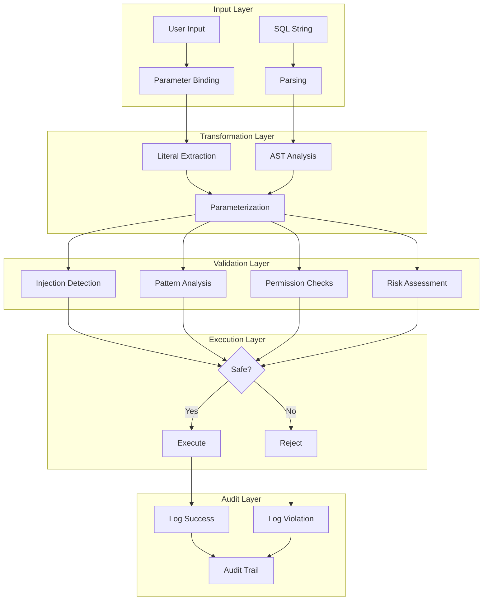

# Security Validation System

## Introduction

SQLSpec's security validation system provides comprehensive protection against SQL injection, data exfiltration, and other database security threats. Built on a defense-in-depth philosophy, it combines multiple validation layers to ensure that only safe SQL reaches your database.

## Security Architecture

The security system operates at multiple levels:



## Core Security Components

### 1. SQL Injection Prevention

The primary defense against SQL injection operates at multiple levels:

#### Automatic Parameterization

```python
from sqlspec.statement.sql import SQL
from sqlspec.config import SQLConfig

# Configure automatic parameterization
config = SQLConfig(
    transformers=[ParameterizeLiterals()],
    validators=[PreventInjection()]
)

# Unsafe input
user_input = "admin'; DROP TABLE users;--"

# Safe query construction
sql = SQL(
    f"SELECT * FROM users WHERE username = '{user_input}'",
    config=config
)
# Automatically transformed to:
# SELECT * FROM users WHERE username = ?
# Parameters: ["admin'; DROP TABLE users;--"]
```

#### Pattern-Based Detection

```python
from sqlspec.statement.pipelines.validators import SecurityValidator

validator = SecurityValidator(
    SecurityValidatorConfig(
        # Detect common injection patterns
        forbidden_patterns=[
            r";\s*DROP",           # Command chaining
            r"--\s*$",             # Comment injection
            r"\/\*.*\*\/",         # Block comments
            r"UNION\s+SELECT",     # Union-based injection
            r"OR\s+1\s*=\s*1",     # Tautology injection
        ],

        # Block dangerous functions
        forbidden_keywords=[
            "xp_cmdshell",         # SQL Server command execution
            "LOAD_FILE",           # MySQL file access
            "UTL_HTTP",            # Oracle HTTP access
            "dbms_java",           # Oracle Java execution
        ]
    )
)
```

### 2. Multi-Layer Validation

#### Layer 1: Input Validation

```python
class InputValidator:
    """Validate inputs before SQL construction."""

    def validate_identifier(self, name: str) -> str:
        """Validate table/column names."""
        if not re.match(r'^[a-zA-Z_][a-zA-Z0-9_]*$', name):
            raise SecurityError(f"Invalid identifier: {name}")

        # Check against reserved words
        if name.upper() in SQL_RESERVED_WORDS:
            raise SecurityError(f"Reserved word used as identifier: {name}")

        return name

    def validate_value(self, value: Any) -> Any:
        """Validate parameter values."""
        if isinstance(value, str):
            # Check for suspicious patterns
            if re.search(r'[;\'"\\]|--|\*|union|select|drop', value, re.I):
                logger.warning(f"Suspicious value detected: {value[:50]}...")

        return value
```

#### Layer 2: AST Analysis

```python
class ASTSecurityAnalyzer:
    """Analyze parsed SQL for security issues."""

    def analyze(self, expression: exp.Expression) -> SecurityReport:
        report = SecurityReport()

        # Check for multiple statements
        if self._has_multiple_statements(expression):
            report.add_critical("Multiple statements detected")

        # Check for system table access
        for table in expression.find_all(exp.Table):
            if self._is_system_table(table.name):
                report.add_warning(f"System table access: {table.name}")

        # Check for dangerous functions
        for func in expression.find_all(exp.Function):
            if func.name in DANGEROUS_FUNCTIONS:
                report.add_error(f"Dangerous function: {func.name}")

        return report
```

#### Layer 3: Behavioral Analysis

```python
class BehavioralAnalyzer:
    """Detect anomalous query patterns."""

    def __init__(self, baseline_stats: QueryStatistics):
        self.baseline = baseline_stats

    def analyze(self, sql: SQL) -> AnomalyReport:
        report = AnomalyReport()

        # Check query complexity
        complexity = self._calculate_complexity(sql)
        if complexity > self.baseline.avg_complexity * 3:
            report.add_anomaly("Unusually complex query")

        # Check data access patterns
        tables = self._extract_tables(sql)
        if len(tables) > self.baseline.avg_table_count * 2:
            report.add_anomaly("Accessing unusual number of tables")

        # Check result size estimation
        estimated_rows = self._estimate_result_size(sql)
        if estimated_rows > self.baseline.avg_result_size * 10:
            report.add_anomaly("Potentially large result set")

        return report
```

### 3. Permission-Based Security

#### Role-Based Access Control

```python
from dataclasses import dataclass
from typing import Set, Dict

@dataclass
class SecurityPolicy:
    """Define security permissions for a role."""
    allowed_operations: Set[str] = field(default_factory=set)
    allowed_tables: Set[str] = field(default_factory=set)
    denied_tables: Set[str] = field(default_factory=set)
    max_rows_per_query: int = 10000
    allow_system_tables: bool = False
    allow_ddl: bool = False
    time_restrictions: Dict[str, tuple] = field(default_factory=dict)

class PermissionValidator:
    """Validate queries against security policies."""

    def __init__(self, policies: Dict[str, SecurityPolicy]):
        self.policies = policies

    def validate(
        self,
        sql: SQL,
        user_role: str,
        context: Dict[str, Any]
    ) -> ValidationResult:
        policy = self.policies.get(user_role, SecurityPolicy())
        result = ValidationResult()

        # Check operation permissions
        operation = self._get_operation_type(sql)
        if operation not in policy.allowed_operations:
            result.add_error(f"Operation {operation} not allowed for role {user_role}")

        # Check table permissions
        for table in self._get_accessed_tables(sql):
            if table in policy.denied_tables:
                result.add_error(f"Access to table {table} is denied")
            elif policy.allowed_tables and table not in policy.allowed_tables:
                result.add_error(f"Table {table} not in allowed list")

        # Check time restrictions
        current_time = context.get("current_time", datetime.now())
        for restriction, (start, end) in policy.time_restrictions.items():
            if not self._within_time_window(current_time, start, end):
                result.add_error(f"Operation not allowed at this time: {restriction}")

        return result
```

#### Column-Level Security

```python
class ColumnSecurityValidator:
    """Enforce column-level access controls."""

    def __init__(self, column_policies: Dict[str, ColumnPolicy]):
        self.policies = column_policies

    def validate(self, sql: SQL, user_context: UserContext) -> ValidationResult:
        result = ValidationResult()

        for column in self._get_accessed_columns(sql):
            policy = self.policies.get(f"{column.table}.{column.name}")
            if not policy:
                continue

            # Check read permissions
            if column.is_selected and not policy.can_read(user_context):
                result.add_error(f"No read permission for {column}")

            # Check write permissions
            if column.is_updated and not policy.can_write(user_context):
                result.add_error(f"No write permission for {column}")

            # Check for PII access
            if policy.is_pii and not user_context.has_pii_access:
                result.add_error(f"PII access required for {column}")

        return result
```

### 4. Data Exfiltration Prevention

#### Rate Limiting

```python
class QueryRateLimiter:
    """Prevent data exfiltration through rate limiting."""

    def __init__(self, limits: RateLimitConfig):
        self.limits = limits
        self.history = defaultdict(list)

    def check_limit(
        self,
        user_id: str,
        sql: SQL,
        estimated_rows: int
    ) -> bool:
        now = time.time()
        user_history = self.history[user_id]

        # Clean old entries
        user_history = [
            (ts, rows) for ts, rows in user_history
            if now - ts < self.limits.window_seconds
        ]

        # Check query count limit
        if len(user_history) >= self.limits.max_queries_per_window:
            raise RateLimitExceeded("Query rate limit exceeded")

        # Check row count limit
        total_rows = sum(rows for _, rows in user_history) + estimated_rows
        if total_rows > self.limits.max_rows_per_window:
            raise RateLimitExceeded("Row retrieval limit exceeded")

        # Update history
        user_history.append((now, estimated_rows))
        self.history[user_id] = user_history

        return True
```

#### Sensitive Data Detection

```python
class SensitiveDataDetector:
    """Detect potential sensitive data access."""

    def __init__(self, patterns: Dict[str, Pattern]):
        self.patterns = patterns

    def analyze(self, sql: SQL) -> SensitivityReport:
        report = SensitivityReport()

        # Check column names
        for column in self._get_columns(sql):
            for pattern_name, pattern in self.patterns.items():
                if pattern.matches(column.name):
                    report.add_sensitive_field(
                        column=column,
                        type=pattern_name,
                        confidence=pattern.confidence
                    )

        # Check for bulk exports
        if self._is_bulk_export(sql):
            report.add_warning("Potential bulk data export detected")

        # Check for sensitive table access
        for table in self._get_tables(sql):
            if table in SENSITIVE_TABLES:
                report.add_sensitive_table(table)

        return report
```

## Advanced Security Features

### 1. Query Fingerprinting

```python
class QueryFingerprinter:
    """Generate unique fingerprints for query patterns."""

    def fingerprint(self, sql: SQL) -> str:
        """Generate a stable fingerprint for a query pattern."""
        # Normalize the query
        normalized = self._normalize(sql)

        # Extract structural elements
        structure = {
            "operation": self._get_operation(normalized),
            "tables": sorted(self._get_tables(normalized)),
            "join_pattern": self._get_join_pattern(normalized),
            "condition_pattern": self._get_condition_pattern(normalized)
        }

        # Generate hash
        return hashlib.sha256(
            json.dumps(structure, sort_keys=True).encode()
        ).hexdigest()

    def _normalize(self, sql: SQL) -> exp.Expression:
        """Normalize query by removing literals and formatting."""
        normalized = sql.expression.copy()

        # Replace all literals with placeholders
        for literal in normalized.find_all(exp.Literal):
            literal.replace(exp.Placeholder())

        return normalized
```

### 2. Anomaly Detection

```python
class SQLAnomalyDetector:
    """Detect anomalous SQL patterns using ML."""

    def __init__(self, model_path: str):
        self.model = self._load_model(model_path)
        self.vectorizer = self._create_vectorizer()

    def detect_anomaly(self, sql: SQL) -> AnomalyScore:
        """Calculate anomaly score for a query."""
        # Extract features
        features = self._extract_features(sql)

        # Vectorize
        vector = self.vectorizer.transform([features])

        # Predict
        anomaly_score = self.model.decision_function(vector)[0]
        is_anomaly = self.model.predict(vector)[0] == -1

        return AnomalyScore(
            score=float(anomaly_score),
            is_anomaly=is_anomaly,
            confidence=self._calculate_confidence(anomaly_score)
        )

    def _extract_features(self, sql: SQL) -> Dict[str, Any]:
        """Extract ML features from SQL."""
        return {
            "query_length": len(sql.to_sql()),
            "table_count": len(self._get_tables(sql)),
            "join_count": len(sql.expression.find_all(exp.Join)),
            "condition_complexity": self._calculate_condition_complexity(sql),
            "function_usage": self._get_function_usage(sql),
            "timestamp": datetime.now().hour,  # Time-based features
            "day_of_week": datetime.now().weekday()
        }
```

### 3. Security Event Correlation

```python
class SecurityEventCorrelator:
    """Correlate security events to detect attacks."""

    def __init__(self, window_minutes: int = 15):
        self.window = timedelta(minutes=window_minutes)
        self.events = defaultdict(list)

    def add_event(self, event: SecurityEvent) -> List[SecurityAlert]:
        """Add event and check for correlated patterns."""
        user_events = self.events[event.user_id]
        user_events.append(event)

        # Clean old events
        cutoff = datetime.now() - self.window
        user_events = [e for e in user_events if e.timestamp > cutoff]
        self.events[event.user_id] = user_events

        # Check for attack patterns
        alerts = []

        # SQL injection attempt pattern
        injection_events = [
            e for e in user_events
            if e.type == SecurityEventType.INJECTION_ATTEMPT
        ]
        if len(injection_events) >= 3:
            alerts.append(SecurityAlert(
                type=AlertType.SQL_INJECTION_ATTACK,
                severity=Severity.CRITICAL,
                message=f"Multiple injection attempts from user {event.user_id}",
                events=injection_events
            ))

        # Data exfiltration pattern
        data_events = [
            e for e in user_events
            if e.type == SecurityEventType.LARGE_RESULT_SET
        ]
        if len(data_events) >= 5:
            total_rows = sum(e.metadata.get("row_count", 0) for e in data_events)
            alerts.append(SecurityAlert(
                type=AlertType.DATA_EXFILTRATION,
                severity=Severity.HIGH,
                message=f"Potential data exfiltration: {total_rows} rows",
                events=data_events
            ))

        return alerts
```

## Security Configuration

### Comprehensive Security Setup

```python
from sqlspec.config import SQLConfig
from sqlspec.statement.pipelines.validators import (
    SecurityValidator,
    SecurityValidatorConfig,
    DMLSafetyValidator,
    DMLSafetyConfig
)

# Create comprehensive security configuration
security_config = SQLConfig(
    # Enable all security features
    enable_transformation=True,
    enable_validation=True,
    strict_mode=True,  # Fail on any security warning

    # Security transformers
    transformers=[
        # Parameterize all literals
        ParameterizeLiterals(skip_if_has_placeholders=False),

        # Sanitize identifiers
        SanitizeIdentifiers(),

        # Remove comments that might hide attacks
        RemoveComments(preserve_hints=False)
    ],

    # Security validators
    validators=[
        # Core security
        SecurityValidator(SecurityValidatorConfig(
            detect_injection=True,
            detect_tautology=True,
            detect_suspicious_keywords=True,
            detect_dynamic_sql=True,
            forbidden_keywords=SECURITY_FORBIDDEN_KEYWORDS,
            forbidden_patterns=SECURITY_FORBIDDEN_PATTERNS
        )),

        # DML safety
        DMLSafetyValidator(DMLSafetyConfig(
            require_where_for_update=True,
            require_where_for_delete=True,
            protected_tables=["users", "permissions", "audit_log"],
            max_affected_rows_error=10000
        )),

        # Custom business rules
        BusinessRuleValidator(),

        # Anomaly detection
        AnomalyDetectionValidator(model_path="./models/sql_anomaly.pkl")
    ]
)
```

### Role-Based Configuration

```python
# Different security levels for different roles
ROLE_CONFIGS = {
    "admin": SQLConfig(
        validators=[
            SecurityValidator(SecurityValidatorConfig(
                detect_injection=True,
                # Admins can use some system functions
                forbidden_keywords=["xp_cmdshell", "UTL_HTTP"]
            ))
        ]
    ),

    "application": SQLConfig(
        validators=[
            SecurityValidator(SecurityValidatorConfig(
                detect_injection=True,
                detect_suspicious_keywords=True,
                forbidden_keywords=SECURITY_FORBIDDEN_KEYWORDS
            )),
            DMLSafetyValidator(DMLSafetyConfig(
                allowed_operations=["SELECT", "INSERT", "UPDATE"],
                require_where_for_update=True,
                max_affected_rows_warning=1000
            ))
        ]
    ),

    "readonly": SQLConfig(
        validators=[
            SecurityValidator(SecurityValidatorConfig(
                detect_injection=True
            )),
            DMLSafetyValidator(DMLSafetyConfig(
                allowed_operations=["SELECT"],
                blocked_operations=["INSERT", "UPDATE", "DELETE", "DROP", "CREATE"]
            ))
        ]
    )
}
```

## Security Best Practices

### 1. Defense in Depth

```python
# Layer multiple security controls
config = SQLConfig(
    # Layer 1: Input sanitization
    transformers=[ParameterizeLiterals(), SanitizeIdentifiers()],

    # Layer 2: Validation
    validators=[
        PreventInjection(),
        SecurityValidator(),
        PermissionValidator()
    ],

    # Layer 3: Runtime limits
    execution_options={
        "timeout": 30,  # 30 second timeout
        "max_rows": 10000,  # Result size limit
        "read_only": True  # For certain connections
    }
)
```

### 2. Audit Everything

```python
class SecurityAuditLogger:
    """Log all security-relevant events."""

    def log_query_execution(
        self,
        sql: SQL,
        user: User,
        result: Result,
        security_context: SecurityContext
    ):
        self.logger.info({
            "event": "query_execution",
            "user_id": user.id,
            "user_role": user.role,
            "query_fingerprint": self.fingerprinter.fingerprint(sql),
            "tables_accessed": list(sql.tables),
            "operation": sql.operation,
            "row_count": result.row_count,
            "execution_time": result.execution_time,
            "security_flags": security_context.flags,
            "anomaly_score": security_context.anomaly_score
        })
```

### 3. Fail Securely

```python
try:
    result = session.execute(sql)
except SecurityValidationError as e:
    # Log security violation
    security_logger.error({
        "event": "security_validation_failed",
        "error": str(e),
        "user": user.id,
        "query": sql.to_sql()[:1000]  # Truncate for logging
    })

    # Return generic error to user
    raise UserError("Query validation failed")
except Exception as e:
    # Don't leak internal errors
    logger.error(f"Unexpected error: {e}")
    raise UserError("An error occurred processing your request")
```

## Summary

SQLSpec's security validation system provides:

- **Multi-layered protection** against SQL injection and other attacks
- **Configurable security policies** for different roles and contexts
- **Automatic parameterization** to prevent injection attacks
- **Behavioral analysis** to detect anomalous patterns
- **Comprehensive auditing** for security compliance

The system is designed to be both secure by default and flexible enough to meet specific organizational requirements.

---

[← Security Architecture](./12-security-architecture.md) | [Parameter Handling →](./14-parameter-handling.md)
