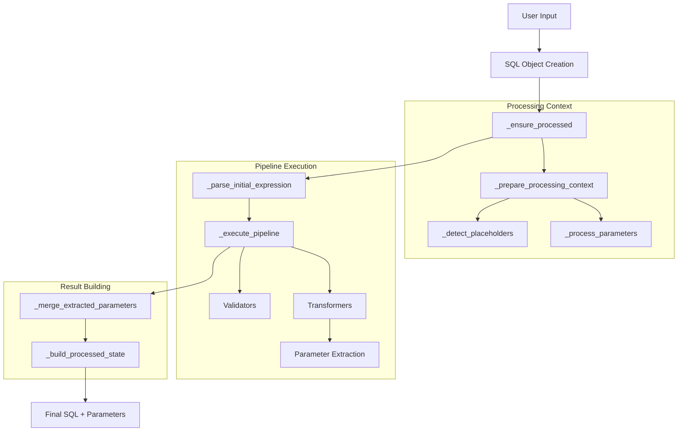

# Parameter Handling and Binding

## Introduction

Parameter handling is a critical security feature in SQLSpec that prevents SQL injection attacks while providing a flexible interface for query construction. This document covers the complete parameter lifecycle from input to database execution.

## Parameter Types and Styles

### Supported Parameter Types

SQLSpec supports multiple parameter formats to accommodate different use cases:

```python
from typing import Union, Dict, List, Tuple, Any
from sqlspec.statement.parameters import SQLParameterType

# Parameter type definition
SQLParameterType = Union[
    None,                        # No parameters
    Dict[str, Any],             # Named parameters
    List[Any],                  # Positional list
    Tuple[Any, ...],           # Positional tuple
    Any                        # Single parameter
]
```

### Parameter Style Reference

Different databases use different parameter placeholder styles:

```python
from enum import Enum

class ParameterStyle(Enum):
    """SQL parameter placeholder styles."""

    QMARK = "qmark"                    # ? (SQLite, ODBC)
    NUMERIC = "numeric"                # $1, $2 (PostgreSQL)
    NAMED_COLON = "named_colon"        # :name (Oracle, SQLite)
    NAMED_AT = "named_at"              # @name (SQL Server, BigQuery)
    PYFORMAT_POSITIONAL = "pyformat"  # %s (MySQL, Psycopg)
    PYFORMAT_NAMED = "pyformat_named"  # %(name)s (Psycopg)
    STATIC = "static"                  # No parameters (scripts)
```

## Parameter Processing Pipeline

The parameter validation and processing flow follows a sophisticated pipeline that ensures security and compatibility:



### 1. Initial Detection Phase

When a SQL object is created, the system first detects existing placeholders:

```python
def _detect_placeholders(self, context: SQLProcessingContext, raw_sql_input: str) -> None:
    """Detect existing placeholders in the SQL input."""
    with wrap_exceptions(suppress=Exception):
        param_validator = self._config.parameter_validator
        existing_params_info = param_validator.extract_parameters(raw_sql_input)
        if existing_params_info:
            context.input_sql_had_placeholders = True
            # Also update the config so transformers can see it
            self._config.input_sql_had_placeholders = True
```

### 2. Parameter Processing

The system then processes and merges parameters from multiple sources:

```python
def _process_parameters(
    self, context: SQLProcessingContext,
    raw_sql_input: str,
    raw_parameters: SQLParameterType
) -> None:
    """Process and merge parameters for the SQL context."""
    param_info = self._config.parameter_validator.extract_parameters(raw_sql_input)
    has_positional = any(p.name is None for p in param_info)
    has_named = any(p.name is not None for p in param_info)
    has_mixed = has_positional and has_named

    # Handle mixed parameters specially
    if has_mixed and parameters is not None and kwargs:
        args = parameters if isinstance(parameters, (list, tuple)) else [parameters]
        merged = self._config.parameter_converter._merge_mixed_parameters(
            param_info, args, kwargs
        )
        context.parameter_info, context.merged_parameters = param_info, merged
        return

    # Standard parameter conversion
    convert_result = self._config.parameter_converter.convert_parameters(
        raw_sql_input, parameters, None, kwargs,
        validate=self._config.enable_validation
    )
    context.parameter_info = convert_result[1]
    context.merged_parameters = convert_result[2]
```

### 3. Pipeline Transformation

During pipeline execution, transformers may extract additional parameters:

```python
class ParameterizeLiterals(Transformer):
    """Extracts literal values and converts them to parameters."""

    def transform(self, ast: Expression, context: SQLProcessingContext):
        # Extract literals into context.extracted_parameters_from_pipeline
        for node in ast.walk():
            if isinstance(node, Literal):
                context.extracted_parameters_from_pipeline.append(node.value)
                # Replace with placeholder
                param_name = f"param_{len(context.extracted_parameters_from_pipeline) - 1}"
                node.replace(Placeholder(param_name))
```

### 4. Parameter Merging

After pipeline execution, extracted parameters must be merged:

```python
def _merge_extracted_parameters(
    pipeline_result: StatementPipelineResult,
    context: SQLProcessingContext
) -> None:
    """Merge extracted parameters from pipeline transformers."""
    if not context.extracted_parameters_from_pipeline:
        return

    final_merged_parameters = pipeline_result.merged_parameters
    extracted_params = context.extracted_parameters_from_pipeline

    if isinstance(final_merged_parameters, dict):
        # Add extracted params with generated names
        for i, param in enumerate(extracted_params):
            param_name = f"param_{i}"
            final_merged_parameters[param_name] = param
    elif isinstance(final_merged_parameters, list):
        # Append to existing list
        final_merged_parameters.extend(extracted_params)
    else:
        # Replace with extracted params
        pipeline_result.merged_parameters = extracted_params
```

## Database-Specific Parameter Handling

### Parameter Style Configuration

Each database adapter declares its parameter style preferences:

```python
class SqliteConfig(NoPoolSyncConfig[SqliteConnection, SqliteDriver]):
    supported_parameter_styles: ClassVar[tuple[str, ...]] = ("qmark", "named_colon")
    preferred_parameter_style: ClassVar[str] = "qmark"

class AsyncpgConfig(AsyncDatabaseConfig[AsyncpgConnection, AsyncpgDriver]):
    supported_parameter_styles: ClassVar[tuple[str, ...]] = ("numeric",)
    preferred_parameter_style: ClassVar[str] = "numeric"

class PsycopgConfig(SyncDatabaseConfig[PsycopgConnection, PsycopgDriver]):
    supported_parameter_styles: ClassVar[tuple[str, ...]] = ("pyformat_positional", "pyformat_named")
    preferred_parameter_style: ClassVar[str] = "pyformat_positional"
```

### Automatic Style Injection

The parameter style is automatically injected into SQL processing:

```python
def provide_session(self, *args: Any, **kwargs: Any) -> Generator[Driver, None, None]:
    with self.provide_connection(*args, **kwargs) as connection:
        statement_config = self.statement_config

        # Inject parameter style information
        if statement_config.allowed_parameter_styles is None:
            from dataclasses import replace
            statement_config = replace(
                statement_config,
                allowed_parameter_styles=self.supported_parameter_styles,
                target_parameter_style=self.preferred_parameter_style,
            )
```

### Driver Parameter Conversion

Drivers convert parameters to their expected format:

```python
# AsyncPG expects positional parameters
if isinstance(params, dict) and params:
    if all(key.startswith("param_") for key in params):
        # Convert extracted parameters to positional
        params = [params[f"param_{i}"] for i in range(len(params))]
    else:
        # Convert named params to positional based on SQL order
        validator = ParameterValidator()
        param_info = validator.extract_parameters(statement._sql)
        params = [params[info.name] for info in param_info if info.name in params]
```

## Security Features

### 1. SQL Injection Prevention

Parameters are always kept separate from SQL code:

```python
# Dangerous: String concatenation
user_input = "admin'; DROP TABLE users;--"
dangerous_sql = f"SELECT * FROM users WHERE username = '{user_input}'"
# Result: SELECT * FROM users WHERE username = 'admin'; DROP TABLE users;--'

# Safe: Parameterized query
safe_sql = SQL("SELECT * FROM users WHERE username = ?", (user_input,))
# SQL: SELECT * FROM users WHERE username = ?
# Parameters: ["admin'; DROP TABLE users;--"]
# The dangerous input is safely passed as data, not SQL code
```

### 2. Parameter Validation

The system validates parameters at multiple levels:

```python
class ParameterStyleValidator(ProcessorProtocol):
    """Validates that parameter styles match database requirements."""

    def process(self, context: SQLProcessingContext):
        # Extract parameter information
        param_info = extract_parameters(context.current_sql)

        # Check against allowed styles
        if context.config.allowed_parameter_styles:
            for info in param_info:
                if info.style not in context.config.allowed_parameter_styles:
                    raise UnsupportedParameterStyleError(
                        f"{info.style} not supported by {context.dialect}"
                    )

        # Check for mixed styles
        if not context.config.allow_mixed_parameter_styles:
            styles = {info.style for info in param_info}
            if len(styles) > 1:
                raise MixedParameterStyleError(
                    f"Mixed parameter styles found: {styles}"
                )
```

### 3. Type Safety

Parameter handling maintains type information:

```python
from typing import TypeVar, Generic, overload

T = TypeVar("T")

class SQL(Generic[T]):
    @overload
    def execute(self, *, schema_type: type[T]) -> T: ...

    @overload
    def execute(self) -> DictRow: ...

    def execute(self, *, schema_type=None):
        # Type-safe execution with automatic serialization
        result = self.driver.execute(self)
        if schema_type:
            return schema_type(**result)
        return result
```

## Common Patterns and Best Practices

### 1. Query Builder Integration

Query builders automatically handle parameterization:

```python
from sqlspec import sql

# Parameters are automatically extracted and bound
query = (
    sql.select("id", "name", "email")
    .from_("users")
    .where("age", ">", 25)              # Becomes param_0
    .where("status", "=", "active")      # Becomes param_1
    .where("created_at", ">", "2024-01-01")  # Becomes param_2
)

print(query.to_sql())      # SELECT id, name, email FROM users WHERE age > ? AND status = ? AND created_at > ?
print(query.parameters)    # [25, 'active', '2024-01-01']
```

### 2. Manual Parameter Binding

For direct SQL construction:

```python
# Positional parameters
sql_pos = SQL("SELECT * FROM users WHERE age > ? AND status = ?", [25, "active"])

# Named parameters
sql_named = SQL(
    "SELECT * FROM users WHERE age > :age AND status = :status",
    {"age": 25, "status": "active"}
)

# Mixed with kwargs
sql_kwargs = SQL(
    "SELECT * FROM users WHERE age > :age AND status = :status",
    age=25,
    status="active"
)
```

### 3. Batch Operations

Execute many with proper parameter handling:

```python
# Batch insert with parameters
insert_sql = sql.insert("users").columns("name", "email", "age")

# Parameters for multiple rows
batch_params = [
    {"name": "Alice", "email": "alice@example.com", "age": 30},
    {"name": "Bob", "email": "bob@example.com", "age": 25},
    {"name": "Charlie", "email": "charlie@example.com", "age": 35}
]

# Mark as batch operation
insert_sql.is_many = True
result = driver.execute(insert_sql, batch_params)
```

### 4. Dynamic Query Building

Build queries with safe parameter handling:

```python
class DynamicQueryBuilder:
    def build_search_query(self, filters: dict[str, Any]) -> SQL:
        query = sql.select("*").from_("products")

        for field, value in filters.items():
            if isinstance(value, dict):
                # Range queries
                if "min" in value:
                    query = query.where(field, ">=", value["min"])
                if "max" in value:
                    query = query.where(field, "<=", value["max"])
            elif isinstance(value, list):
                # IN clause - parameters are automatically handled
                query = query.where(field, "IN", value)
            elif value is not None:
                # Exact match
                query = query.where(field, "=", value)

        return query
```

## Troubleshooting Parameter Issues

### Common Errors and Solutions

1. **Parameter Mismatch Error**
   ```python
   # Error: Expected 2 parameters, got 1
   sql = SQL("SELECT * FROM users WHERE id = ? AND status = ?", (123,))

   # Solution: Provide all parameters
   sql = SQL("SELECT * FROM users WHERE id = ? AND status = ?", (123, "active"))
   ```

2. **Unsupported Parameter Style**
   ```python
   # Error: SQLite doesn't support numeric style
   sql = SQL("SELECT * FROM users WHERE id = $1", config=sqlite_config)

   # Solution: Use supported style or let system convert
   sql = SQL("SELECT * FROM users WHERE id = ?", (123,), config=sqlite_config)
   ```

3. **Empty Dictionary Parameters**
   ```python
   # Error: Server expects 0 arguments, 1 was passed
   sql = SQL("SELECT CURRENT_TIMESTAMP", {})

   # Solution: Use None for no parameters
   sql = SQL("SELECT CURRENT_TIMESTAMP")
   ```

4. **Mixed Parameter Styles**
   ```python
   # Error: Mixed parameter styles detected
   sql = SQL("SELECT * FROM users WHERE id = ? AND name = :name")

   # Solution: Use consistent style
   sql = SQL("SELECT * FROM users WHERE id = ? AND name = ?", (123, "John"))
   # Or enable mixed styles in config
   config = SQLConfig(allow_mixed_parameter_styles=True)
   ```

## Summary

SQLSpec's parameter handling system provides:

- **Automatic SQL injection prevention** through consistent parameterization
- **Multiple parameter styles** to support different databases
- **Intelligent parameter merging** from multiple sources (literals, filters, manual)
- **Type-safe parameter handling** with validation at multiple levels
- **Database-specific conversion** with automatic style detection
- **Performance optimizations** through prepared statements and batching

The system ensures that user data is always kept separate from SQL code, providing both security and flexibility while maintaining compatibility across different database systems.

---

[← Validation System](./13-validation-system.md) | [Advanced Features →](../15-advanced-features.md)
