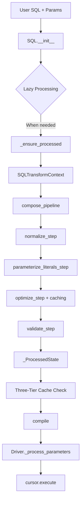

# SQLSpec Quick Reference

*Essential patterns and commands for SQLSpec development*

## Public API - Driver Execute Methods

### Execute Method Overloads

```python
from typing import Union, Optional, type
from sqlspec.statement.filters import StatementFilter
from sqlspec.typing import StatementParameters, ModelDTOT

# Execute with schema conversion
def execute(
    self,
    statement: Union[SQL, Statement, QueryBuilder[Any]],
    /,
    *parameters: Union[StatementParameters, StatementFilter],
    schema_type: type[ModelDTOT],
    _connection: Optional[ConnectionT] = None,
    _config: Optional[SQLConfig] = None,
    **kwargs: Any,
) -> SQLResult[ModelDTOT]: ...

# Execute without schema conversion
def execute(
    self,
    statement: Union[SQL, Statement, QueryBuilder[Any]],
    /,
    *parameters: Union[StatementParameters, StatementFilter],
    schema_type: None = None,
    _connection: Optional[ConnectionT] = None,
    _config: Optional[SQLConfig] = None,
    **kwargs: Any,
) -> SQLResult[RowT]: ...
```

### Execute Many

```python
def execute_many(
    self,
    statement: Union[SQL, Statement, QueryBuilder[Any]],
    /,
    *parameters: Union[StatementParameters, StatementFilter],
    _connection: Optional[ConnectionT] = None,
    _config: Optional[SQLConfig] = None,
    **kwargs: Any,
) -> SQLResult[RowT]:
    """Execute statement multiple times with different parameters."""
```

### Execute Script

```python
def execute_script(
    self,
    statement: Union[str, SQL],
    /,
    *parameters: Union[StatementParameters, StatementFilter],
    _connection: Optional[ConnectionT] = None,
    _config: Optional[SQLConfig] = None,
    _suppress_warnings: bool = False,
    **kwargs: Any,
) -> SQLResult[RowT]:
    """Execute multi-statement script."""
```

## Pipeline Processing Order



### Caching Layers

- **Base Statement Cache**: Processed SQL objects
- **Filter Result Cache**: Applied filter transformations
- **Optimized Expression Cache**: SQLGlot optimization results

## Key Classes & Their Roles

### SQL Statement

```python
sql = SQL("SELECT * WHERE id = ?", 1)
# Holds: AST, parameters, configuration
# Returns: New instances on modification
```

### TypedParameter

```python
TypedParameter(
    value=123,           # Actual value
    type_hint="int",     # For type coercion
    sqlglot_type=...,    # AST type
    semantic_name="id"   # Parameter meaning
)
```

### SQLTransformContext

```python
@dataclass
class SQLTransformContext:
    current_expression: exp.Expression  # Modified AST
    original_expression: exp.Expression # Original AST
    parameters: dict[str, Any]         # Extracted params
    dialect: str                       # Target dialect
    metadata: dict[str, Any]          # Step results
```

## Mixin Responsibilities

| Mixin | Purpose | Key Method |
|-------|---------|------------|
| TypeCoercionMixin | Extract TypedParameter values | `_process_parameters()` |
| SyncStorageMixin | Import/export data | `fetch_arrow_table()` |
| SyncPipelinedExecutionMixin | Pipeline integration | `_get_compiled_sql()` |
| SQLTranslatorMixin | Dialect translation | `transpile_sql()` |
| ToSchemaMixin | Result conversion | `to_schema()` |

## Driver Implementation Pattern

```python
from typing import Optional, Any, ClassVar
from sqlspec.driver import SyncDriverAdapterBase
from sqlspec.driver.mixins import (
    TypeCoercionMixin,
    SyncPipelinedExecutionMixin,
    SyncStorageMixin,
)
from sqlspec.statement.parameters import ParameterStyle
from sqlspec.statement.result import SQLResult
from sqlspec.statement.sql import SQL
from sqlspec.typing import ConnectionT, RowT

class MyDriver(
    SyncDriverAdapterBase[ConnectionT, RowT],
    TypeCoercionMixin,            # REQUIRED
    SyncPipelinedExecutionMixin,  # REQUIRED
    SyncStorageMixin,             # REQUIRED
):
    # Class attributes
    dialect: ClassVar[str] = "mydialect"
    supported_parameter_styles: ClassVar[tuple[ParameterStyle, ...]] = (ParameterStyle.QMARK,)
    default_parameter_style: ClassVar[ParameterStyle] = ParameterStyle.QMARK

    def _execute_statement(
        self,
        statement: SQL,
        connection: Optional[ConnectionT] = None,
        **kwargs: Any
    ) -> SQLResult[RowT]:
        # 1. Handle scripts first
        if statement.is_script:
            sql, _ = self._get_compiled_sql(statement, ParameterStyle.STATIC)
            return self._execute_script(sql, connection=connection, statement=statement, **kwargs)

        # 2. Get target parameter style
        target_style = self._determine_target_style(statement)

        # 3. Compile SQL
        sql, params = self._get_compiled_sql(statement, target_style)

        # 4. Process parameters (DO NOT ADD MORE PROCESSING)
        params = self._process_parameters(params)

        # 5. Route to method
        if statement.is_many:
            return self._execute_many(sql, params, connection=connection, **kwargs)
        else:
            return self._execute(sql, params, statement, connection=connection, **kwargs)

    def _execute(
        self,
        sql: str,
        parameters: Any,
        statement: SQL,
        connection: Optional[ConnectionT] = None,
        **kwargs: Any
    ) -> SQLResult[RowT]:
        """Execute single statement"""
        raise NotImplementedError

    def _execute_many(
        self,
        sql: str,
        param_list: Any,
        connection: Optional[ConnectionT] = None,
        **kwargs: Any
    ) -> SQLResult[RowT]:
        """Execute with multiple parameter sets"""
        raise NotImplementedError

    def _execute_script(
        self,
        script: str,
        connection: Optional[ConnectionT] = None,
        **kwargs: Any
    ) -> SQLResult[RowT]:
        """Execute multi-statement script"""
        raise NotImplementedError
```

## Common Overrides

### Boolean Coercion (SQLite, MySQL)

```python
def _coerce_boolean(self, value: Any) -> Any:
    if isinstance(value, bool):
        return 1 if value else 0
    return value
```

### JSON Coercion (SQLite)

```python
def _coerce_json(self, value: Any) -> Any:
    if isinstance(value, (dict, list)):
        return json.dumps(value)
    return value
```

### Array Coercion (Non-array DBs)

```python
def _coerce_array(self, value: Any) -> Any:
    if isinstance(value, (list, tuple)):
        return json.dumps(list(value))
    return value
```

## Special Cases

### ADBC NULL Parameters

```python
# Problem: ADBC can't determine NULL types
# Solution: AST transformation
```

@sqlspec/adapters/adbc/pipeline_steps.py

### Psycopg COPY

```python
# Problem: COPY data isn't a SQL parameter
# Solution: Detect and skip parameter extraction
```

@sqlspec/adapters/psycopg/pipeline_steps.py

## Parameter Styles

| Style | Example | Databases |
|-------|---------|-----------|
| QMARK | `WHERE id = ?` | SQLite, ADBC SQLite |
| NUMERIC | `WHERE id = $1` | PostgreSQL, ADBC PG |
| NAMED_COLON | `WHERE id = :name` | Oracle (named) |
| NAMED_AT | `WHERE id = @name` | BigQuery |
| POSITIONAL_COLON | `WHERE id = :1` | Oracle (positional) |
| POSITIONAL_PYFORMAT | `WHERE id = %s` | MySQL |
| NAMED_PYFORMAT | `WHERE id = %(name)s` | psycopg (named) |

## DO's and DON'Ts

### ✅ DO

- Trust TypeCoercionMixin for parameter processing
- Override specific `_coerce_*` methods only
- Use AST transformation for SQL changes
- Return new SQL instances (immutability)
- Test with type preservation

### ❌ DON'T

- Add `convert_parameter_sequence` calls
- Manually extract TypedParameter values
- Process parameters multiple times
- Modify SQL strings directly
- Mix concerns between pipeline and driver

## Special Parameters & kwargs

### Common kwargs Usage

```python
# In execute methods, kwargs can include:
# - Driver-specific options
# - Migration flags (_suppress_warnings)
# - Execution hints
# - Custom metadata

def _execute(
    self,
    sql: str,
    parameters: Any,
    statement: SQL,
    connection: Optional[ConnectionT] = None,
    **kwargs: Any  # Driver-specific options
) -> SQLResult[RowT]:
    # Extract known kwargs
    timeout = kwargs.get('timeout', None)
    fetch_size = kwargs.get('fetch_size', 1000)

    # Pass remaining kwargs to cursor if supported
    cursor.execute(sql, parameters, **kwargs)
```

### Parameter Handling Flow

```python
# 1. User provides parameters
result = session.execute(
    "SELECT * FROM users WHERE id = ?",
    123,  # Positional parameter
    LimitOffsetFilter(10, 0),  # Filter (becomes part of SQL)
    timeout=30  # kwargs passed to driver
)

# 2. Driver receives
def execute(self, statement, /, *parameters, **kwargs):
    # parameters includes both values and filters
    # kwargs includes driver options
```

## Testing Patterns

### Debug Script Template

```python
#!/usr/bin/env python
# .tmp/debug_issue.py
from sqlspec.adapters.mydb import MyDbConfig

config = MyDbConfig(
    connection_config={"host": "localhost"},
    statement_config=SQLConfig(enable_transformations=True)
)

with config.provide_session() as session:
    # Reproduce issue
    result = session.execute(SQL("SELECT ?", 1))
    print(f"Result: {result.data}")
```

### Test Specific Adapter

```bash
# Run one test
uv run pytest tests/integration/test_adapter_adbc.py::test_name -xvs

# Run all adapter tests
uv run pytest tests/integration/test_adapter_adbc.py -xvs

# With output
uv run pytest tests/integration/test_adapter_adbc.py -xvs --tb=short
```

## Common Errors & Solutions

| Error | Cause | Solution |
|-------|-------|----------|
| "parameter count mismatch" | Double processing | Remove `convert_parameter_sequence` |
| "TypeError: 'int' object is not subscriptable" | Type lost | Check `_coerce_*` methods |
| "NULL type mapping" | ADBC NULL params | Use AST transformation |
| "COPY data invalid" | Parameter extraction | Skip COPY detection |

## Type Definitions

### Core Types

```python
from typing import Union, Any, Optional
from sqlspec.typing import (
    StatementParameters,  # Union[Sequence[Any], dict[str, Any], Any]
    ConnectionT,         # TypeVar for connection types
    RowT,               # TypeVar for row types (DictRow, TupleRow, etc.)
    ModelDTOT,          # TypeVar for model/DTO types
)

# Statement types
Statement = Union[str, exp.Expression, SQL]

# Filter types
from sqlspec.statement.filters import StatementFilter
```

### StatementFilter Protocol

```python
class StatementFilter(ABC):
    """Filters that can be appended to SQL statements."""

    @abstractmethod
    def append_to_statement(self, statement: SQL) -> SQL:
        """Apply filter and return NEW SQL instance (immutability!)."""
        ...

    def extract_parameters(self) -> tuple[list[Any], dict[str, Any]]:
        """Extract (positional_params, named_params) from filter."""
        return [], {}
```

### Common Filters

```python
from sqlspec.statement.filters import (
    LimitOffsetFilter,     # .limit(10).offset(20)
    OrderByFilter,         # .order_by("name", "created_at DESC")
    InCollectionFilter,    # WHERE col IN (...)
    SearchFilter,          # Text search patterns
    BeforeAfterFilter,     # Date/time filtering
)
```

## File Organization

```
sqlspec/
├── statement/          # Core SQL handling
│   ├── sql.py         # SQL class
│   ├── pipeline.py    # Transform pipeline
│   └── parameters.py  # Parameter types
├── driver/            # Shared driver code
│   └── mixins/       # Mixin implementations
├── adapters/         # Database adapters
│   └── {db}/
│       ├── driver.py  # Driver implementation
│       └── config.py  # Configuration
└── tests/
    ├── .tmp/         # Debug scripts
    ├── .bugs/        # Bug reports
    └── .todos/       # Task tracking
```

## Remember

1. **Pipeline transforms SQL only** - not parameters
2. **TypeCoercionMixin processes parameters** - trust it
3. **Special cases need special handling** - but in the right place
4. **Types flow through the system** - preserve them
5. **Test everything** - especially edge cases
