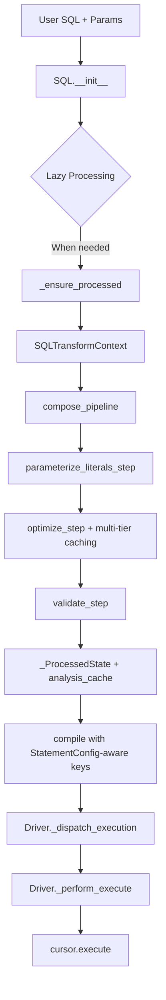

# SQLSpec Quick Reference

*Essential patterns and commands for SQLSpec development - Updated for current implementation*

## 🚨 CRITICAL UPDATES - Current Implementation

### Method Signature Changes (BREAKING)

- **OLD**: `_extract_select_data()` and `_extract_execute_rowcount()`
- **NEW**: `_get_selected_data()` and `_get_row_count()` ✅

### Enhanced Caching System (NEW)

- Multi-tier caching with StatementConfig-aware cache keys
- File cache with checksum validation providing 12x+ performance improvements
- Analysis cache for pipeline step results

### Pipeline Architecture (ENHANCED)

- SQLTransformContext for state management
- compose_pipeline for efficient step composition
- Enhanced StatementConfig.get_pipeline_steps() support

## Public API - Driver Execute Methods

### Execute Method Overloads

```python
from typing import Union, Optional
from sqlspec.core.filters import StatementFilter
from sqlspec.core.statement import SQL, Statement, StatementConfig
from sqlspec.builder import QueryBuilder
from sqlspec.typing import StatementParameters, ModelDTOT

# Execute without schema conversion
def execute(
    self,
    statement: Union[SQL, Statement, QueryBuilder],
    /,
    *parameters: Union[StatementParameters, StatementFilter],
    statement_config: Optional[StatementConfig] = None,
    **kwargs: Any,
) -> SQLResult:
    """Execute SQL statement and return results."""
```

### Execute Many

```python
def execute_many(
    self,
    statement: Union[SQL, Statement, QueryBuilder],
    /,
    *parameters: Union[StatementParameters, StatementFilter],
    statement_config: Optional[StatementConfig] = None,
    **kwargs: Any,
) -> SQLResult:
    """Execute statement multiple times with different parameters."""
```

### Execute Script

```python
def execute_script(
    self,
    statement: Union[str, SQL],
    /,
    *parameters: Union[StatementParameters, StatementFilter],
    statement_config: Optional[StatementConfig] = None,
    **kwargs: Any,
) -> SQLResult:
    """Execute multi-statement script."""
```

## Enhanced Pipeline Processing Order



### Multi-Tier Caching Architecture (ENHANCED)

- **SQL Cache**: Compiled SQL strings with StatementConfig-aware cache keys
- **Optimized Cache**: Post-optimization AST expressions for reuse
- **Builder Cache**: QueryBuilder instances with state serialization
- **File Cache**: SQLFileLoader with checksum validation (12x+ speedup)
- **Analysis Cache**: Pipeline analysis results with step-specific caching

## Key Classes & Their Roles

### SQL Statement

```python
sql = SQL("SELECT * WHERE id = ?", 1)
# Holds: AST, parameters, configuration
# Returns: New instances on modification
# Key methods: compile(), copy(),   as_script()
```

### StatementConfig

```python
StatementConfig(
    dialect="postgres",                    # Target SQL dialect
    enable_parsing=True,                   # Use SQLGlot parsing
    enable_validation=True,                # Run security validators
    enable_transformations=True,           # Apply transformers
    enable_caching=True,                   # Cache processed results
    parameter_config=ParameterStyleConfig(...), # Parameter configuration
)
```

### SQLTransformContext

```python
@dataclass
class SQLTransformContext:
    current_expression: exp.Expression     # Modified AST
    original_expression: exp.Expression    # Original AST
    parameters: dict[str, Any]             # Extracted parameters
    dialect: str                           # Target dialect
    metadata: dict[str, Any]               # Step results
    driver_adapter: Any                    # Current driver instance
```

## Base Class Responsibilities

| Base Class | Purpose | Key Methods |
|------------|---------|-------------|
| SyncDriverAdapterBase | Synchronous execution | `execute()`, `_dispatch_execution()`, `_perform_execute()` |
| AsyncDriverAdapterBase | Asynchronous execution | `execute()`, `_dispatch_execution()`, `_perform_execute()` |
| CommonDriverAttributesMixin | Shared utilities | `prepare_statement()`, `prepare_driver_parameters()` |
| SQLTranslatorMixin | Dialect translation | `transpile_sql()` |
| ToSchemaMixin | Result conversion | `to_schema()` |

## Driver Implementation Pattern

```python
from typing import Optional, Any
from sqlspec.driver import SyncDriverAdapterBase
from sqlspec.core.parameters import ParameterStyle, ParameterStyleConfig
from sqlspec.core.statement import SQL, StatementConfig
from sqlspec.core.result import SQLResult

class MyDriver(SyncDriverAdapterBase):
    """Example driver implementation."""

    dialect = "mydialect"

    def __init__(
        self,
        connection: Any,
        statement_config: Optional[StatementConfig] = None,
        driver_features: Optional[dict[str, Any]] = None,
    ) -> None:
        if statement_config is None:
            parameter_config = ParameterStyleConfig(
                default_parameter_style=ParameterStyle.QMARK,
                supported_parameter_styles={ParameterStyle.QMARK},
                type_coercion_map={},
                has_native_list_expansion=False,
                needs_static_script_compilation=True,
            )
            statement_config = StatementConfig(
                dialect="mydialect",
                parameter_config=parameter_config
            )

        super().__init__(connection, statement_config, driver_features)

    # Context manager for cursor
    def with_cursor(self, connection: Any) -> Any:
        """Return context manager for cursor acquisition."""
        return MyCursorContext(connection)

    # Transaction methods
    def begin(self) -> None:
        """Begin transaction."""
        self.connection.begin()

    def commit(self) -> None:
        """Commit transaction."""
        self.connection.commit()

    def rollback(self) -> None:
        """Rollback transaction."""
        self.connection.rollback()

    # Special handling hook
    def _try_special_handling(self, cursor: Any, statement: SQL) -> Optional[tuple[Any, Optional[int], Any]]:
        """Hook for database-specific operations."""
        return None  # Use standard execution

    # Abstract execution methods
    def _execute_statement(self, cursor: Any, sql: str, prepared_parameters: Any) -> Any:
        """Execute single statement."""
        cursor.execute(sql, prepared_parameters or ())

    def _execute_many(self, cursor: Any, sql: str, prepared_parameters: Any) -> Any:
        """Execute with multiple parameter sets."""
        cursor.executemany(sql, prepared_parameters)

    def _execute_script(self, cursor: Any, sql: str, prepared_parameters: Any, statement_config: StatementConfig) -> Any:
        """Execute script."""
        statements = self.split_script_statements(sql, statement_config)
        for stmt in statements:
            cursor.execute(stmt, prepared_parameters or ())

    # Data extraction methods (CURRENT SIGNATURES)
    def _get_selected_data(self, cursor: Any) -> tuple[list[dict[str, Any]], list[str], int]:
        """Extract SELECT results."""
        data = cursor.fetchall()
        columns = [desc[0] for desc in cursor.description or []]
        return [dict(zip(columns, row)) for row in data], columns, len(data)

    def _get_row_count(self, cursor: Any) -> int:
        """Extract row count."""
        return cursor.rowcount or 0
```

## Type Coercion Configuration

### ParameterStyleConfig Type Coercion

```python
# Boolean coercion for SQLite/MySQL
type_coercion_map = {
    bool: int,  # Convert True/False to 1/0
    datetime.datetime: lambda v: v.isoformat(),  # ISO format
    Decimal: str,  # String representation
    dict: to_json,  # JSON serialization
    list: to_json,  # JSON serialization
    tuple: lambda v: to_json(list(v)),  # Tuple to JSON
}

parameter_config = ParameterStyleConfig(
    default_parameter_style=ParameterStyle.QMARK,
    supported_parameter_styles={ParameterStyle.QMARK},
    type_coercion_map=type_coercion_map,
    has_native_list_expansion=False,
    needs_static_script_compilation=True,
)
```

## Special Cases

### ADBC NULL Parameters

```python
# Problem: ADBC can't determine NULL types
# Solution: AST transformation in pipeline steps
```

`sqlspec/adapters/adbc/pipeline_steps.py` - Custom pipeline step for NULL type handling

### Psycopg COPY

```python
# Problem: COPY data isn't a SQL parameter
# Solution: Special handling hook in _try_special_handling
```

`sqlspec/adapters/psycopg/pipeline_steps.py` - COPY detection and parameter skipping

## Parameter Styles

| Style | Example | Databases |
|-------|---------|-----------|
| QMARK | `WHERE id = ?` | SQLite, ADBC SQLite |
| NUMERIC | `WHERE id = $1` | PostgreSQL, ADBC PG |
| NAMED_COLON | `WHERE id = :name` | Oracle (named) |
| NAMED_AT | `WHERE id = @name` | BigQuery |
| POSITIONAL_COLON | `WHERE id = :1` | Oracle (positional) |
| POSITIONAL_PYFORMAT | `WHERE id = %s` | MySQL |
| NAMED_PYFORMAT | `WHERE id = %(name)s` | psycopg (named) |

## DO's and DON'Ts

### ✅ DO

- Use ParameterStyleConfig for type coercion
- Implement all abstract methods in driver
- Use _try_special_handling for database-specific operations
- Return execution result tuples from _perform_execute
- Test with proper parameter style conversion

### ❌ DON'T

- Process parameters manually - use prepare_driver_parameters()
- Skip implementing required abstract methods
- Modify SQL strings directly - use AST transformations
- Mix execution concerns - use the provided flow
- Ignore parameter style configuration

## Special Parameters & kwargs

### Common kwargs Usage

```python
# In execute methods, kwargs can include:
# - Driver-specific options
# - Migration flags (_suppress_warnings)
# - Execution hints
# - Custom metadata

def _execute(
    self,
    sql: str,
    parameters: Any,
    statement: SQL,
    connection: Optional[ConnectionT] = None,
    **kwargs: Any  # Driver-specific options
) -> SQLResult:
    # Extract known kwargs
    timeout = kwargs.get('timeout', None)
    fetch_size = kwargs.get('fetch_size', 1000)

    # Pass remaining kwargs to cursor if supported
    cursor.execute(sql, parameters, **kwargs)
```

### Parameter Handling Flow

```python
# 1. User provides parameters
result = session.execute(
    "SELECT * FROM users WHERE id = ?",
    123,  # Positional parameter
    LimitOffsetFilter(10, 0),  # Filter (becomes part of SQL)
    timeout=30  # kwargs passed to driver
)

# 2. Driver receives
def execute(self, statement, /, *parameters, **kwargs):
    # parameters includes both values and filters
    # kwargs includes driver options
```

## Testing Patterns

### Debug Script Template

```python
#!/usr/bin/env python
# .tmp/debug_issue.py
from sqlspec.adapters.mydb import MyDbConfig

config = MyDbConfig(
    connectionstatement_config={"host": "localhost"},
    statementstatement_config=StatementConfig(enable_transformations=True)
)

with config.provide_session() as session:
    # Reproduce issue
    result = session.execute(SQL("SELECT ?", 1))
    print(f"Result: {result.data}")
```

### Test Specific Adapter

```bash
# Run one test
uv run pytest tests/integration/test_adapter_adbc.py::test_name -xvs

# Run all adapter tests
uv run pytest tests/integration/test_adapter_adbc.py -xvs

# With output
uv run pytest tests/integration/test_adapter_adbc.py -xvs --tb=short
```

## Common Errors & Solutions

| Error | Cause | Solution |
|-------|-------|----------|
| "parameter count mismatch" | Double processing | Remove `convert_parameter_sequence` |
| "TypeError: 'int' object is not subscriptable" | Type lost | Check `_coerce_*` methods |
| "NULL type mapping" | ADBC NULL parameters | Use AST transformation |
| "COPY data invalid" | Parameter extraction | Skip COPY detection |

## Type Definitions

### Core Types

```python
from typing import Union, Any, Optional
from sqlspec.typing import (
    StatementParameters,  # Union[Sequence[Any], dict[str, Any], Any]
    ConnectionT,         # TypeVar for connection types
    RowT,               # TypeVar for row types (DictRow, TupleRow, etc.)
    ModelDTOT,          # TypeVar for model/DTO types
)

# Statement types
Statement = Union[str, exp.Expression, SQL]

# Filter types
from sqlspec.core.statement.filters import StatementFilter
```

### StatementFilter Protocol

```python
class StatementFilter(ABC):
    """Filters that can be appended to SQL statements."""

    @abstractmethod
    def append_to_statement(self, statement: SQL) -> SQL:
        """Apply filter and return NEW SQL instance (immutability!)."""
        ...

    def extract_parameters(self) -> tuple[list[Any], dict[str, Any]]:
        """Extract (positional_parameters, named_parameters) from filter."""
        return [], {}
```

### Common Filters

```python
from sqlspec.core.statement.filters import (
    LimitOffsetFilter,     # .limit(10).offset(20)
    OrderByFilter,         # .order_by("name", "created_at DESC")
    InCollectionFilter,    # WHERE col IN (...)
    SearchFilter,          # Text search patterns
    BeforeAfterFilter,     # Date/time filtering
)
```

## File Organization

```
sqlspec/
├── statement/          # Core SQL handling
│   ├── sql.py         # SQL class
│   ├── pipeline.py    # Transform pipeline
│   └── parameters.py  # Parameter types
├── driver/            # Shared driver code
│   └── mixins/       # Mixin implementations
├── adapters/         # Database adapters
│   └── {db}/
│       ├── driver.py  # Driver implementation
│       └── config.py  # Configuration
└── tests/
    ├── .tmp/         # Debug scripts
    ├── .bugs/        # Bug reports
    └── .todos/       # Task tracking
```

## Current Execution Architecture

### Enhanced _perform_execute Pattern (CURRENT IMPLEMENTATION)

**✅ CURRENT APPROACH - Template Method Pattern:**

```python
def _perform_execute(self, cursor: Any, statement: SQL) -> tuple[Any, Optional[int], Any]:
    """Enhanced execution with hooks and result tuples."""

    # Step 1: Try special handling first
    special_result = self._try_special_handling(cursor, statement)
    if special_result is not None:
        return special_result

    # Step 2: Get compiled SQL with driver's parameter style
    sql, parameters = self._get_compiled_sql(statement, self.statement_config)

    # Step 3: Route to appropriate execution method
    if statement.is_script:
        if self.statement_config.parameter_config.needs_static_script_compilation:
            static_sql = self._prepare_script_sql(statement)
            result = self._execute_script(cursor, static_sql, None, self.statement_config)
        else:
            prepared_parameters = self.prepare_driver_parameters(parameters, self.statement_config, is_many=False)
            result = self._execute_script(cursor, sql, prepared_parameters, self.statement_config)
        return create_execution_result(result)

    elif statement.is_many:
        prepared_parameters = self.prepare_driver_parameters(parameters, self.statement_config, is_many=True)
        result = self._execute_many(cursor, sql, prepared_parameters)
        return create_execution_result(result)

    else:
        prepared_parameters = self.prepare_driver_parameters(parameters, self.statement_config, is_many=False)
        result = self._execute_statement(cursor, sql, prepared_parameters)
        return create_execution_result(result)
```

### Abstract Methods Pattern (CURRENT IMPLEMENTATION)

**Required Implementation Methods:**

```python
# Hook for special operations
def _try_special_handling(self, cursor: Any, statement: SQL) -> Optional[tuple[Any, Optional[int], Any]]:
    """Return None for standard execution or result tuple for special handling."""

# Core execution methods (CURRENT SIGNATURES)
def _execute_statement(self, cursor: Any, sql: str, prepared_parameters: Any) -> Any:
    """Execute single statement."""

def _execute_many(self, cursor: Any, sql: str, prepared_parameters: Any) -> Any:
    """Execute with parameter batches."""

def _execute_script(self, cursor: Any, sql: str, prepared_parameters: Any, statement_config: StatementConfig) -> Any:
    """Execute multi-statement script."""

# Data extraction methods (CURRENT SIGNATURES)
def _get_selected_data(self, cursor: Any) -> tuple[list[dict[str, Any]], list[str], int]:
    """Extract SELECT results: (data, columns, count)."""

def _get_row_count(self, cursor: Any) -> int:
    """Extract affected row count."""
```

### Modern Configuration Pattern

**StatementConfig with ParameterStyleConfig:**

```python
from sqlspec.core.parameters import ParameterStyle, ParameterStyleConfig
from sqlspec.core.statement import StatementConfig

# Create parameter configuration
parameter_config = ParameterStyleConfig(
    default_parameter_style=ParameterStyle.QMARK,
    supported_parameter_styles={ParameterStyle.QMARK, ParameterStyle.NAMED_COLON},
    type_coercion_map={
        bool: int,
        datetime.datetime: lambda v: v.isoformat(),
        Decimal: str,
        dict: to_json,
        list: to_json,
    },
    has_native_list_expansion=False,
    needs_static_script_compilation=True,
)

# Create statement configuration
statement_config = StatementConfig(
    dialect="mydb",
    parameter_config=parameter_config,
    enable_parsing=True,
    enable_validation=True,
    enable_transformations=True,
    enable_caching=True,
)
```

### SQLite Driver Example (Reference Implementation)

**Current SQLite Driver Structure:**

```python
from sqlspec.driver import SyncDriverAdapterBase
from sqlspec.core.parameters import ParameterStyle, ParameterStyleConfig
from sqlspec.core.statement import StatementConfig

class SqliteDriver(SyncDriverAdapterBase):
    """Reference implementation for SQLite."""

    dialect = "sqlite"

    def __init__(self, connection, statement_config=None, driver_features=None):
        if statement_config is None:
            parameter_config = ParameterStyleConfig(
                default_parameter_style=ParameterStyle.QMARK,
                supported_parameter_styles={ParameterStyle.QMARK, ParameterStyle.NAMED_COLON},
                type_coercion_map={
                    bool: int,
                    datetime.datetime: lambda v: v.isoformat(),
                    Decimal: str,
                    dict: to_json,
                    list: to_json,
                },
                has_native_list_expansion=False,
                needs_static_script_compilation=True,
            )
            statement_config = StatementConfig(dialect="sqlite", parameter_config=parameter_config)

        super().__init__(connection, statement_config, driver_features)

    def with_cursor(self, connection):
        return SqliteCursor(connection)

    def _try_special_handling(self, cursor, statement):
        return None  # No special operations for SQLite

    def _execute_script(self, cursor, sql, prepared_parameters, statement_config):
        cursor.executescript(sql)  # Uses static compilation

    def _execute_many(self, cursor, sql, prepared_parameters):
        cursor.executemany(sql, prepared_parameters)

    def _execute_statement(self, cursor, sql, prepared_parameters):
        cursor.execute(sql, prepared_parameters or ())

    def _get_selected_data(self, cursor):
        """CURRENT SIGNATURE: Extract SELECT results."""
        fetched_data = cursor.fetchall()
        column_names = [col[0] for col in cursor.description or []]
        data = [dict(zip(column_names, row)) for row in fetched_data]
        return data, column_names, len(data)

    def _get_row_count(self, cursor):
        """CURRENT SIGNATURE: Extract row count."""
        return cursor.rowcount or 0
```

### Script Execution Patterns by Database

**SQLite (executescript support):**

```python
if statement.is_script:
    sql, _ = statement.compile(placeholder_style=ParameterStyle.STATIC)
    cursor.executescript(sql)  # Native script support
```

**PostgreSQL (no executescript):**

```python
if statement.is_script:
    sql, parameters = statement.compile(placeholder_style=self.statement_config.parameter_config.default_parameter_style)
    prepared_parameters = self._prepare_driver_parameters(parameters)
    statements = self._split_script_statements(sql, strip_trailing_semicolon=True)
    for stmt in statements:
        if stmt.strip():
            cursor.execute(stmt, prepared_parameters or ())
```

**BigQuery (job-based):**

```python
if statement.is_script:
    sql, parameters = statement.compile(placeholder_style=self.statement_config.parameter_config.default_parameter_style)
    prepared_parameters = self._prepare_driver_parameters(parameters)
    statements = self._split_script_statements(sql)
    jobs = []
    for stmt in statements:
        if stmt.strip():
            job = self._run_query_job(stmt, prepared_parameters)
            jobs.append(job)
    cursor.jobs = jobs
```

### Modern Parameter Processing Rules

**DO:**

- Use `_get_compiled_sql()` for consistent compilation
- Use `prepare_driver_parameters()` to prepare parameters
- Configure type coercion in ParameterStyleConfig
- Return execution result tuples from _perform_execute
- Implement _try_special_handling for database-specific operations

**DON'T:**

- Process parameters manually - use the base class methods
- Skip implementing required abstract methods
- Modify compiled SQL - use AST transformations instead
- Mix parameter styles within a single execution
- Override _perform_execute unless absolutely necessary

### Testing Pattern

**Modern Adapter Test Structure:**

```python
def test_script_execution(driver):
    """Test script execution with proper compilation."""
    script = """
    CREATE TABLE test (id INTEGER, name TEXT);
    INSERT INTO test (id, name) VALUES (1, 'test');
    SELECT * FROM test;
    """

    result = driver.execute_script(script)
    assert isinstance(result, SQLResult)
    assert result.operation_type == "SCRIPT"
    assert result.total_statements == 3

    # Verify results
    check = driver.execute("SELECT * FROM test")
    assert len(check.data) == 1
    assert check.data[0]["name"] == "test"

def test_parameter_styles(driver):
    """Test different parameter binding styles."""
    # Positional parameters
    result = driver.execute("SELECT ?", ("value",))
    assert len(result.data) == 1

    # Multiple parameter sets
    result = driver.execute_many(
        "INSERT INTO test (name) VALUES (?)",
        [("name1",), ("name2",)]
    )
    assert result.rows_affected == 2

def test_special_handling(driver):
    """Test _try_special_handling hook."""
    # This would test database-specific operations
    # like PostgreSQL COPY or bulk operations
    pass
```

### Common Pitfalls

| Problem | Symptom | Solution |
|---------|---------|----------|
| Missing abstract methods | NotImplementedError at runtime | Implement all required abstract methods |
| Wrong parameter processing | Type errors, parameter mismatches | Use prepare_driver_parameters() |
| Incorrect execution result | Missing data extraction | Implement _get_selected_data() and_get_row_count() (CURRENT SIGNATURES) |
| Script execution issues | Parameter embedding problems | Configure needs_static_script_compilation correctly |
| Memory leaks | Growing memory usage | Implement proper cursor context managers |
| Method signature errors | AttributeError on *extract** methods | Use _get_selected_data and_get_row_count (current) |

### Development Workflow

1. **Start with SQLite adapter as reference** - `sqlspec/adapters/sqlite/driver.py`
2. **Inherit from SyncDriverAdapterBase** - Use proper base class
3. **Configure ParameterStyleConfig** - Set up parameter handling
4. **Implement all abstract methods** - Don't skip any required methods
5. **Create proper cursor context manager** - Handle cleanup correctly
6. **Test all execution paths** - Single, many, script execution
7. **Add comprehensive integration tests** - Test with real database

## Key Principles

1. **Template Method Pattern** - Base class orchestrates, drivers implement specifics
2. **Configuration over Code** - Use ParameterStyleConfig for behavior
3. **Execution Result Tuples** - Standard format for data flow
4. **Special Handling Hook** - _try_special_handling for database-specific operations
5. **Proper Abstraction** - Clear separation between compilation and execution
6. **Test Coverage** - Comprehensive testing of all execution paths
